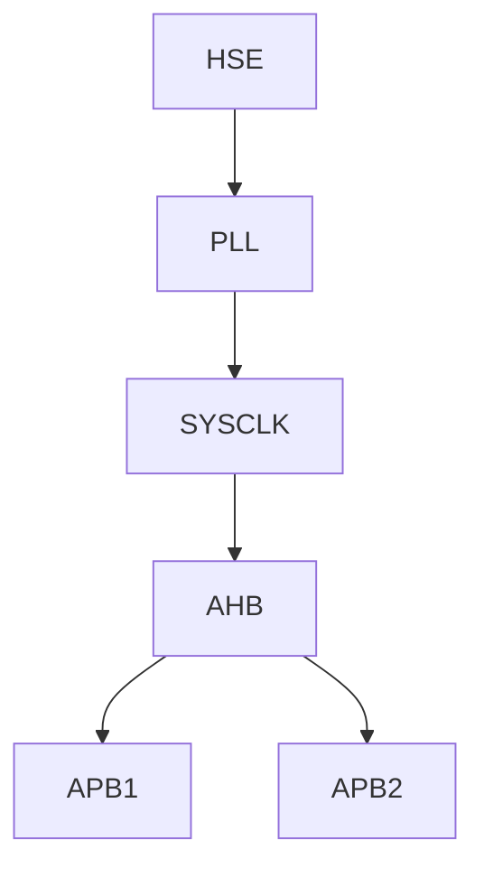

# STM32 CubeMX工具

## 介绍

STM32CubeMX是STMicroelectronics提供的一款图形化配置工具，旨在帮助开发者快速配置STM32微控制器的硬件外设和生成初始化代码。通过STM32CubeMX，开发者可以轻松选择引脚功能、配置时钟树、设置外设参数，并生成适用于多种IDE（如Keil、IAR、STM32CubeIDE等）的初始化代码。对于初学者来说，STM32CubeMX是一个强大的工具，能够显著降低STM32开发的入门门槛。

## 安装与设置

### 下载与安装

1. 访问[STMicroelectronics官网](https://www.st.com/)并下载STM32CubeMX。
2. 安装过程中，确保勾选安装STM32Cube库和驱动程序。
3. 安装完成后，启动STM32CubeMX。

### 配置环境

在首次启动时，STM32CubeMX会提示你下载STM32系列微控制器的支持包。选择你使用的STM32系列并下载相应的支持包。

## 使用STM32CubeMX

### 创建新项目

1. 启动STM32CubeMX后，点击“New Project”按钮。
2. 在弹出的“MCU Selector”窗口中，选择你使用的STM32微控制器型号。
3. 点击“Start Project”按钮，进入配置界面。

### 配置引脚功能

在“Pinout & Configuration”选项卡中，你可以看到STM32微控制器的引脚图。通过点击引脚，你可以选择其功能。例如，将PA5引脚配置为GPIO输出：

1. 点击PA5引脚。
2. 在弹出的菜单中选择“GPIO_Output”。

### 配置时钟树

在“Clock Configuration”选项卡中，你可以配置STM32的时钟树。STM32CubeMX提供了直观的图形界面，帮助你设置系统时钟、外设时钟等。



### 配置外设

在“Configuration”选项卡中，你可以配置STM32的外设参数。例如，配置USART2为异步通信模式：

1. 在左侧的“Connectivity”菜单中选择“USART2”。
2. 在“Mode”选项中选择“Asynchronous”。
3. 设置波特率、数据位、停止位等参数。

### 生成代码

完成配置后，点击“Project”菜单中的“Settings”选项，设置生成的代码的IDE类型和输出路径。然后点击“Generate Code”按钮，STM32CubeMX将生成初始化代码。

```c
// 生成的代码示例
int main(void)
{
  HAL_Init();
  SystemClock_Config();
  MX_GPIO_Init();
  MX_USART2_UART_Init();

  while (1)
  {
    HAL_GPIO_TogglePin(GPIOA, GPIO_PIN_5);
    HAL_Delay(500);
  }
}
```

## 实际案例

### LED闪烁示例

假设我们使用STM32F103C8T6微控制器，配置PA5引脚为GPIO输出，并实现LED闪烁功能。

1. 在STM32CubeMX中配置PA5为GPIO输出。
2. 生成代码并打开生成的工程。
3. 在`main.c`文件中添加以下代码：

```c
int main(void)
{
  HAL_Init();
  SystemClock_Config();
  MX_GPIO_Init();

  while (1)
  {
    HAL_GPIO_TogglePin(GPIOA, GPIO_PIN_5);
    HAL_Delay(500);
  }
}
```

4. 编译并下载代码到STM32微控制器，你将看到连接到PA5引脚的LED以500ms的间隔闪烁。

## 总结

STM32CubeMX是一个功能强大的工具，能够帮助初学者快速上手STM32微控制器的开发。通过图形化界面配置引脚、时钟和外设，开发者可以节省大量时间，并减少配置错误的风险。生成的初始化代码可以直接用于多种IDE，进一步简化了开发流程。

## 附加资源与练习

- **练习1**：尝试配置STM32的ADC外设，并读取模拟信号。
- **练习2**：使用STM32CubeMX配置TIM外设，生成PWM信号控制LED亮度。
- **资源**：访问[STMicroelectronics官网](https://www.st.com/)获取更多关于STM32CubeMX的文档和教程。

:::tip
建议初学者多动手实践，通过实际项目来熟悉STM32CubeMX的使用。
:::