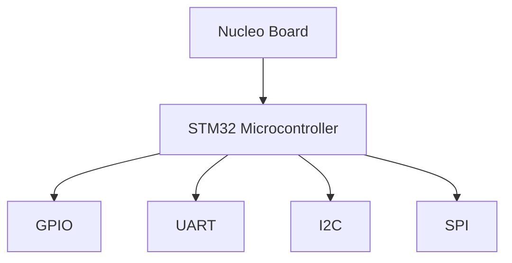

## 介绍

STM32生态系统是STMicroelectronics为STM32微控制器提供的一套完整的开发工具和资源集合。它不仅包括硬件开发板，还涵盖了软件开发工具、库、中间件和社区支持。通过扩展STM32生态系统，开发者可以更高效地实现复杂功能，缩短开发周期。

## STM32 生态系统的核心组件

### 1. STM32CubeMX
STM32CubeMX是一个图形化配置工具，用于生成初始化代码和项目配置。它支持所有STM32微控制器，并提供了丰富的外设配置选项。

### 2. STM32CubeIDE
STM32CubeIDE是一个集成开发环境（IDE），集成了代码编辑、编译、调试和仿真功能。它基于Eclipse平台，支持C/C++开发。

### 3. STM32Cube库
STM32Cube库是一组硬件抽象层（HAL）和底层库（LL），提供了对STM32微控制器外设的抽象和封装，简化了开发过程。

## STM32 生态系统的扩展

### 1. 第三方库集成
STM32生态系统支持与第三方库的集成，如FreeRTOS、FatFS、LwIP等。这些库可以帮助开发者快速实现多任务管理、文件系统和网络通信等功能。

```c
#include "FreeRTOS.h"
#include "task.h"

void vTaskFunction(void *pvParameters) {
    for (;;) {
        // Task code here
    }
}

int main(void) {
    xTaskCreate(vTaskFunction, "Task", configMINIMAL_STACK_SIZE, NULL, 1, NULL);
    vTaskStartScheduler();
    for (;;);
}
```

### 2. 中间件扩展
STM32生态系统提供了多种中间件，如USB主机/设备库、TCP/IP协议栈、图形库等。这些中间件可以显著简化复杂应用的开发。

```c
#include "stm32f4xx_hal.h"
#include "usbh_core.h"

USBH_HandleTypeDef hUsbHostFS;

void USBH_UserProcess(USBH_HandleTypeDef *phost, uint8_t id) {
    // User process code here
}

int main(void) {
    HAL_Init();
    USBH_Init(&hUsbHostFS, USBH_UserProcess, 0);
    USBH_Start(&hUsbHostFS);
    for (;;);
}
```

### 3. 开发板扩展
STM32生态系统支持多种开发板，如Nucleo、Discovery和Evaluation boards。这些开发板提供了丰富的外设和接口，方便开发者进行原型设计和测试。



## 实际案例

### 案例1：使用FreeRTOS实现多任务管理
在一个智能家居系统中，需要同时处理传感器数据、控制执行器和与云平台通信。通过集成FreeRTOS，可以轻松实现多任务管理，确保系统的实时性和稳定性。

### 案例2：使用FatFS实现文件系统
在一个数据记录器中，需要将传感器数据存储到SD卡中。通过集成FatFS库，可以快速实现文件系统的读写操作，简化数据存储的实现。

## 总结

STM32生态系统的扩展功能为开发者提供了强大的工具和资源，帮助他们更高效地实现复杂功能。通过集成第三方库、中间件和开发板，开发者可以快速构建原型并实现产品化。

## 附加资源

- [STM32CubeMX用户手册](https://www.st.com/resource/en/user_manual/dm00104712-stm32cubemx-for-stm32-configuration-and-initialization-c-code-generation-stmicroelectronics.pdf)
- [STM32CubeIDE用户手册](https://www.st.com/resource/en/user_manual/dm00568301-stm32cubeide-user-guide-stmicroelectronics.pdf)
- [FreeRTOS官方文档](https://www.freertos.org/Documentation/RTOS_book.html)

## 练习

1. 使用STM32CubeMX配置一个UART通信项目，并生成初始化代码。
2. 在STM32CubeIDE中创建一个FreeRTOS项目，实现两个任务的并行执行。
3. 集成FatFS库，实现SD卡的文件读写操作。
