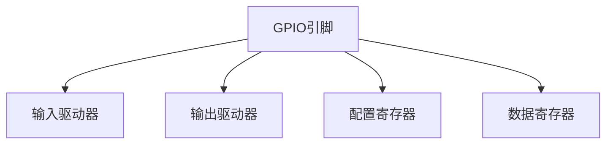

## 介绍

GPIO（General Purpose Input/Output，通用输入输出）是STM32微控制器中最基本的外设之一。它允许微控制器与外部设备进行数字信号的交互。通过配置GPIO引脚，可以实现输入（读取外部信号）或输出（控制外部设备）功能。

在STM32中，每个GPIO引脚都可以独立配置为输入或输出，并支持多种工作模式。理解GPIO的工作原理是学习STM32编程的第一步。

---

## GPIO的基本概念

### GPIO引脚的结构

每个GPIO引脚由以下几个部分组成：
1. **输入驱动器**：用于读取外部信号。
2. **输出驱动器**：用于驱动外部设备。
3. **配置寄存器**：用于设置引脚的工作模式。
4. **数据寄存器**：用于读取或写入引脚的状态。



### GPIO的工作模式

STM32的GPIO引脚可以配置为以下几种模式：
1. **输入模式**：
   - 浮空输入（Floating Input）
   - 上拉输入（Pull-up Input）
   - 下拉输入（Pull-down Input）
2. **输出模式**：
   - 推挽输出（Push-Pull Output）
   - 开漏输出（Open-Drain Output）
3. **复用功能模式**：用于连接其他外设（如UART、SPI等）。
4. **模拟模式**：用于ADC或DAC功能。

:::tip
在输入模式下，上拉或下拉电阻可以确保引脚在没有外部信号时保持稳定的电平状态。
:::

---

## GPIO的配置

### 配置步骤
1. 启用GPIO端口的时钟。
2. 配置引脚的工作模式。
3. 配置引脚的速度（可选）。
4. 配置引脚的上拉/下拉电阻（可选）。

### 代码示例

以下是一个配置GPIO引脚为推挽输出模式的示例代码：

```c
#include "stm32f4xx.h" // 包含STM32库文件

void GPIO_Config(void) {
    // 1. 启用GPIO端口的时钟
    RCC_AHB1PeriphClockCmd(RCC_AHB1Periph_GPIOA, ENABLE);

    // 2. 配置引脚的工作模式
    GPIO_InitTypeDef GPIO_InitStruct;
    GPIO_InitStruct.GPIO_Pin = GPIO_Pin_5; // 选择引脚5
    GPIO_InitStruct.GPIO_Mode = GPIO_Mode_OUT; // 设置为输出模式
    GPIO_InitStruct.GPIO_OType = GPIO_OType_PP; // 推挽输出
    GPIO_InitStruct.GPIO_Speed = GPIO_Speed_50MHz; // 输出速度
    GPIO_InitStruct.GPIO_PuPd = GPIO_PuPd_NOPULL; // 无上拉/下拉
    GPIO_Init(GPIOA, &GPIO_InitStruct); // 初始化GPIO
}
```

:::note
在STM32中，每个GPIO端口（如GPIOA、GPIOB等）都有多个引脚（如Pin0、Pin1等），需要根据具体需求选择引脚。
:::

---

## GPIO的实际应用

### 控制LED灯

以下是一个使用GPIO控制LED灯闪烁的示例：

```c
void LED_Blink(void) {
    GPIO_Config(); // 配置GPIO
    while (1) {
        GPIO_SetBits(GPIOA, GPIO_Pin_5); // 点亮LED
        for (int i = 0; i < 1000000; i++); // 延时
        GPIO_ResetBits(GPIOA, GPIO_Pin_5); // 熄灭LED
        for (int i = 0; i < 1000000; i++); // 延时
    }
}
```

:::caution
在实际项目中，建议使用定时器或系统滴答定时器（SysTick）来实现精确的延时，而不是使用空循环。
:::

### 读取按钮状态

以下是一个读取按钮状态并控制LED灯的示例：

```c
void Button_Control_LED(void) {
    GPIO_Config(); // 配置GPIO
    while (1) {
        if (GPIO_ReadInputDataBit(GPIOA, GPIO_Pin_0) == Bit_SET) { // 读取按钮状态
            GPIO_SetBits(GPIOA, GPIO_Pin_5); // 点亮LED
        } else {
            GPIO_ResetBits(GPIOA, GPIO_Pin_5); // 熄灭LED
        }
    }
}
```

---

## 总结

GPIO是STM32微控制器中最基础的外设，掌握其配置和使用方法是学习STM32编程的关键。通过本教程，您已经了解了GPIO的基本概念、配置方法以及实际应用场景。

---

## 附加资源与练习

### 推荐资源
- [STM32官方参考手册](https://www.st.com)
- [STM32 GPIO库函数指南](https://www.st.com)

### 练习
1. 尝试配置多个GPIO引脚，控制多个LED灯实现流水灯效果。
2. 使用GPIO输入模式读取多个按钮的状态，并根据按钮状态控制LED灯。
3. 探索GPIO的复用功能模式，尝试将GPIO引脚配置为UART或SPI通信引脚。

:::warning
在实验过程中，请务必注意电路连接的正确性，避免短路或损坏设备。
:::