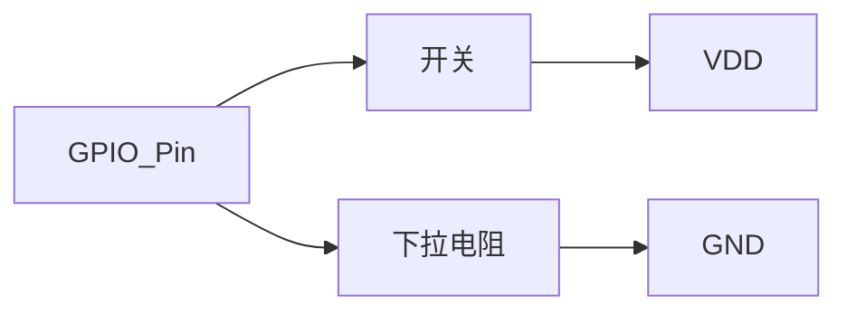

# STM32 GPIO上拉下拉

在STM32微控制器中，GPIO（通用输入输出）引脚是连接外部世界的关键接口。为了确保GPIO引脚在未连接外部信号时能够保持稳定的状态，STM32提供了上拉和下拉电阻的配置选项。本文将详细介绍上拉和下拉电阻的概念、配置方法以及实际应用场景。

## 什么是上拉和下拉电阻？

上拉电阻和下拉电阻是用于确保GPIO引脚在未连接外部信号时保持确定电平的电阻。上拉电阻将引脚拉至高电平（通常为VDD），而下拉电阻将引脚拉至低电平（通常为GND）。这两种电阻配置可以防止引脚在未连接时处于不确定的浮空状态，从而避免误触发或噪声干扰。

### 上拉电阻
- **作用**：将GPIO引脚拉至高电平。
- **应用场景**：常用于按键输入，当按键未按下时，引脚通过上拉电阻保持高电平；按键按下时，引脚被拉低。

### 下拉电阻
- **作用**：将GPIO引脚拉至低电平。
- **应用场景**：常用于开关或传感器输入，当开关未闭合时，引脚通过下拉电阻保持低电平；开关闭合时，引脚被拉高。

## 配置上拉和下拉电阻

在STM32中，GPIO引脚的上拉和下拉电阻可以通过配置寄存器来设置。以下是一个简单的代码示例，展示如何配置GPIO引脚的上拉和下拉电阻。

```c
#include "stm32f4xx.h"

void GPIO_Config(void) {
    // 启用GPIOA时钟
    RCC_AHB1PeriphClockCmd(RCC_AHB1Periph_GPIOA, ENABLE);

    // 配置GPIOA引脚5为上拉输入
    GPIO_InitTypeDef GPIO_InitStruct;
    GPIO_InitStruct.GPIO_Pin = GPIO_Pin_5;
    GPIO_InitStruct.GPIO_Mode = GPIO_Mode_IN;
    GPIO_InitStruct.GPIO_PuPd = GPIO_PuPd_UP;  // 上拉电阻
    GPIO_Init(GPIOA, &GPIO_InitStruct);

    // 配置GPIOA引脚6为下拉输入
    GPIO_InitStruct.GPIO_Pin = GPIO_Pin_6;
    GPIO_InitStruct.GPIO_PuPd = GPIO_PuPd_DOWN;  // 下拉电阻
    GPIO_Init(GPIOA, &GPIO_InitStruct);
}
```

:::note
在上面的代码中，我们使用了 `GPIO_PuPd_UP` 和 `GPIO_PuPd_DOWN` 来分别配置上拉和下拉电阻。`GPIO_Mode_IN` 表示将引脚配置为输入模式。
:::

## 实际应用场景

### 按键输入
在按键输入电路中，通常使用上拉电阻来确保按键未按下时引脚保持高电平。当按键按下时，引脚被拉低，从而触发输入信号。


### 开关输入
在开关输入电路中，通常使用下拉电阻来确保开关未闭合时引脚保持低电平。当开关闭合时，引脚被拉高，从而触发输入信号。



## 总结

上拉和下拉电阻是STM32 GPIO配置中的重要概念，它们确保了引脚在未连接外部信号时能够保持稳定的电平状态。通过合理配置上拉和下拉电阻，可以有效避免误触发和噪声干扰，提高系统的可靠性。

## 附加资源与练习

- **练习1**：尝试在STM32开发板上配置一个按键输入电路，使用上拉电阻，并编写代码检测按键状态。
- **练习2**：设计一个开关输入电路，使用下拉电阻，并编写代码检测开关状态。
- **参考文档**：STM32官方参考手册中的GPIO章节，了解更多关于GPIO配置的详细信息。

通过以上内容的学习和实践，你应该能够掌握STM32 GPIO上拉和下拉电阻的配置方法，并能够在实际项目中灵活应用。