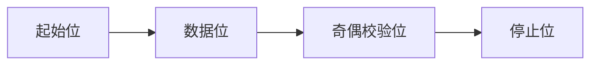

## 介绍

UART（Universal Asynchronous Receiver/Transmitter，通用异步收发传输器）是一种常见的串行通信协议，广泛应用于嵌入式系统中。STM32 微控制器内置了多个 UART 外设，能够轻松实现与其他设备的数据交换。本文将详细介绍如何在 STM32 上配置和使用 UART 进行数据的发送和接收。

## UART 的基本概念

UART 是一种异步通信协议，意味着它不需要时钟信号来同步数据传输。UART 通信通常使用两根线：TX（发送）和 RX（接收）。数据以帧的形式传输，每帧包含起始位、数据位、可选的奇偶校验位和停止位。

### UART 帧结构



- **起始位**：标志数据帧的开始，通常为低电平。
- **数据位**：实际传输的数据，通常为 5 到 9 位。
- **奇偶校验位**：用于错误检测，可选。
- **停止位**：标志数据帧的结束，通常为高电平。

## STM32 UART 配置

在 STM32 上使用 UART 之前，需要对其进行配置。以下是配置 UART 的基本步骤：

1. **启用 UART 时钟**：通过 RCC 寄存器启用 UART 外设的时钟。
2. **配置 GPIO 引脚**：将 TX 和 RX 引脚配置为复用功能。
3. **配置 UART 参数**：设置波特率、数据位、停止位、奇偶校验等参数。
4. **启用 UART**：启用 UART 外设。

### 代码示例：配置 UART

```c
#include "stm32f4xx.h"

void UART_Config(void) {
    // 1. 启用 GPIO 和 UART 时钟
    RCC_AHB1PeriphClockCmd(RCC_AHB1Periph_GPIOA, ENABLE);
    RCC_APB2PeriphClockCmd(RCC_APB2Periph_USART1, ENABLE);

    // 2. 配置 GPIO 引脚
    GPIO_InitTypeDef GPIO_InitStruct;
    GPIO_InitStruct.GPIO_Pin = GPIO_Pin_9 | GPIO_Pin_10;
    GPIO_InitStruct.GPIO_Mode = GPIO_Mode_AF;
    GPIO_InitStruct.GPIO_Speed = GPIO_Speed_50MHz;
    GPIO_InitStruct.GPIO_OType = GPIO_OType_PP;
    GPIO_InitStruct.GPIO_PuPd = GPIO_PuPd_UP;
    GPIO_Init(GPIOA, &GPIO_InitStruct);

    // 3. 配置 UART 参数
    USART_InitTypeDef USART_InitStruct;
    USART_InitStruct.USART_BaudRate = 9600;
    USART_InitStruct.USART_WordLength = USART_WordLength_8b;
    USART_InitStruct.USART_StopBits = USART_StopBits_1;
    USART_InitStruct.USART_Parity = USART_Parity_No;
    USART_InitStruct.USART_HardwareFlowControl = USART_HardwareFlowControl_None;
    USART_InitStruct.USART_Mode = USART_Mode_Rx | USART_Mode_Tx;
    USART_Init(USART1, &USART_InitStruct);

    // 4. 启用 UART
    USART_Cmd(USART1, ENABLE);
}
```

## UART 数据发送与接收

### 发送数据

在 STM32 上发送数据非常简单。只需将数据写入 UART 的数据寄存器（DR），UART 外设会自动将数据发送出去。

```c
void UART_SendChar(char ch) {
    while (USART_GetFlagStatus(USART1, USART_FLAG_TXE) == RESET);
    USART_SendData(USART1, ch);
}

void UART_SendString(char *str) {
    while (*str) {
        UART_SendChar(*str++);
    }
}
```

### 接收数据

接收数据时，需要检查 UART 的状态寄存器，以确定是否有新数据到达。如果有新数据，可以从数据寄存器中读取。

```c
char UART_ReceiveChar(void) {
    while (USART_GetFlagStatus(USART1, USART_FLAG_RXNE) == RESET);
    return USART_ReceiveData(USART1);
}
```

## 实际应用场景

### 与 PC 通信

假设你正在开发一个 STM32 项目，需要将传感器数据发送到 PC 进行显示。你可以使用 UART 将数据发送到 PC 的串口终端。

```c
int main(void) {
    UART_Config();

    while (1) {
        char data = UART_ReceiveChar();
        UART_SendString("Received: ");
        UART_SendChar(data);
        UART_SendString("\n");
    }
}
```

### 与蓝牙模块通信

另一个常见的应用场景是与蓝牙模块通信。通过 UART，STM32 可以与蓝牙模块交换数据，实现无线通信。

```c
void SendDataToBluetooth(char *data) {
    UART_SendString(data);
}

char ReceiveDataFromBluetooth(void) {
    return UART_ReceiveChar();
}
```

## 总结

UART 是 STM32 微控制器中非常重要的通信接口，掌握其使用方法对于嵌入式开发至关重要。本文介绍了 UART 的基本概念、配置方法以及数据的发送和接收。通过实际应用场景的示例，你可以更好地理解 UART 在嵌入式系统中的应用。

## 附加资源与练习

- **练习 1**：修改代码，使其能够通过 UART 发送和接收字符串。
- **练习 2**：尝试使用不同的波特率进行通信，观察通信效果。
- **资源**：参考 STM32 官方文档，了解更多关于 UART 的高级功能，如 DMA 传输和中断处理。

:::tip
在实际项目中，建议使用中断或 DMA 来处理 UART 数据的接收和发送，以提高系统的效率和响应速度。
:::