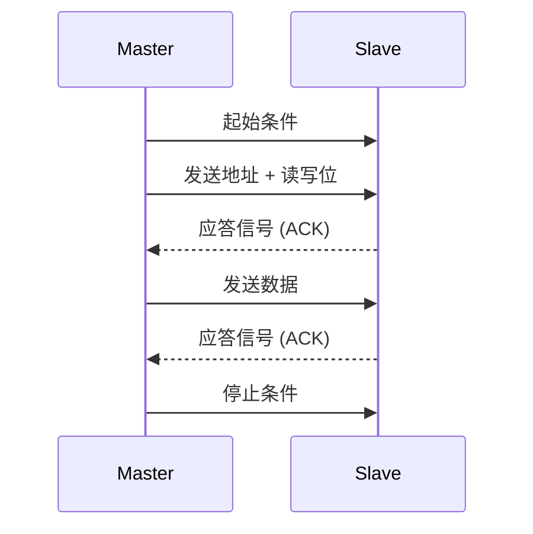

# STM32 I2C 基础

I2C（Inter-Integrated Circuit）是一种广泛使用的串行通信协议，用于连接低速外围设备。它仅需两根线（SDA 和 SCL）即可实现设备之间的通信，非常适合在资源有限的嵌入式系统中使用。本文将详细介绍 STM32 微控制器中的 I2C 通信，帮助初学者快速掌握其基本原理和实际应用。

## 什么是 I2C？

I2C 是一种同步、多主从、双向的串行通信协议。它由 Philips（现为 NXP）开发，主要用于短距离通信。I2C 协议具有以下特点：

- **两根线**：SDA（数据线）和 SCL（时钟线）。
- **多主从架构**：支持多个主设备和从设备。
- **地址寻址**：每个从设备都有一个唯一的地址，主设备通过地址与从设备通信。
- **低速通信**：通常用于低速设备，如传感器、EEPROM 等。

## I2C 通信的基本原理

I2C 通信基于主从模式。主设备负责发起通信并控制时钟信号（SCL），而从设备则响应主设备的请求。以下是 I2C 通信的基本步骤：

1. **起始条件**：主设备拉低 SDA 线，然后拉低 SCL 线，表示通信开始。
2. **地址传输**：主设备发送从设备的地址（7 位或 10 位）和读写位（0 表示写，1 表示读）。
3. **应答信号**：从设备接收到地址后，发送一个应答信号（ACK）表示确认。
4. **数据传输**：主设备或从设备开始传输数据，每个字节后跟随一个应答信号。
5. **停止条件**：主设备拉高 SDA 线，然后拉高 SCL 线，表示通信结束。



## STM32 中的 I2C 配置

在 STM32 中，I2C 通信通过硬件外设实现。以下是配置 I2C 的基本步骤：

1. **启用 I2C 外设时钟**：通过 RCC 寄存器启用 I2C 外设的时钟。
2. **配置 GPIO 引脚**：将 SDA 和 SCL 引脚配置为复用功能。
3. **配置 I2C 参数**：设置 I2C 的时钟速度、地址模式等参数。
4. **启用 I2C**：启动 I2C 外设。

以下是一个简单的代码示例，展示如何在 STM32 中配置 I2C：

```c
#include "stm32f4xx.h"

void I2C_Config(void) {
    // 启用 GPIOB 和 I2C1 时钟
    RCC_AHB1PeriphClockCmd(RCC_AHB1Periph_GPIOB, ENABLE);
    RCC_APB1PeriphClockCmd(RCC_APB1Periph_I2C1, ENABLE);

    // 配置 GPIOB 引脚 6 和 7 为 I2C1 的 SCL 和 SDA
    GPIO_PinAFConfig(GPIOB, GPIO_PinSource6, GPIO_AF_I2C1);
    GPIO_PinAFConfig(GPIOB, GPIO_PinSource7, GPIO_AF_I2C1);

    GPIO_InitTypeDef GPIO_InitStruct;
    GPIO_InitStruct.GPIO_Pin = GPIO_Pin_6 | GPIO_Pin_7;
    GPIO_InitStruct.GPIO_Mode = GPIO_Mode_AF;
    GPIO_InitStruct.GPIO_Speed = GPIO_Speed_50MHz;
    GPIO_InitStruct.GPIO_OType = GPIO_OType_OD;
    GPIO_InitStruct.GPIO_PuPd = GPIO_PuPd_UP;
    GPIO_Init(GPIOB, &GPIO_InitStruct);

    // 配置 I2C1
    I2C_InitTypeDef I2C_InitStruct;
    I2C_InitStruct.I2C_ClockSpeed = 100000; // 100 kHz
    I2C_InitStruct.I2C_Mode = I2C_Mode_I2C;
    I2C_InitStruct.I2C_DutyCycle = I2C_DutyCycle_2;
    I2C_InitStruct.I2C_OwnAddress1 = 0x00; // 主设备地址
    I2C_InitStruct.I2C_Ack = I2C_Ack_Enable;
    I2C_InitStruct.I2C_AcknowledgedAddress = I2C_AcknowledgedAddress_7bit;
    I2C_Init(I2C1, &I2C_InitStruct);

    // 启用 I2C1
    I2C_Cmd(I2C1, ENABLE);
}
```

:::tip
在实际应用中，I2C 的时钟速度应根据从设备的规格进行设置。常见的时钟速度有 100 kHz（标准模式）和 400 kHz（快速模式）。
:::

## 实际应用案例：读取温度传感器数据

假设我们有一个 I2C 温度传感器（如 LM75），我们可以通过以下步骤读取其温度数据：

1. **发送传感器地址**：LM75 的地址通常为 `0x48`。
2. **发送读取命令**：发送读取温度寄存器的命令。
3. **读取数据**：从传感器读取两个字节的温度数据。

以下是一个简单的代码示例：

```c
uint8_t I2C_ReadTemperature(void) {
    uint8_t temperature[2];

    // 发送起始条件
    I2C_GenerateSTART(I2C1, ENABLE);
    while (!I2C_CheckEvent(I2C1, I2C_EVENT_MASTER_MODE_SELECT));

    // 发送传感器地址（写模式）
    I2C_Send7bitAddress(I2C1, 0x48, I2C_Direction_Transmitter);
    while (!I2C_CheckEvent(I2C1, I2C_EVENT_MASTER_TRANSMITTER_MODE_SELECTED));

    // 发送读取温度寄存器的命令
    I2C_SendData(I2C1, 0x00); // 温度寄存器地址
    while (!I2C_CheckEvent(I2C1, I2C_EVENT_MASTER_BYTE_TRANSMITTED));

    // 重新发送起始条件
    I2C_GenerateSTART(I2C1, ENABLE);
    while (!I2C_CheckEvent(I2C1, I2C_EVENT_MASTER_MODE_SELECT));

    // 发送传感器地址（读模式）
    I2C_Send7bitAddress(I2C1, 0x48, I2C_Direction_Receiver);
    while (!I2C_CheckEvent(I2C1, I2C_EVENT_MASTER_RECEIVER_MODE_SELECTED));

    // 读取温度数据
    temperature[0] = I2C_ReceiveData(I2C1);
    while (!I2C_CheckEvent(I2C1, I2C_EVENT_MASTER_BYTE_RECEIVED));
    temperature[1] = I2C_ReceiveData(I2C1);
    while (!I2C_CheckEvent(I2C1, I2C_EVENT_MASTER_BYTE_RECEIVED));

    // 发送停止条件
    I2C_GenerateSTOP(I2C1, ENABLE);

    return temperature[0]; // 返回温度数据
}
```

:::note
在实际应用中，读取的温度数据可能需要进一步处理，例如将原始数据转换为实际温度值。
:::

## 总结

I2C 是一种简单而强大的串行通信协议，广泛应用于嵌入式系统中。通过本文的学习，你应该已经掌握了 STM32 中 I2C 的基本原理、配置方法以及实际应用。希望这些知识能够帮助你在未来的项目中更好地使用 I2C 通信。

## 附加资源与练习

- **练习**：尝试使用 STM32 的 I2C 接口与多个从设备通信，例如同时读取温度和湿度传感器的数据。
- **资源**：参考 STM32 的官方参考手册，了解更多关于 I2C 外设的详细信息。

:::caution
在实际开发中，务必注意 I2C 总线的上拉电阻配置，以确保通信的稳定性。
:::