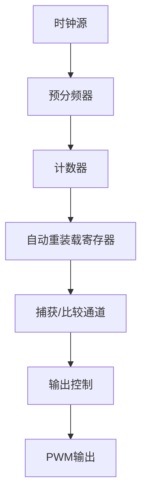

## 介绍

STM32微控制器中的高级定时器（Advanced Timer）是一种功能强大的外设，广泛应用于需要精确时间控制的场景，如电机控制、PWM信号生成、编码器接口等。与基本定时器和通用定时器相比，高级定时器提供了更多的功能和灵活性，能够满足复杂的应用需求。

高级定时器通常具有以下特点：
- 支持多种计数模式（向上、向下、中央对齐）。
- 支持多通道PWM输出。
- 支持死区时间插入，适用于电机控制。
- 支持编码器接口。
- 支持事件触发和中断。

## 高级定时器的基本结构

高级定时器的核心是一个16位或32位的计数器，可以通过配置预分频器和自动重装载寄存器来控制计数器的频率和周期。高级定时器通常包含多个捕获/比较通道，用于生成PWM信号或测量输入信号的频率和占空比。

以下是一个高级定时器的简化结构图：



## 配置高级定时器

配置高级定时器通常包括以下几个步骤：
1. 使能定时器时钟。
2. 配置预分频器和自动重装载寄存器。
3. 配置捕获/比较通道。
4. 配置输出模式（如PWM模式）。
5. 使能定时器。

以下是一个配置高级定时器生成PWM信号的示例代码：

```c
#include "stm32f4xx.h"

void TIM1_PWM_Init(void) {
    // 使能TIM1时钟
    RCC_APB2PeriphClockCmd(RCC_APB2Periph_TIM1, ENABLE);

    // 配置TIM1
    TIM_TimeBaseInitTypeDef TIM_TimeBaseStructure;
    TIM_TimeBaseStructure.TIM_Period = 999; // 自动重装载值
    TIM_TimeBaseStructure.TIM_Prescaler = 83; // 预分频器
    TIM_TimeBaseStructure.TIM_ClockDivision = 0;
    TIM_TimeBaseStructure.TIM_CounterMode = TIM_CounterMode_Up;
    TIM_TimeBaseInit(TIM1, &TIM_TimeBaseStructure);

    // 配置PWM模式
    TIM_OCInitTypeDef TIM_OCInitStructure;
    TIM_OCInitStructure.TIM_OCMode = TIM_OCMode_PWM1;
    TIM_OCInitStructure.TIM_OutputState = TIM_OutputState_Enable;
    TIM_OCInitStructure.TIM_Pulse = 500; // 占空比50%
    TIM_OCInitStructure.TIM_OCPolarity = TIM_OCPolarity_High;
    TIM_OC1Init(TIM1, &TIM_OCInitStructure);

    // 使能TIM1
    TIM_Cmd(TIM1, ENABLE);
    TIM_CtrlPWMOutputs(TIM1, ENABLE);
}

int main(void) {
    TIM1_PWM_Init();
    while (1) {
        // 主循环
    }
}
```

:::note
在上述代码中，我们配置了TIM1定时器生成一个占空比为50%的PWM信号。`TIM_Pulse`参数决定了PWM信号的占空比。
:::

## 实际应用场景

### 电机控制

在电机控制中，高级定时器可以用于生成精确的PWM信号，控制电机的转速和方向。通过配置死区时间，可以防止电机驱动电路中的上下桥臂同时导通，从而避免短路。

### 编码器接口

高级定时器支持编码器接口模式，可以用于读取旋转编码器的位置和速度。编码器接口模式可以自动处理编码器信号，减少CPU的负担。

### 事件触发

高级定时器可以配置为在特定事件（如计数器溢出、捕获事件）时触发中断或DMA请求。这在需要精确时间控制的场景中非常有用，如数据采集系统。

## 总结

STM32高级定时器是一种功能强大的外设，适用于多种需要精确时间控制的应用场景。通过合理配置，可以实现PWM信号生成、电机控制、编码器接口等功能。希望本文能帮助你理解并掌握STM32高级定时器的基本概念和配置方法。

## 附加资源与练习

- **练习1**：尝试修改上述代码，生成一个占空比为25%的PWM信号。
- **练习2**：配置高级定时器，使其在计数器溢出时触发中断，并在中断服务程序中翻转一个GPIO引脚的状态。
- **参考文档**：STM32参考手册中的“高级控制定时器”章节。

:::tip
如果你在配置高级定时器时遇到问题，可以参考STM32的官方例程或社区论坛，获取更多帮助。
:::