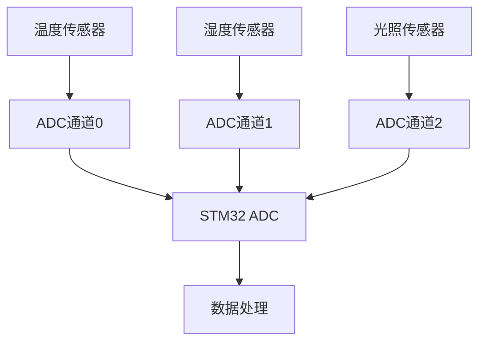

## 介绍

STM32微控制器中的ADC（模数转换器）是一个强大的外设，用于将模拟信号转换为数字信号。在许多应用中，我们需要同时从多个模拟通道采集数据，这就是所谓的**多通道采样**。本教程将逐步讲解如何在STM32中配置和使用ADC进行多通道采样。

## 多通道采样的基本概念

多通道采样是指ADC依次从多个模拟输入通道采集数据。STM32的ADC支持多种扫描模式，可以配置为连续扫描多个通道，并将转换结果存储在指定的寄存器中。

### 关键点：
- **通道选择**：通过配置ADC的通道序列寄存器（SQR），可以选择要采样的通道。
- **扫描模式**：ADC可以配置为单次扫描或连续扫描模式。
- **数据存储**：转换结果可以存储在单个寄存器或多个寄存器中，具体取决于配置。

## 配置步骤

以下是配置STM32 ADC进行多通道采样的基本步骤：

1. **初始化ADC外设**：配置ADC的时钟、分辨率和采样时间。
2. **配置通道序列**：设置要采样的通道顺序。
3. **配置扫描模式**：选择单次扫描或连续扫描模式。
4. **启动ADC**：启动ADC并开始采样。
5. **读取数据**：从ADC数据寄存器中读取转换结果。

### 代码示例

以下是一个简单的代码示例，展示了如何在STM32中配置ADC进行多通道采样：

```c
#include "stm32f4xx.h"

void ADC_Init(void) {
    // 1. 使能ADC时钟
    RCC_APB2PeriphClockCmd(RCC_APB2Periph_ADC1, ENABLE);

    // 2. 配置ADC
    ADC_InitTypeDef ADC_InitStruct;
    ADC_InitStruct.ADC_Resolution = ADC_Resolution_12b;
    ADC_InitStruct.ADC_ScanConvMode = ENABLE; // 启用扫描模式
    ADC_InitStruct.ADC_ContinuousConvMode = ENABLE; // 连续转换模式
    ADC_InitStruct.ADC_ExternalTrigConvEdge = ADC_ExternalTrigConvEdge_None;
    ADC_InitStruct.ADC_DataAlign = ADC_DataAlign_Right;
    ADC_InitStruct.ADC_NbrOfConversion = 3; // 3个通道
    ADC_Init(ADC1, &ADC_InitStruct);

    // 3. 配置通道序列
    ADC_RegularChannelConfig(ADC1, ADC_Channel_0, 1, ADC_SampleTime_84Cycles); // 通道0
    ADC_RegularChannelConfig(ADC1, ADC_Channel_1, 2, ADC_SampleTime_84Cycles); // 通道1
    ADC_RegularChannelConfig(ADC1, ADC_Channel_2, 3, ADC_SampleTime_84Cycles); // 通道2

    // 4. 使能ADC
    ADC_Cmd(ADC1, ENABLE);

    // 5. 启动ADC
    ADC_SoftwareStartConv(ADC1);
}

uint16_t ADC_ReadChannel(uint8_t channel) {
    // 等待转换完成
    while (!ADC_GetFlagStatus(ADC1, ADC_FLAG_EOC));

    // 读取转换结果
    return ADC_GetConversionValue(ADC1);
}

int main(void) {
    ADC_Init();

    while (1) {
        uint16_t value0 = ADC_ReadChannel(0);
        uint16_t value1 = ADC_ReadChannel(1);
        uint16_t value2 = ADC_ReadChannel(2);

        // 处理采集到的数据
    }
}
```

:::note
**注意**：在实际应用中，可能需要根据具体的STM32型号和开发环境调整代码。
:::

## 实际应用场景

多通道采样在许多实际应用中非常有用，例如：

- **环境监测**：同时采集温度、湿度和光照强度等数据。
- **工业控制**：监控多个传感器的输出，如压力、流量和温度。
- **医疗设备**：采集多个生物信号，如心电图（ECG）和血氧饱和度（SpO2）。

### 示例：环境监测系统

假设我们正在开发一个环境监测系统，需要同时采集温度、湿度和光照强度。我们可以使用STM32的ADC多通道采样功能来实现这一需求。



## 总结

在本教程中，我们学习了如何在STM32微控制器中配置和使用ADC进行多通道采样。我们介绍了基本概念、配置步骤，并提供了一个代码示例。此外，我们还探讨了多通道采样在实际应用中的使用场景。

## 附加资源与练习

- **练习**：尝试修改代码，使其支持更多通道，并测试其性能。
- **资源**：查阅STM32参考手册，了解更多关于ADC的配置选项和高级功能。

:::tip
**提示**：在实际项目中，确保对ADC的采样时间和分辨率进行优化，以获得最佳的性能和精度。
:::