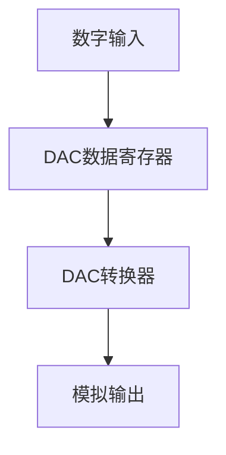

# STM32 DAC基础

## 介绍

数字模拟转换器（DAC，Digital-to-Analog Converter）是微控制器中用于将数字信号转换为模拟信号的重要外设。STM32微控制器内置了DAC模块，允许开发者将数字值转换为相应的模拟电压输出。这在音频处理、电机控制、信号生成等应用中非常有用。

本文将介绍STM32 DAC的基本概念、工作原理、配置方法以及实际应用案例。

## DAC的工作原理

DAC的核心功能是将数字信号转换为模拟信号。STM32的DAC模块通常支持12位分辨率，这意味着它可以输出4096个不同的电压级别（从0到4095）。DAC的输出电压范围通常为0V到参考电压（Vref），Vref可以是内部参考电压或外部提供的参考电压。

### DAC的基本结构

STM32的DAC模块通常包含以下部分：
- **数据寄存器**：用于存储待转换的数字值。
- **DAC输出缓冲器**：用于驱动外部负载。
- **触发源**：用于控制DAC转换的时机，可以是定时器、外部事件等。



## 配置STM32 DAC

要使用STM32的DAC，首先需要配置相关的寄存器或使用HAL库进行初始化。以下是一个简单的配置步骤：

1. **启用DAC时钟**：首先需要启用DAC外设的时钟。
2. **配置GPIO引脚**：将DAC输出引脚配置为模拟模式。
3. **初始化DAC**：设置DAC的分辨率、触发源等参数。
4. **启动DAC**：使能DAC并开始转换。

### 代码示例

以下是一个使用STM32 HAL库配置DAC的示例代码：

```c
#include "stm32f4xx_hal.h"

DAC_HandleTypeDef hdac;

void DAC_Init(void) {
    // 启用DAC时钟
    __HAL_RCC_DAC_CLK_ENABLE();

    // 配置DAC输出引脚为模拟模式
    GPIO_InitTypeDef GPIO_InitStruct = {0};
    GPIO_InitStruct.Pin = GPIO_PIN_4; // 假设使用PA4作为DAC输出
    GPIO_InitStruct.Mode = GPIO_MODE_ANALOG;
    GPIO_InitStruct.Pull = GPIO_NOPULL;
    HAL_GPIO_Init(GPIOA, &GPIO_InitStruct);

    // 初始化DAC
    hdac.Instance = DAC;
    HAL_DAC_Init(&hdac);

    // 配置DAC通道1
    DAC_ChannelConfTypeDef sConfig = {0};
    sConfig.DAC_Trigger = DAC_TRIGGER_NONE; // 不使用外部触发
    sConfig.DAC_OutputBuffer = DAC_OUTPUTBUFFER_ENABLE; // 启用输出缓冲器
    HAL_DAC_ConfigChannel(&hdac, &sConfig, DAC_CHANNEL_1);

    // 启动DAC
    HAL_DAC_Start(&hdac, DAC_CHANNEL_1);
}

void Set_DAC_Value(uint32_t value) {
    // 设置DAC输出值
    HAL_DAC_SetValue(&hdac, DAC_CHANNEL_1, DAC_ALIGN_12B_R, value);
}
```

### 输入与输出

- **输入**：`value` 是一个12位的数字值（0到4095）。
- **输出**：DAC输出引脚将产生一个与`value`对应的模拟电压，范围为0V到Vref。

## 实际应用案例

### 音频信号生成

DAC可以用于生成音频信号。例如，通过将音频样本数据（如WAV文件中的采样值）连续写入DAC，可以生成音频输出。以下是一个简单的示例：

```c
void Play_Audio(uint16_t* audio_data, uint32_t length) {
    for (uint32_t i = 0; i < length; i++) {
        Set_DAC_Value(audio_data[i]);
        HAL_Delay(1); // 控制采样率
    }
}
```

### 电机控制

在电机控制中，DAC可以用于生成PWM信号的参考电压，从而控制电机的转速。通过调整DAC的输出电压，可以改变PWM信号的占空比，进而控制电机的转速。

## 总结

STM32的DAC模块为开发者提供了将数字信号转换为模拟信号的便捷方式。通过合理配置和使用DAC，可以实现音频信号生成、电机控制等多种应用。本文介绍了DAC的基本概念、配置方法以及实际应用案例，希望能帮助初学者更好地理解和应用STM32的DAC功能。

## 附加资源与练习

- **练习1**：尝试使用DAC生成一个正弦波信号。
- **练习2**：结合定时器触发DAC转换，实现周期性信号输出。
- **参考文档**：STM32参考手册中的DAC章节，了解更多高级功能和配置选项。

:::tip
在实际项目中，DAC的输出可能会受到噪声的影响。可以通过添加滤波电路或使用DAC的输出缓冲器来改善输出信号的质量。
:::