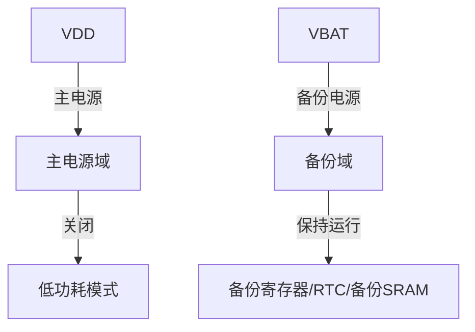

## 介绍

STM32微控制器的备份域（Backup Domain）是一个独立于主电源的电源域，通常由备份电池供电。备份域的主要功能是在主电源关闭或系统进入低功耗模式时，保存关键数据并维持某些外设的运行。备份域通常包括备份寄存器（Backup Registers）、实时时钟（RTC）和备份SRAM。

:::note
备份域的内容在主电源关闭后仍然保留，前提是备份电池正常工作。
:::

## 备份域的组成

备份域由以下几个主要部分组成：

1. **备份寄存器（Backup Registers）**：用于存储少量关键数据，如配置参数或状态标志。
2. **实时时钟（RTC）**：用于在低功耗模式下提供时间戳或定时功能。
3. **备份SRAM**：用于存储较大量的数据，通常在低功耗模式下使用。

## 备份域的电源管理

备份域由独立的电源供电，通常是备份电池（VBAT）。当主电源（VDD）关闭时，备份域仍然可以正常工作。以下是备份域的电源管理示意图：



## 备份寄存器的使用

备份寄存器是备份域中最常用的部分。它们通常用于存储系统状态、配置参数或其他关键数据。以下是一个简单的代码示例，展示如何读写备份寄存器：

```c
#include "stm32f4xx.h"

void write_backup_register(uint8_t reg_index, uint32_t value) {
    // 使能备份域访问
    RCC->APB1ENR |= RCC_APB1ENR_PWREN;
    PWR->CR |= PWR_CR_DBP;

    // 写入备份寄存器
    RTC->BKP0R = value;

    // 关闭备份域访问
    PWR->CR &= ~PWR_CR_DBP;
}

uint32_t read_backup_register(uint8_t reg_index) {
    // 使能备份域访问
    RCC->APB1ENR |= RCC_APB1ENR_PWREN;
    PWR->CR |= PWR_CR_DBP;

    // 读取备份寄存器
    uint32_t value = RTC->BKP0R;

    // 关闭备份域访问
    PWR->CR &= ~PWR_CR_DBP;

    return value;
}
```

:::tip
在访问备份寄存器之前，必须使能备份域访问权限（DBP位）。
:::

## 实际应用案例

### 案例1：保存系统状态

假设你正在开发一个低功耗设备，需要在系统进入低功耗模式之前保存当前的系统状态。你可以使用备份寄存器来存储这些状态信息：

```c
void save_system_state() {
    uint32_t system_state = get_system_state(); // 获取当前系统状态
    write_backup_register(0, system_state);    // 将状态保存到备份寄存器0
}

void restore_system_state() {
    uint32_t system_state = read_backup_register(0); // 从备份寄存器0读取状态
    set_system_state(system_state);                 // 恢复系统状态
}
```

### 案例2：RTC与备份寄存器的结合使用

在某些应用中，你可能需要使用RTC来记录事件发生的时间，并将时间戳存储在备份寄存器中：

```c
void log_event() {
    uint32_t timestamp = RTC->TR; // 获取当前RTC时间
    write_backup_register(1, timestamp); // 将时间戳保存到备份寄存器1
}
```

## 总结

STM32的备份域是一个强大的功能，特别适用于低功耗应用场景。通过备份寄存器、RTC和备份SRAM，你可以在主电源关闭或系统进入低功耗模式时，保存关键数据并维持某些外设的运行。

:::caution
在使用备份域时，请确保备份电池正常工作，否则备份域的数据可能会丢失。
:::

## 附加资源与练习

- **练习1**：尝试在STM32开发板上实现一个简单的低功耗模式，并使用备份寄存器保存系统状态。
- **练习2**：结合RTC和备份寄存器，实现一个事件日志系统，记录事件发生的时间戳。

:::tip
更多关于STM32备份域的详细信息，请参考STM32参考手册和官方文档。
:::