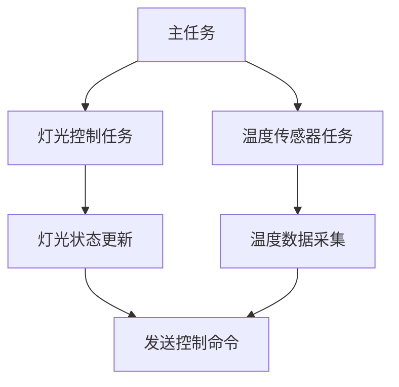

# STM32 FreeRTOS基础

FreeRTOS 是一个开源的实时操作系统（RTOS），专为嵌入式系统设计。它提供了任务管理、调度、内存管理、队列、信号量等功能，非常适合在资源受限的微控制器（如STM32）上运行。本文将带你了解如何在STM32上使用FreeRTOS，并通过实际案例展示其应用。

## 什么是FreeRTOS？

FreeRTOS 是一个轻量级的实时操作系统，支持多任务并发执行。它通过任务调度器管理多个任务的执行顺序，确保高优先级的任务能够及时响应。FreeRTOS 的核心功能包括：

- **任务管理**：创建、删除和调度任务。
- **队列**：任务间通信的机制。
- **信号量**：任务同步和资源管理的工具。
- **内存管理**：动态内存分配和释放。

## 安装FreeRTOS

在STM32项目中使用FreeRTOS，首先需要将其添加到项目中。可以通过STM32CubeMX工具自动生成FreeRTOS配置代码，或者手动将FreeRTOS源码添加到项目中。

:::tip
使用STM32CubeMX可以快速配置FreeRTOS，并生成初始化代码，非常适合初学者。
:::

## 创建任务

任务是FreeRTOS的基本执行单元。每个任务都是一个独立的函数，拥有自己的堆栈和优先级。以下是一个简单的任务创建示例：

```c
#include "FreeRTOS.h"
#include "task.h"

void vTaskFunction(void *pvParameters) {
    while (1) {
        // 任务执行的代码
        vTaskDelay(1000 / portTICK_PERIOD_MS); // 延时1秒
    }
}

int main(void) {
    // 创建任务
    xTaskCreate(vTaskFunction, "Task1", configMINIMAL_STACK_SIZE, NULL, 1, NULL);

    // 启动调度器
    vTaskStartScheduler();

    // 调度器启动后，程序不会执行到这里
    while (1);
}
```

在这个示例中，`vTaskFunction` 是一个简单的任务函数，它会每隔1秒执行一次。`xTaskCreate` 函数用于创建任务，并指定任务的名称、堆栈大小、优先级等参数。

## 任务调度

FreeRTOS 使用优先级调度算法，确保高优先级的任务优先执行。如果有多个任务处于就绪状态，调度器会选择优先级最高的任务运行。如果多个任务具有相同的优先级，调度器会按照时间片轮转的方式分配CPU时间。

:::caution
确保任务的优先级设置合理，避免低优先级任务长时间得不到执行。
:::

## 队列

队列是任务间通信的重要机制。任务可以通过队列发送和接收数据。以下是一个使用队列的示例：

```c
#include "FreeRTOS.h"
#include "task.h"
#include "queue.h"

QueueHandle_t xQueue;

void vSenderTask(void *pvParameters) {
    int iValueToSend = 0;
    while (1) {
        iValueToSend++;
        xQueueSend(xQueue, &iValueToSend, portMAX_DELAY);
        vTaskDelay(1000 / portTICK_PERIOD_MS);
    }
}

void vReceiverTask(void *pvParameters) {
    int iReceivedValue;
    while (1) {
        if (xQueueReceive(xQueue, &iReceivedValue, portMAX_DELAY) == pdPASS) {
            // 处理接收到的数据
        }
    }
}

int main(void) {
    xQueue = xQueueCreate(10, sizeof(int));

    xTaskCreate(vSenderTask, "Sender", configMINIMAL_STACK_SIZE, NULL, 1, NULL);
    xTaskCreate(vReceiverTask, "Receiver", configMINIMAL_STACK_SIZE, NULL, 1, NULL);

    vTaskStartScheduler();

    while (1);
}
```

在这个示例中，`vSenderTask` 任务每隔1秒向队列发送一个整数，`vReceiverTask` 任务从队列中接收数据并处理。

## 信号量

信号量用于任务同步和资源管理。FreeRTOS 提供了二进制信号量和计数信号量。以下是一个使用二进制信号量的示例：

```c
#include "FreeRTOS.h"
#include "task.h"
#include "semphr.h"

SemaphoreHandle_t xBinarySemaphore;

void vTask1(void *pvParameters) {
    while (1) {
        // 等待信号量
        xSemaphoreTake(xBinarySemaphore, portMAX_DELAY);
        // 执行任务
        vTaskDelay(1000 / portTICK_PERIOD_MS);
        // 释放信号量
        xSemaphoreGive(xBinarySemaphore);
    }
}

void vTask2(void *pvParameters) {
    while (1) {
        // 等待信号量
        xSemaphoreTake(xBinarySemaphore, portMAX_DELAY);
        // 执行任务
        vTaskDelay(1000 / portTICK_PERIOD_MS);
        // 释放信号量
        xSemaphoreGive(xBinarySemaphore);
    }
}

int main(void) {
    xBinarySemaphore = xSemaphoreCreateBinary();

    xTaskCreate(vTask1, "Task1", configMINIMAL_STACK_SIZE, NULL, 1, NULL);
    xTaskCreate(vTask2, "Task2", configMINIMAL_STACK_SIZE, NULL, 1, NULL);

    vTaskStartScheduler();

    while (1);
}
```

在这个示例中，`vTask1` 和 `vTask2` 任务通过二进制信号量进行同步，确保同一时间只有一个任务在执行。

## 实际应用案例

假设你正在开发一个智能家居系统，需要同时控制多个设备（如灯光、温度传感器等）。使用FreeRTOS，你可以为每个设备创建一个独立的任务，并通过队列和信号量实现任务间的通信和同步。



在这个案例中，主任务负责协调各个子任务的执行，灯光控制任务和温度传感器任务分别负责设备的控制和数据采集。

## 总结

FreeRTOS 是一个功能强大且灵活的实时操作系统，非常适合在STM32等资源受限的微控制器上使用。通过本文的介绍，你应该已经掌握了FreeRTOS的基础知识，包括任务创建、调度、队列和信号量的使用。希望这些内容能够帮助你在STM32项目中更好地使用FreeRTOS。

## 附加资源

- [FreeRTOS官方文档](https://www.freertos.org/Documentation/RTOS_book.html)
- [STM32CubeMX用户手册](https://www.st.com/resource/en/user_manual/dm00104712-stm32cubemx-for-stm32-configuration-and-initialization-c-code-generation-stmicroelectronics.pdf)

## 练习

1. 创建一个包含两个任务的FreeRTOS项目，一个任务用于控制LED闪烁，另一个任务用于读取按键状态。
2. 使用队列实现两个任务之间的数据传递，按键状态改变时，通过队列通知LED任务改变闪烁频率。
3. 使用信号量确保LED任务和按键任务之间的同步。

通过完成这些练习，你将进一步巩固对FreeRTOS的理解和应用能力。