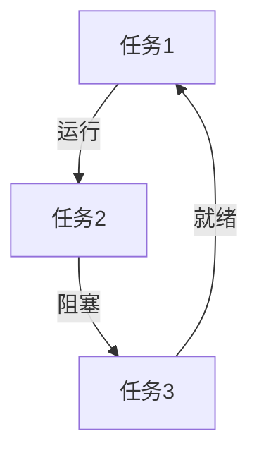

# STM32 RTOS调试技术

## 介绍

实时操作系统（RTOS）在嵌入式系统中扮演着重要角色，尤其是在STM32这样的微控制器上。RTOS允许多个任务并发执行，提高了系统的响应性和效率。然而，调试RTOS应用程序可能会比调试单线程应用程序更具挑战性，因为需要处理任务调度、资源竞争和时序问题。

本文将介绍STM32RTOS调试的基本技术，帮助初学者快速掌握调试方法。

## 调试工具

在STM32上调试RTOS应用程序时，常用的工具包括：

1. **ST-Link调试器**：ST-Link是STMicroelectronics提供的调试工具，支持JTAG和SWD接口。
2. **STM32CubeIDE**：STMicroelectronics提供的集成开发环境，内置调试功能，支持RTOS任务视图。
3. **FreeRTOS Tracealyzer**：一个强大的可视化工具，用于分析FreeRTOS任务的行为。

## 调试步骤

### 1. 配置调试环境

首先，确保你的开发环境已正确配置。在STM32CubeIDE中，选择正确的调试配置，并确保RTOS支持已启用。

```c
// 示例：在STM32CubeIDE中启用FreeRTOS支持
#include "FreeRTOS.h"
#include "task.h"
```

### 2. 使用断点

断点是调试中最基本的工具之一。你可以在代码中设置断点，以便在特定位置暂停执行，检查变量和任务状态。

```c
void vTaskFunction(void *pvParameters) {
    while (1) {
        // 设置断点
        vTaskDelay(1000 / portTICK_PERIOD_MS);
    }
}
```

### 3. 查看任务状态

在调试过程中，查看任务的状态非常重要。STM32CubeIDE提供了任务视图，可以实时显示每个任务的状态（运行、就绪、阻塞等）。



### 4. 处理资源竞争

RTOS中常见的调试问题之一是资源竞争。使用信号量（Semaphore）或互斥量（Mutex）可以避免多个任务同时访问共享资源。

```c
SemaphoreHandle_t xSemaphore = xSemaphoreCreateMutex();

void vTaskFunction(void *pvParameters) {
    while (1) {
        if (xSemaphoreTake(xSemaphore, portMAX_DELAY) == pdTRUE) {
            // 访问共享资源
            xSemaphoreGive(xSemaphore);
        }
        vTaskDelay(1000 / portTICK_PERIOD_MS);
    }
}
```

### 5. 调试时序问题

RTOS中的时序问题可能导致任务无法按时执行。使用FreeRTOS Tracealyzer可以分析任务的执行时间，找出潜在的时序问题。

```mermaid
gantt
    title 任务执行时间
    dateFormat  HH:mm:ss
    section 任务1
    任务1 :a1, 00:00:00, 1s
    section 任务2
    任务2 :a2, 00:00:01, 1s
    section 任务3
    任务3 :a3, 00:00:02, 1s
```



## 实际案例

假设你正在开发一个基于STM32的智能家居系统，其中包含多个任务：温度监控、灯光控制和用户界面更新。在调试过程中，你发现灯光控制任务偶尔无法按时执行。

通过使用STM32CubeIDE的任务视图和FreeRTOS Tracealyzer，你发现温度监控任务占用了过多的CPU时间，导致灯光控制任务被延迟。通过优化温度监控任务的优先级和使用信号量，你成功解决了这个问题。

## 总结

调试STM32RTOS应用程序需要掌握多种工具和技术。通过合理使用断点、任务视图、信号量和时序分析工具，你可以有效地解决RTOS中的常见问题。

## 附加资源

- [STM32CubeIDE用户手册](https://www.st.com/en/development-tools/stm32cubeide.html)
- [FreeRTOS官方文档](https://www.freertos.org/)
- [FreeRTOS Tracealyzer用户指南](https://percepio.com/tracealyzer/)

## 练习

1. 在STM32CubeIDE中创建一个包含两个任务的RTOS应用程序，并使用断点调试任务切换。
2. 使用FreeRTOS Tracealyzer分析一个简单的RTOS应用程序，找出潜在的时序问题。
3. 实现一个使用信号量的RTOS应用程序，确保多个任务可以安全地访问共享资源。
