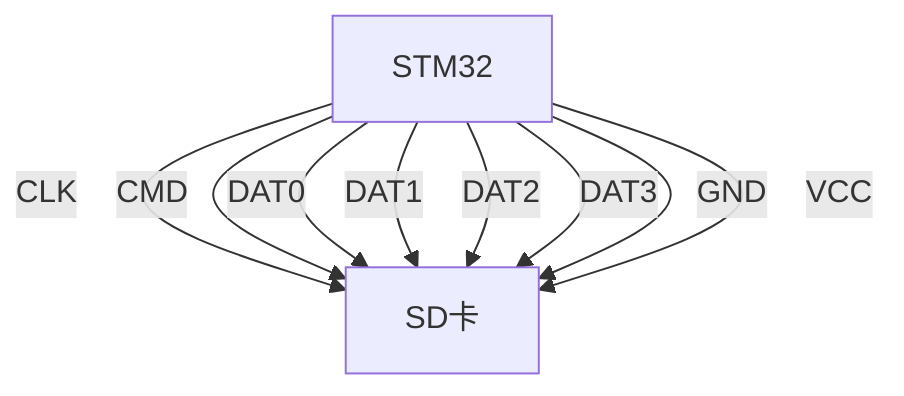
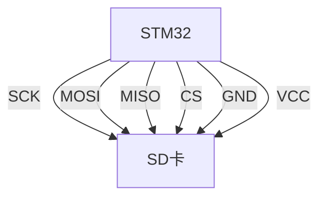

# STM32 SD卡接口

## 介绍

SD卡是一种常见的存储设备，广泛应用于嵌入式系统中。STM32微控制器通过其内置的SDIO（Secure Digital Input Output）接口或SPI接口与SD卡通信。本文将详细介绍如何在STM32上使用SD卡接口，包括硬件连接、软件配置以及实际应用案例。

## 硬件连接

### SDIO接口

STM32的SDIO接口是一种高速接口，支持SD卡和MMC卡。SDIO接口通常使用4位数据线（DAT0-DAT3）、命令线（CMD）和时钟线（CLK）。



### SPI接口

如果STM32没有SDIO接口，或者需要简化设计，可以使用SPI接口与SD卡通信。SPI接口通常使用MOSI、MISO、SCK和CS（片选）信号线。



## 软件配置

### 使用HAL库配置SDIO接口

STM32的HAL库提供了方便的API来配置SDIO接口。以下是一个简单的配置示例：

```c
#include "stm32f4xx_hal.h"

SD_HandleTypeDef hsd;

void SDIO_Init(void) {
    hsd.Instance = SDIO;
    hsd.Init.ClockEdge = SDIO_CLOCK_EDGE_RISING;
    hsd.Init.ClockBypass = SDIO_CLOCK_BYPASS_DISABLE;
    hsd.Init.ClockPowerSave = SDIO_CLOCK_POWER_SAVE_DISABLE;
    hsd.Init.BusWide = SDIO_BUS_WIDE_4B;
    hsd.Init.HardwareFlowControl = SDIO_HARDWARE_FLOW_CONTROL_DISABLE;
    hsd.Init.ClockDiv = 0;

    if (HAL_SD_Init(&hsd) != HAL_OK) {
        // 初始化错误处理
    }
}
```

### 使用SPI接口读写SD卡

如果使用SPI接口，可以使用以下代码进行初始化：

```c
#include "stm32f4xx_hal.h"

SPI_HandleTypeDef hspi;

void SPI_Init(void) {
    hspi.Instance = SPI1;
    hspi.Init.Mode = SPI_MODE_MASTER;
    hspi.Init.Direction = SPI_DIRECTION_2LINES;
    hspi.Init.DataSize = SPI_DATASIZE_8BIT;
    hspi.Init.CLKPolarity = SPI_POLARITY_LOW;
    hspi.Init.CLKPhase = SPI_PHASE_1EDGE;
    hspi.Init.NSS = SPI_NSS_SOFT;
    hspi.Init.BaudRatePrescaler = SPI_BAUDRATEPRESCALER_256;
    hspi.Init.FirstBit = SPI_FIRSTBIT_MSB;
    hspi.Init.TIMode = SPI_TIMODE_DISABLE;
    hspi.Init.CRCCalculation = SPI_CRCCALCULATION_DISABLE;
    hspi.Init.CRCPolynomial = 10;

    if (HAL_SPI_Init(&hspi) != HAL_OK) {
        // 初始化错误处理
    }
}
```

## 实际应用案例

### 数据记录器

假设我们需要设计一个数据记录器，将传感器数据存储在SD卡中。以下是一个简单的实现：

```c
void LogDataToSD(float temperature, float humidity) {
    FILE *file = fopen("data.txt", "a");
    if (file != NULL) {
        fprintf(file, "Temperature: %.2f, Humidity: %.2f\n", temperature, humidity);
        fclose(file);
    } else {
        // 文件打开错误处理
    }
}
```

:::tip
在实际应用中，建议使用FAT文件系统来管理SD卡上的文件，以便更好地组织数据。
:::

## 总结

本文介绍了如何在STM32微控制器上使用SD卡接口，包括硬件连接和软件配置。我们还通过一个实际应用案例展示了如何使用SD卡进行数据记录。希望这些内容能帮助你更好地理解STM32的SD卡接口。

## 附加资源

- [STM32 HAL库文档](https://www.st.com/en/embedded-software/stm32cube-mcu-mpu-packages.html)
- [FAT文件系统库](https://github.com/elm-chan/fatfs)

## 练习

1. 尝试使用SDIO接口读取SD卡的容量信息。
2. 使用SPI接口将一段文本写入SD卡，并验证写入的内容。
3. 设计一个简单的数据记录器，将传感器数据存储在SD卡中，并使用FAT文件系统管理文件。

:::caution
在进行硬件连接时，请确保电源和地线连接正确，避免损坏设备。
:::