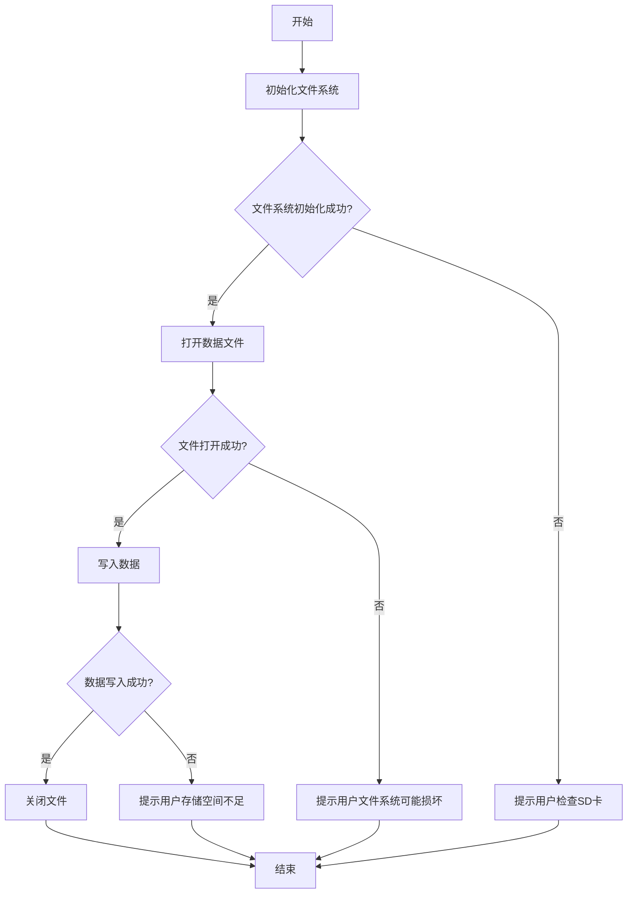

## 介绍

在嵌入式系统中，文件系统是管理存储设备（如SD卡、Flash等）上数据的重要组成部分。STM32微控制器通常使用FATFS等文件系统库来管理文件操作。然而，在实际应用中，文件系统操作可能会遇到各种错误，例如存储设备故障、文件损坏或操作超时等。因此，了解如何正确处理这些错误对于开发稳定的嵌入式应用至关重要。

本文将逐步讲解STM32文件系统中的错误处理机制，并通过代码示例和实际案例帮助初学者掌握相关技能。

## 常见错误类型

在STM32文件系统中，常见的错误类型包括：

1. **FR_DISK_ERR**：存储设备错误，通常是由于硬件故障或连接问题引起的。
2. **FR_NOT_READY**：存储设备未准备好，可能是设备未初始化或未正确插入。
3. **FR_NO_FILE**：文件未找到，可能是路径错误或文件不存在。
4. **FR_TIMEOUT**：操作超时，通常是由于设备响应过慢或通信问题引起的。
5. **FR_INVALID_OBJECT**：无效的文件或目录对象，可能是由于文件系统损坏或操作不当引起的。

## 错误处理方法

在STM32文件系统中，错误处理通常通过检查文件系统函数的返回值来实现。FATFS库中的函数通常会返回一个`FRESULT`类型的值，该值表示操作的结果。开发者可以通过检查该返回值来判断操作是否成功，并根据错误类型采取相应的处理措施。

### 示例代码

以下是一个简单的文件读取操作示例，展示了如何处理文件系统错误：

```c
#include "ff.h"

FATFS fs;  // 文件系统对象
FIL file;  // 文件对象
FRESULT res;  // 文件操作结果
UINT bytesRead;  // 读取的字节数
char buffer[100];  // 读取缓冲区

// 初始化文件系统
res = f_mount(&fs, "", 1);
if (res != FR_OK) {
    // 处理文件系统挂载错误
    printf("文件系统挂载失败: %d\n", res);
    return;
}

// 打开文件
res = f_open(&file, "example.txt", FA_READ);
if (res != FR_OK) {
    // 处理文件打开错误
    printf("文件打开失败: %d\n", res);
    return;
}

// 读取文件内容
res = f_read(&file, buffer, sizeof(buffer), &bytesRead);
if (res != FR_OK) {
    // 处理文件读取错误
    printf("文件读取失败: %d\n", res);
    f_close(&file);
    return;
}

// 关闭文件
f_close(&file);

// 输出读取的内容
printf("读取的内容: %s\n", buffer);
```

在上述代码中，我们首先尝试挂载文件系统，然后打开文件并读取其内容。在每个操作步骤中，我们都检查了`FRESULT`类型的返回值，并根据返回值判断操作是否成功。如果操作失败，我们会输出错误信息并采取相应的处理措施。

### 错误处理策略

在实际应用中，错误处理策略可以根据具体需求进行调整。以下是一些常见的错误处理策略：

1. **重试操作**：对于某些临时性错误（如`FR_TIMEOUT`），可以尝试重新执行操作。
2. **恢复操作**：对于文件系统损坏或设备故障，可以尝试恢复文件系统或重新初始化设备。
3. **日志记录**：将错误信息记录到日志中，便于后续分析和排查问题。
4. **用户提示**：在用户界面中显示错误信息，提示用户采取相应措施。

## 实际案例

假设我们正在开发一个基于STM32的数据采集系统，该系统需要将采集到的数据存储到SD卡中。在数据存储过程中，可能会遇到以下错误：

1. **SD卡未插入**：系统检测到SD卡未插入，提示用户插入SD卡。
2. **文件系统损坏**：系统检测到文件系统损坏，尝试修复文件系统或格式化SD卡。
3. **存储空间不足**：系统检测到存储空间不足，提示用户清理存储空间或更换SD卡。

以下是一个简化的错误处理流程：



在上述流程中，我们通过检查每个操作的返回值来判断操作是否成功，并根据错误类型采取相应的处理措施。

## 总结

在STM32文件系统中，错误处理是确保系统稳定运行的重要环节。通过检查文件系统函数的返回值，开发者可以及时发现和处理各种错误，从而提高系统的可靠性和用户体验。本文介绍了常见的错误类型、错误处理方法以及实际应用案例，希望能够帮助初学者更好地理解和掌握STM32文件系统错误处理的相关知识。

## 附加资源

- [FATFS官方文档](http://elm-chan.org/fsw/ff/00index_e.html)
- [STM32 HAL库文档](https://www.st.com/resource/en/user_manual/dm00105879.pdf)
- [嵌入式文件系统设计与实现](https://www.amazon.com/Embedded-File-Systems-Design-Implementation/dp/0471386782)

## 练习

1. 修改上述代码示例，使其在文件读取失败时尝试重新读取文件。
2. 设计一个错误处理流程，用于处理SD卡存储空间不足的情况。
3. 编写一个函数，用于检测文件系统是否损坏，并尝试修复文件系统。
