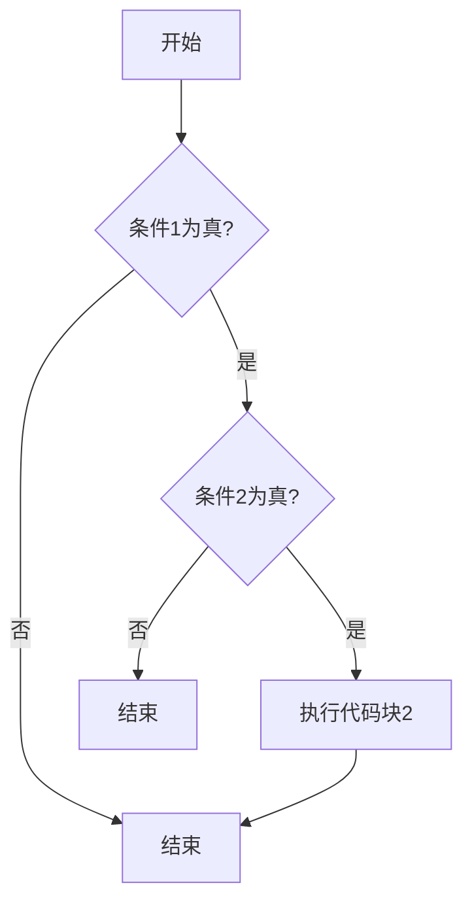

# C 语言嵌套If

在C语言中，`if`语句用于根据条件执行特定的代码块。当我们需要在满足某个条件的情况下进一步检查其他条件时，可以使用**嵌套If**。嵌套If是指在一个`if`语句的代码块中再嵌套另一个`if`语句，从而实现多层条件判断。

## 嵌套If的基本语法

嵌套If的语法非常简单，只需在一个`if`语句的代码块中再编写另一个`if`语句即可。以下是一个基本的嵌套If结构：

```c
if (条件1) {
    // 条件1为真时执行的代码
    if (条件2) {
        // 条件1和条件2都为真时执行的代码
    }
}
```

### 示例1：简单的嵌套If

让我们通过一个简单的例子来理解嵌套If的工作原理。假设我们要判断一个数是否为正数，并且进一步判断它是否为偶数。

```c
#include <stdio.h>

int main() {
    int num = 10;

    if (num > 0) {
        printf("这是一个正数。\n");
        if (num % 2 == 0) {
            printf("这是一个偶数。\n");
        }
    }

    return 0;
}
```

**输出：**
```
这是一个正数。
这是一个偶数。
```

在这个例子中，首先检查`num`是否大于0。如果条件为真，则进入第一个`if`语句的代码块，并打印“这是一个正数”。接着，在第一个`if`语句的代码块中，进一步检查`num`是否为偶数。如果条件为真，则打印“这是一个偶数”。

## 嵌套If的实际应用

嵌套If在实际编程中非常有用，尤其是在需要处理多层条件判断的情况下。以下是一个实际应用场景的示例。

### 示例2：学生成绩评级

假设我们要根据学生的分数来评定他们的等级。评级的规则如下：

- 如果分数大于等于90，评为A。
- 如果分数大于等于80且小于90，评为B。
- 如果分数大于等于70且小于80，评为C。
- 如果分数大于等于60且小于70，评为D。
- 如果分数小于60，评为F。

我们可以使用嵌套If来实现这个逻辑：

```c
#include <stdio.h>

int main() {
    int score = 85;

    if (score >= 90) {
        printf("等级：A\n");
    } else {
        if (score >= 80) {
            printf("等级：B\n");
        } else {
            if (score >= 70) {
                printf("等级：C\n");
            } else {
                if (score >= 60) {
                    printf("等级：D\n");
                } else {
                    printf("等级：F\n");
                }
            }
        }
    }

    return 0;
}
```

**输出：**
```
等级：B
```

在这个例子中，我们使用了多层嵌套If来判断学生的分数并输出相应的等级。虽然这个例子可以正常工作，但嵌套层数过多会使代码难以阅读和维护。在这种情况下，可以考虑使用`else if`来简化代码。

:::tip
**提示：** 当嵌套层数较多时，可以考虑使用`else if`或`switch`语句来简化代码结构。
:::

## 嵌套If的流程图

为了更好地理解嵌套If的执行流程，我们可以使用流程图来表示。以下是一个简单的嵌套If流程图：



在这个流程图中，程序首先检查条件1。如果条件1为真，则进一步检查条件2。如果条件2也为真，则执行相应的代码块。否则，程序直接结束。

## 总结

嵌套If是C语言中实现多层条件判断的重要工具。通过在一个`if`语句中嵌套另一个`if`语句，我们可以处理更复杂的逻辑。然而，过多的嵌套会使代码难以阅读和维护，因此在编写代码时应注意代码结构的清晰性。

:::caution
**注意：** 虽然嵌套If非常强大，但过度使用嵌套If会导致代码难以理解和维护。在编写代码时，应尽量保持代码的简洁和可读性。
:::

## 附加练习

1. 编写一个程序，判断一个年份是否为闰年。闰年的判断规则如下：
   - 如果年份能被4整除但不能被100整除，则为闰年。
   - 如果年份能被400整除，则为闰年。
   - 否则，不是闰年。

2. 修改学生成绩评级的示例，使用`else if`语句来简化代码。

通过这些练习，你将更好地掌握嵌套If的使用方法，并能够在实际编程中灵活运用。