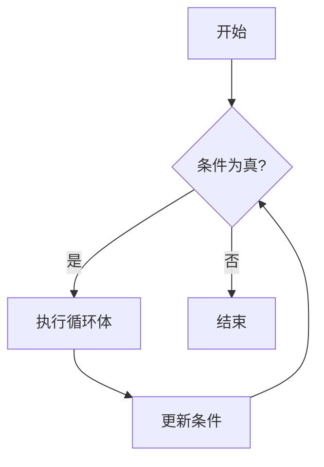

# C 语言While循环

在C语言中，循环结构是控制程序流程的重要工具之一。`while`循环是一种常见的循环结构，它允许程序在满足特定条件时重复执行一段代码。本文将详细介绍`while`循环的语法、工作原理以及实际应用场景。

## 什么是While循环？

`while`循环是一种条件循环，它会在条件为真（非零）时重复执行一段代码。与`for`循环不同，`while`循环更适合在不确定循环次数的情况下使用。

### 基本语法

```c
while (条件) {
    // 循环体
}
```

- **条件**：一个布尔表达式，如果为真（非零），则执行循环体；如果为假（零），则退出循环。
- **循环体**：需要重复执行的代码块。

### 示例

以下是一个简单的`while`循环示例，用于打印数字1到5：

```c
#include <stdio.h>

int main() {
    int i = 1;
    while (i <= 5) {
        printf("%d\n", i);
        i++;
    }
    return 0;
}
```

**输出：**
```
1
2
3
4
5
```

在这个示例中，`i`的初始值为1。`while`循环会检查`i <= 5`是否为真，如果为真，则执行循环体中的代码。每次循环结束后，`i`的值会增加1，直到`i`的值大于5时，循环结束。

## While循环的工作原理

`while`循环的执行过程可以分为以下几个步骤：

1. **条件检查**：首先，程序会检查`while`语句中的条件是否为真。
2. **执行循环体**：如果条件为真，则执行循环体中的代码。
3. **更新条件**：执行完循环体后，程序会返回到`while`语句，再次检查条件。
4. **循环结束**：如果条件为假，则退出循环，继续执行循环体之后的代码。

### 流程图



## 实际应用场景

`while`循环在实际编程中有广泛的应用，以下是一些常见的场景：

### 1. 用户输入验证

在需要用户输入时，可以使用`while`循环来确保输入的有效性。例如，要求用户输入一个正整数：

```c
#include <stdio.h>

int main() {
    int num;
    printf("请输入一个正整数: ");
    scanf("%d", &num);

    while (num <= 0) {
        printf("输入无效，请重新输入一个正整数: ");
        scanf("%d", &num);
    }

    printf("你输入的正整数是: %d\n", num);
    return 0;
}
```

在这个示例中，如果用户输入的不是正整数，程序会提示用户重新输入，直到输入有效为止。

### 2. 文件读取

在处理文件时，`while`循环可以用于逐行读取文件内容，直到文件结束：

```c
#include <stdio.h>

int main() {
    FILE *file = fopen("example.txt", "r");
    char line[100];

    if (file == NULL) {
        printf("无法打开文件\n");
        return 1;
    }

    while (fgets(line, sizeof(line), file) != NULL) {
        printf("%s", line);
    }

    fclose(file);
    return 0;
}
```

在这个示例中，`while`循环会逐行读取文件内容，直到文件结束。

## 总结

`while`循环是C语言中一种强大的控制流工具，它允许程序在满足特定条件时重复执行一段代码。通过本文的学习，你应该已经掌握了`while`循环的基本语法、工作原理以及实际应用场景。

:::tip 提示
在使用`while`循环时，务必确保循环条件能够在某个时刻变为假，否则会导致无限循环。
:::

## 附加资源与练习

- **练习1**：编写一个程序，使用`while`循环计算1到100的和。
- **练习2**：编写一个程序，使用`while`循环实现一个简单的猜数字游戏。

通过不断练习，你将更加熟练地掌握`while`循环的使用。祝你编程学习顺利！