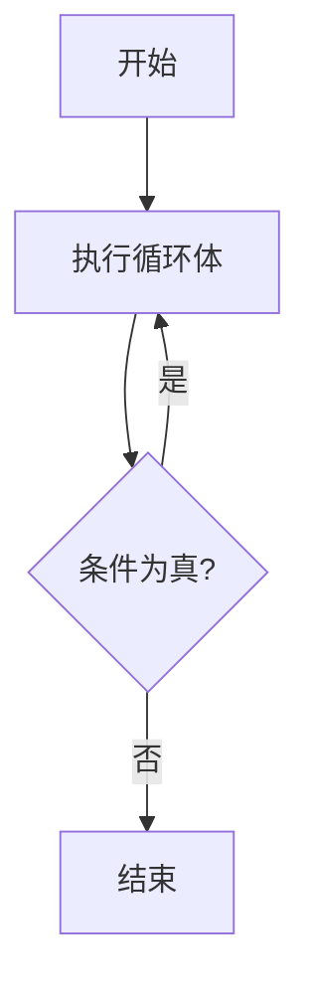

## 介绍

在C语言中，循环是一种重要的控制流结构，用于重复执行一段代码。`do while`循环是其中一种循环类型，它的特点是**至少执行一次循环体**，然后根据条件决定是否继续循环。与`while`循环不同，`do while`循环的条件判断是在循环体执行之后进行的。

## 语法

`do while`循环的基本语法如下：

```c
do {
    // 循环体
} while (条件);
```

- `do`：表示循环的开始。
- `循环体`：需要重复执行的代码块。
- `while (条件)`：在每次循环体执行后，检查条件是否为真。如果条件为真，则继续循环；否则，退出循环。

:::note
注意：`do while`循环的末尾有一个分号（`;`），这是语法的一部分，不能省略。
:::

## 工作原理

`do while`循环的执行流程如下：

1. 首先执行循环体中的代码。
2. 然后检查`while`后面的条件。
3. 如果条件为真，则回到步骤1，继续执行循环体。
4. 如果条件为假，则退出循环。



## 代码示例

以下是一个简单的`do while`循环示例，用于从用户输入中读取一个正整数，并确保输入有效：

```c
#include <stdio.h>

int main() {
    int number;

    do {
        printf("请输入一个正整数: ");
        scanf("%d", &number);
    } while (number <= 0);

    printf("你输入的正整数是: %d\n", number);

    return 0;
}
```

### 输入与输出

假设用户输入如下：

```
请输入一个正整数: -5
请输入一个正整数: 0
请输入一个正整数: 10
```

程序的输出将是：

```
你输入的正整数是: 10
```

:::tip
在这个例子中，即使用户一开始输入了负数或零，程序也会继续提示用户输入，直到输入一个正整数为止。
:::

## 实际应用场景

`do while`循环在需要**至少执行一次**的场景中非常有用。以下是一些常见的应用场景：

1. **菜单驱动程序**：在用户选择退出之前，程序需要至少显示一次菜单。
2. **输入验证**：确保用户输入的数据符合要求，如上面的示例所示。
3. **游戏循环**：在游戏结束之前，游戏逻辑需要至少执行一次。

### 示例：菜单驱动程序

以下是一个简单的菜单驱动程序示例：

```c
#include <stdio.h>

int main() {
    int choice;

    do {
        printf("1. 开始游戏\n");
        printf("2. 查看帮助\n");
        printf("3. 退出\n");
        printf("请选择: ");
        scanf("%d", &choice);

        switch (choice) {
            case 1:
                printf("游戏开始！\n");
                break;
            case 2:
                printf("帮助信息...\n");
                break;
            case 3:
                printf("退出程序。\n");
                break;
            default:
                printf("无效的选择，请重试。\n");
        }
    } while (choice != 3);

    return 0;
}
```

:::caution
在这个例子中，即使用户一开始选择了无效的选项，程序也会继续显示菜单，直到用户选择退出。
:::

## 总结

`do while`循环是C语言中一种非常有用的控制流结构，特别适用于需要至少执行一次循环体的场景。它的语法简单，易于理解，但在使用时需要注意条件的设置，以避免无限循环。

通过本文的学习，你应该已经掌握了`do while`循环的基本语法、工作原理以及实际应用场景。接下来，你可以尝试编写一些自己的`do while`循环程序，以加深对这一概念的理解。

## 附加资源与练习

### 练习

1. 编写一个程序，使用`do while`循环计算用户输入的一系列数字的平均值，直到用户输入0为止。
2. 修改上面的菜单驱动程序，添加更多的选项，并确保程序能够正确处理用户的输入。

### 附加资源

- [C语言循环结构详解](https://example.com/c-loops)（假设链接）
- [C语言编程入门指南](https://example.com/c-basics)（假设链接）
