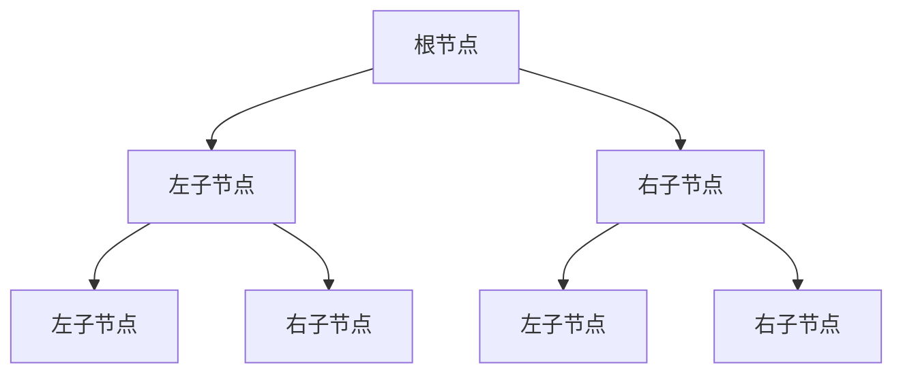

# C 语言树基础

树（Tree）是计算机科学中一种非常重要的数据结构，广泛应用于各种算法和系统中。它是一种分层的数据结构，由节点（Node）和边（Edge）组成，每个节点可以有零个或多个子节点。树结构的一个典型特点是它没有环路，即从一个节点出发，不会回到同一个节点。

## 树的基本概念

### 1. 节点（Node）
树中的每个元素称为节点。每个节点包含数据和指向其子节点的指针。

### 2. 根节点（Root）
树的最顶层节点称为根节点。它是树的起点，没有父节点。

### 3. 子节点（Child）和父节点（Parent）
一个节点的直接下级节点称为子节点，而直接上级节点称为父节点。

### 4. 叶子节点（Leaf）
没有子节点的节点称为叶子节点。

### 5. 深度（Depth）和高度（Height）
- **深度**：从根节点到某个节点的路径长度。
- **高度**：从某个节点到叶子节点的最长路径长度。

### 6. 子树（Subtree）
树中的任意一个节点及其所有后代节点构成一个子树。

## 树的表示

在C语言中，树通常通过结构体和指针来实现。以下是一个简单的二叉树节点的定义：

```c
struct TreeNode {
    int data;
    struct TreeNode* left;
    struct TreeNode* right;
};
```

在这个结构中，`data` 存储节点的值，`left` 和 `right` 是指向左子树和右子树的指针。

## 树的遍历

树的遍历是指按照某种顺序访问树中的所有节点。常见的遍历方式有三种：

### 1. 前序遍历（Pre-order Traversal）
访问顺序：根节点 -> 左子树 -> 右子树

```c
void preOrder(struct TreeNode* root) {
    if (root == NULL) return;
    printf("%d ", root->data); // 访问根节点
    preOrder(root->left);      // 遍历左子树
    preOrder(root->right);     // 遍历右子树
}
```

### 2. 中序遍历（In-order Traversal）
访问顺序：左子树 -> 根节点 -> 右子树

```c
void inOrder(struct TreeNode* root) {
    if (root == NULL) return;
    inOrder(root->left);       // 遍历左子树
    printf("%d ", root->data); // 访问根节点
    inOrder(root->right);      // 遍历右子树
}
```

### 3. 后序遍历（Post-order Traversal）
访问顺序：左子树 -> 右子树 -> 根节点

```c
void postOrder(struct TreeNode* root) {
    if (root == NULL) return;
    postOrder(root->left);     // 遍历左子树
    postOrder(root->right);    // 遍历右子树
    printf("%d ", root->data); // 访问根节点
}
```

## 实际应用场景

树结构在计算机科学中有广泛的应用，以下是一些常见的应用场景：

### 1. 文件系统
文件系统通常以树的形式组织，目录是节点，文件是叶子节点。

### 2. 数据库索引
数据库中的B树和B+树用于加速数据的查找。

### 3. 表达式解析
编译器使用树结构来解析和计算表达式。

### 4. 决策树
在机器学习中，决策树用于分类和回归任务。

## 总结

树是一种非常重要的数据结构，掌握树的基本概念和操作对于理解更复杂的算法和系统至关重要。通过本文，你应该已经了解了树的基本概念、如何在C语言中实现树结构以及树的遍历方法。

:::tip 提示
如果你对树结构感兴趣，可以尝试实现一个二叉搜索树（Binary Search Tree），并实现插入、删除和查找操作。
:::

## 附加资源

- [《算法导论》](https://mitpress.mit.edu/books/introduction-algorithms) - 深入讲解树结构及其应用。
- [LeetCode](https://leetcode.com/) - 提供大量关于树结构的练习题。



通过以上内容，你应该对C语言中的树结构有了初步的了解。继续练习和探索，你将能够更深入地掌握这一重要的数据结构。