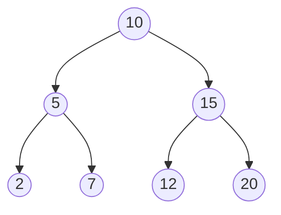

# C 语言二叉树

## 介绍

二叉树是一种常见的数据结构，广泛应用于计算机科学的各个领域。它由节点（Node）组成，每个节点最多有两个子节点，分别称为左子节点和右子节点。二叉树的一个重要特性是它的层次结构，这使得它在搜索、排序和存储数据时非常高效。

在本文中，我们将逐步讲解如何在C语言中实现二叉树，并通过实际案例展示其应用场景。

## 二叉树的基本结构

在C语言中，二叉树通常通过结构体（struct）来表示。每个节点包含数据以及指向其左右子节点的指针。

```c
struct Node {
    int data;
    struct Node* left;
    struct Node* right;
};
```

### 创建节点

我们可以通过以下代码创建一个新的二叉树节点：

```c
struct Node* createNode(int data) {
    struct Node* newNode = (struct Node*)malloc(sizeof(struct Node));
    newNode->data = data;
    newNode->left = NULL;
    newNode->right = NULL;
    return newNode;
}
```

### 插入节点

插入节点的操作通常依赖于具体的应用场景。以下是一个简单的插入示例，假设我们正在构建一个二叉搜索树（BST）：

```c
struct Node* insertNode(struct Node* root, int data) {
    if (root == NULL) {
        return createNode(data);
    }
    if (data < root->data) {
        root->left = insertNode(root->left, data);
    } else {
        root->right = insertNode(root->right, data);
    }
    return root;
}
```

## 二叉树的遍历

二叉树的遍历是指按照某种顺序访问树中的所有节点。常见的遍历方式有三种：

1. **前序遍历（Pre-order Traversal）**：先访问根节点，然后递归地访问左子树和右子树。
2. **中序遍历（In-order Traversal）**：先递归地访问左子树，然后访问根节点，最后访问右子树。
3. **后序遍历（Post-order Traversal）**：先递归地访问左子树和右子树，最后访问根节点。

以下是C语言中实现这三种遍历方式的代码：

```c
void preOrder(struct Node* root) {
    if (root == NULL) return;
    printf("%d ", root->data);
    preOrder(root->left);
    preOrder(root->right);
}

void inOrder(struct Node* root) {
    if (root == NULL) return;
    inOrder(root->left);
    printf("%d ", root->data);
    inOrder(root->right);
}

void postOrder(struct Node* root) {
    if (root == NULL) return;
    postOrder(root->left);
    postOrder(root->right);
    printf("%d ", root->data);
}
```

### 示例

假设我们有以下二叉树：



使用上述代码进行遍历，输出结果如下：

- **前序遍历**：`10 5 2 7 15 12 20`
- **中序遍历**：`2 5 7 10 12 15 20`
- **后序遍历**：`2 7 5 12 20 15 10`

## 二叉树的实际应用

二叉树在计算机科学中有广泛的应用，以下是一些常见的应用场景：

1. **二叉搜索树（BST）**：用于快速查找、插入和删除数据。
2. **堆（Heap）**：用于实现优先队列。
3. **表达式树**：用于表示数学表达式。
4. **哈夫曼树**：用于数据压缩。

### 案例：二叉搜索树

二叉搜索树是一种特殊的二叉树，其中每个节点的左子树包含的值小于该节点的值，右子树包含的值大于该节点的值。这使得二叉搜索树在查找、插入和删除操作中非常高效。

以下是一个简单的二叉搜索树实现：

```c
struct Node* search(struct Node* root, int data) {
    if (root == NULL || root->data == data) {
        return root;
    }
    if (data < root->data) {
        return search(root->left, data);
    }
    return search(root->right, data);
}
```

## 总结

二叉树是一种强大且灵活的数据结构，适用于多种应用场景。通过本文，您已经了解了如何在C语言中实现二叉树，并掌握了基本的遍历方法和实际应用。

:::tip 提示
如果您想进一步深入学习二叉树，可以尝试实现以下功能：
- 删除节点
- 计算树的高度
- 检查树是否为平衡二叉树
:::

## 附加资源

- [《算法导论》](https://mitpress.mit.edu/books/introduction-algorithms) - 一本经典的算法书籍，详细介绍了二叉树及其相关算法。
- [LeetCode](https://leetcode.com/) - 提供大量二叉树相关的编程练习题。

:::caution 注意
在实际编程中，务必注意内存管理，避免内存泄漏。使用 `malloc` 分配内存后，记得使用 `free` 释放内存。
:::