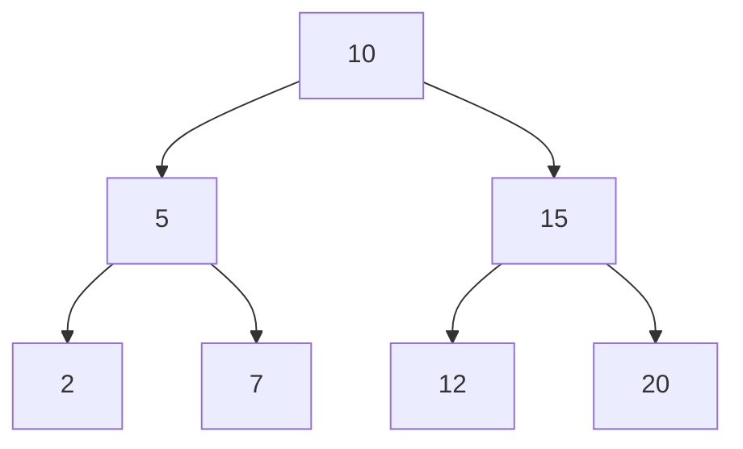

# C 语言二叉搜索树

二叉搜索树（Binary Search Tree，简称BST）是一种常见的数据结构，广泛应用于数据存储和检索。它是一种特殊的二叉树，具有以下特性：

1. **左子树**中的所有节点的值都**小于**根节点的值。
2. **右子树**中的所有节点的值都**大于**根节点的值。
3. **左右子树**也分别是二叉搜索树。

这些特性使得二叉搜索树在查找、插入和删除操作中非常高效，平均时间复杂度为O(log n)。

## 二叉搜索树的基本操作

### 1. 节点定义

在C语言中，二叉搜索树的节点通常定义为结构体：

```c
struct TreeNode {
    int data;
    struct TreeNode* left;
    struct TreeNode* right;
};
```

- `data`：存储节点的值。
- `left`：指向左子节点的指针。
- `right`：指向右子节点的指针。

### 2. 插入节点

插入节点的过程是从根节点开始，比较要插入的值与当前节点的值：

- 如果插入的值小于当前节点的值，则递归插入到左子树。
- 如果插入的值大于当前节点的值，则递归插入到右子树。
- 如果当前节点为空，则在此处插入新节点。

```c
struct TreeNode* insert(struct TreeNode* root, int data) {
    if (root == NULL) {
        struct TreeNode* newNode = (struct TreeNode*)malloc(sizeof(struct TreeNode));
        newNode->data = data;
        newNode->left = newNode->right = NULL;
        return newNode;
    }
    if (data < root->data) {
        root->left = insert(root->left, data);
    } else if (data > root->data) {
        root->right = insert(root->right, data);
    }
    return root;
}
```

**示例：**

```c
struct TreeNode* root = NULL;
root = insert(root, 10);
root = insert(root, 5);
root = insert(root, 15);
```

### 3. 查找节点

查找节点的过程与插入类似：

- 如果查找的值等于当前节点的值，返回该节点。
- 如果查找的值小于当前节点的值，递归查找左子树。
- 如果查找的值大于当前节点的值，递归查找右子树。
- 如果当前节点为空，返回NULL。

```c
struct TreeNode* search(struct TreeNode* root, int data) {
    if (root == NULL || root->data == data) {
        return root;
    }
    if (data < root->data) {
        return search(root->left, data);
    }
    return search(root->right, data);
}
```

**示例：**

```c
struct TreeNode* result = search(root, 5);
if (result != NULL) {
    printf("Node found: %d\n", result->data);
} else {
    printf("Node not found\n");
}
```

### 4. 删除节点

删除节点是二叉搜索树中最复杂的操作，需要考虑三种情况：

1. **节点没有子节点**：直接删除该节点。
2. **节点有一个子节点**：用子节点替换该节点。
3. **节点有两个子节点**：找到右子树中的最小节点（或左子树中的最大节点），用该节点的值替换当前节点的值，然后删除最小节点。

```c
struct TreeNode* deleteNode(struct TreeNode* root, int data) {
    if (root == NULL) return root;

    if (data < root->data) {
        root->left = deleteNode(root->left, data);
    } else if (data > root->data) {
        root->right = deleteNode(root->right, data);
    } else {
        if (root->left == NULL) {
            struct TreeNode* temp = root->right;
            free(root);
            return temp;
        } else if (root->right == NULL) {
            struct TreeNode* temp = root->left;
            free(root);
            return temp;
        }
        struct TreeNode* temp = minValueNode(root->right);
        root->data = temp->data;
        root->right = deleteNode(root->right, temp->data);
    }
    return root;
}

struct TreeNode* minValueNode(struct TreeNode* node) {
    struct TreeNode* current = node;
    while (current && current->left != NULL) {
        current = current->left;
    }
    return current;
}
```

**示例：**

```c
root = deleteNode(root, 5);
```

## 二叉搜索树的应用场景

二叉搜索树在许多实际应用中非常有用，例如：

1. **数据库索引**：二叉搜索树可以用于实现数据库的索引结构，加快数据检索速度。
2. **字典**：二叉搜索树可以用于实现字典，存储单词及其定义，支持快速查找。
3. **排序**：二叉搜索树的中序遍历可以得到有序的数据序列。

## 总结

二叉搜索树是一种高效的数据结构，适用于需要频繁查找、插入和删除操作的场景。通过理解其基本概念和操作，你可以在C语言中实现并应用二叉搜索树来解决实际问题。

:::tip
**练习：**
1. 实现一个函数，计算二叉搜索树的高度。
2. 实现一个函数，判断一棵二叉树是否为二叉搜索树。
:::

:::note
**附加资源：**
- [二叉搜索树 - Wikipedia](https://zh.wikipedia.org/wiki/%E4%BA%8C%E5%8F%89%E6%90%9C%E7%B4%A2%E6%A0%91)
- [C语言数据结构与算法 - 书籍推荐](https://example.com)
:::



以上是一个简单的二叉搜索树示例图，展示了节点之间的关系。