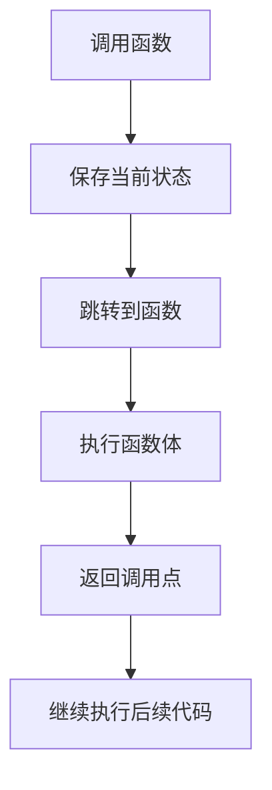

# C 语言函数调用

在C语言中，函数是程序的基本构建块之一。函数调用是执行函数的过程，它允许我们将代码组织成可重用的模块。通过函数调用，我们可以将复杂的任务分解为更小的、可管理的部分，从而提高代码的可读性和可维护性。

## 什么是函数调用？

函数调用是指在程序中执行一个函数的过程。当我们调用一个函数时，程序会跳转到该函数的定义处，执行函数体中的代码，并在函数执行完毕后返回到调用点继续执行后续代码。

### 函数调用的基本语法

在C语言中，函数调用的基本语法如下：

```c
return_type function_name(argument_list);
```

- `return_type`：函数返回值的类型。如果函数不返回任何值，则使用 `void`。
- `function_name`：函数的名称。
- `argument_list`：传递给函数的参数列表。如果函数不需要参数，则可以留空或使用 `void`。

### 示例：简单的函数调用

让我们通过一个简单的例子来理解函数调用的过程：

```c
#include <stdio.h>

// 定义一个简单的函数
void greet() {
    printf("Hello, World!\n");
}

int main() {
    // 调用 greet 函数
    greet();
    return 0;
}
```

**输出：**
```
Hello, World!
```

在这个例子中，`greet` 函数被定义为一个无返回值、无参数的函数。在 `main` 函数中，我们通过 `greet();` 调用了 `greet` 函数，程序执行时会输出 "Hello, World!"。

## 函数调用的执行过程

当我们调用一个函数时，程序的执行流程如下：

1. **保存当前状态**：程序会保存当前的执行状态，包括程序计数器（PC）和其他寄存器的值。
2. **跳转到函数**：程序跳转到被调用函数的起始地址，开始执行函数体中的代码。
3. **执行函数体**：函数体中的代码按顺序执行。
4. **返回调用点**：函数执行完毕后，程序返回到调用点，恢复之前保存的状态，并继续执行后续代码。



## 带参数的函数调用

函数可以接受参数，这些参数在函数调用时传递给函数。参数可以是基本数据类型（如 `int`、`float` 等），也可以是复杂的数据结构（如数组、指针等）。

### 示例：带参数的函数调用

```c
#include <stdio.h>

// 定义一个带参数的函数
void printSum(int a, int b) {
    int sum = a + b;
    printf("Sum: %d\n", sum);
}

int main() {
    // 调用 printSum 函数并传递参数
    printSum(5, 3);
    return 0;
}
```

**输出：**
```
Sum: 8
```

在这个例子中，`printSum` 函数接受两个整数参数 `a` 和 `b`，并计算它们的和。在 `main` 函数中，我们通过 `printSum(5, 3);` 调用了 `printSum` 函数，并传递了两个整数参数。

## 返回值与函数调用

函数可以返回一个值，这个值可以在函数调用时被捕获并用于后续的计算或操作。

### 示例：带返回值的函数调用

```c
#include <stdio.h>

// 定义一个带返回值的函数
int add(int a, int b) {
    return a + b;
}

int main() {
    // 调用 add 函数并捕获返回值
    int result = add(5, 3);
    printf("Result: %d\n", result);
    return 0;
}
```

**输出：**
```
Result: 8
```

在这个例子中，`add` 函数接受两个整数参数并返回它们的和。在 `main` 函数中，我们通过 `int result = add(5, 3);` 调用了 `add` 函数，并将返回值存储在 `result` 变量中。

## 实际应用场景

函数调用在实际编程中有广泛的应用。以下是一些常见的应用场景：

1. **代码复用**：通过将常用的代码封装成函数，可以在多个地方调用，避免重复编写相同的代码。
2. **模块化编程**：将程序分解为多个函数，每个函数负责一个特定的任务，从而提高代码的可读性和可维护性。
3. **递归**：函数可以调用自身，这种技术称为递归，常用于解决分治问题（如阶乘、斐波那契数列等）。

### 示例：递归函数调用

```c
#include <stdio.h>

// 定义一个递归函数
int factorial(int n) {
    if (n == 0) {
        return 1;
    } else {
        return n * factorial(n - 1);
    }
}

int main() {
    // 调用递归函数
    int result = factorial(5);
    printf("Factorial of 5 is: %d\n", result);
    return 0;
}
```

**输出：**
```
Factorial of 5 is: 120
```

在这个例子中，`factorial` 函数通过递归调用自身来计算一个数的阶乘。

## 总结

函数调用是C语言中非常重要的概念，它允许我们将代码组织成可重用的模块，从而提高代码的可读性和可维护性。通过理解函数调用的基本语法、执行过程以及实际应用场景，初学者可以更好地掌握C语言编程。

:::tip
**练习：**
1. 编写一个函数 `multiply`，接受两个整数参数并返回它们的乘积。
2. 编写一个递归函数 `fibonacci`，计算第 `n` 个斐波那契数。
:::

:::caution
**注意：**
- 在函数调用时，确保传递的参数类型与函数定义中的参数类型一致。
- 递归函数需要有明确的终止条件，否则会导致无限递归。
:::

通过不断练习和实践，你将能够熟练地使用函数调用来构建复杂的C语言程序。祝你学习愉快！