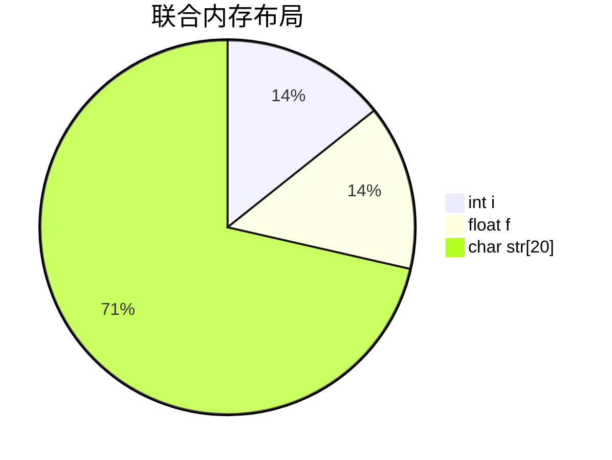

# C 语言联合基础

在C语言中，联合（union）是一种特殊的数据类型，允许在同一内存位置存储不同的数据类型。联合与结构体（struct）类似，但联合的所有成员共享同一块内存空间。这意味着联合的大小由其最大成员决定，并且任何时候只能存储其中一个成员的值。

## 联合的定义与声明

联合的定义语法与结构体非常相似，使用关键字 `union`。以下是一个简单的联合定义示例：

```c
union Data {
    int i;
    float f;
    char str[20];
};
```

在这个例子中，`Data` 是一个联合类型，包含三个成员：一个整数 `i`、一个浮点数 `f` 和一个字符数组 `str`。这些成员共享同一块内存空间。

## 联合的内存布局

联合的内存大小由其最大成员决定。例如，在上面的 `Data` 联合中，`int` 通常占用4字节，`float` 也占用4字节，而 `char str[20]` 占用20字节。因此，`Data` 联合的大小为20字节。



## 联合的使用

联合的使用方式与结构体类似，可以通过点运算符（`.`）访问其成员。以下是一个简单的示例：

```c
#include <stdio.h>

union Data {
    int i;
    float f;
    char str[20];
};

int main() {
    union Data data;

    data.i = 10;
    printf("data.i : %d\n", data.i);

    data.f = 220.5;
    printf("data.f : %.2f\n", data.f);

    strcpy(data.str, "C Programming");
    printf("data.str : %s\n", data.str);

    return 0;
}
```

**输出：**
```
data.i : 10
data.f : 220.50
data.str : C Programming
```

:::caution 注意
在联合中，同一时间只能存储一个成员的值。如果给一个成员赋值，其他成员的值将被覆盖。
:::

## 联合的实际应用场景

联合在实际编程中有多种应用场景，以下是一些常见的例子：

### 1. 节省内存

联合可以用于节省内存，特别是在需要存储多种数据类型但不同时使用的情况下。例如，在一个系统中，可能需要存储不同类型的传感器数据，但每次只使用一种数据。

```c
union SensorData {
    int temperature;
    float humidity;
    char status[10];
};
```

### 2. 类型转换

联合可以用于在不同数据类型之间进行转换。例如，可以将一个整数转换为浮点数，或者将浮点数转换为字符数组。

```c
union Converter {
    int i;
    float f;
};

int main() {
    union Converter converter;
    converter.f = 3.14;
    printf("Float: %.2f, Integer: %d\n", converter.f, converter.i);
    return 0;
}
```

**输出：**
```
Float: 3.14, Integer: 1078523331
```

:::tip 提示
这种类型转换通常用于底层编程或硬件相关的开发中，但在高级应用中应谨慎使用，以避免未定义行为。
:::

## 总结

联合是C语言中一种强大的工具，允许在同一内存位置存储不同的数据类型。它可以帮助节省内存，并在某些情况下简化代码。然而，由于联合的所有成员共享同一块内存，使用时需要格外小心，以避免数据覆盖和未定义行为。

## 附加资源与练习

- **练习1**：定义一个联合，包含 `int`、`float` 和 `char` 类型成员，并编写程序测试其内存共享特性。
- **练习2**：使用联合实现一个简单的类型转换工具，将整数转换为浮点数，并打印结果。

:::note 进一步学习
如果你想深入了解联合的高级用法，可以参考C语言标准库中的相关文档，或者阅读关于内存管理和数据类型的书籍。
:::