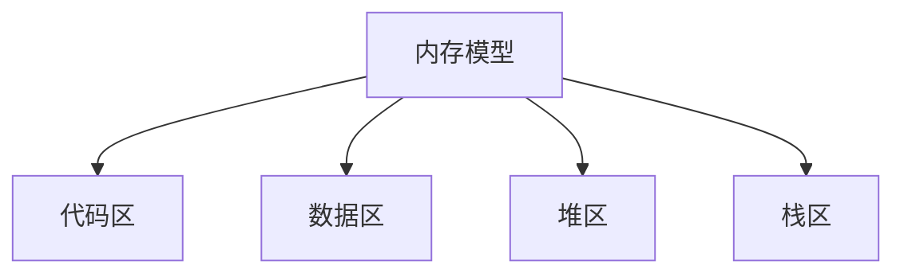

# C 语言内存模型

C语言是一种强大的编程语言，但它要求开发者手动管理内存。理解C语言的内存模型是编写高效、安全程序的关键。本文将带你深入了解C语言的内存模型，包括内存布局、栈与堆的区别以及如何管理内存。

## 什么是C语言内存模型？

C语言的内存模型描述了程序在运行时如何使用内存。它主要包括以下几个部分：

1. **代码区（Text Segment）**：存储程序的机器指令。
2. **数据区（Data Segment）**：存储全局变量和静态变量。
3. **堆区（Heap Segment）**：动态分配的内存区域。
4. **栈区（Stack Segment）**：存储局部变量和函数调用的上下文。



## 代码区（Text Segment）

代码区存储程序的机器指令。这部分内存是只读的，防止程序意外修改指令。

## 数据区（Data Segment）

数据区分为两部分：

- **初始化的数据区**：存储已初始化的全局变量和静态变量。
- **未初始化的数据区（BSS）**：存储未初始化的全局变量和静态变量。

```c
#include <stdio.h>

int global_var = 10; // 初始化的全局变量
static int static_var = 20; // 初始化的静态变量

int main() {
    printf("global_var: %d\n", global_var);
    printf("static_var: %d\n", static_var);
    return 0;
}
```

**输出：**
```
global_var: 10
static_var: 20
```

## 堆区（Heap Segment）

堆区用于动态内存分配。使用 `malloc`、`calloc`、`realloc` 和 `free` 函数来管理堆内存。

```c
#include <stdio.h>
#include <stdlib.h>

int main() {
    int *arr = (int *)malloc(5 * sizeof(int)); // 动态分配内存
    if (arr == NULL) {
        printf("内存分配失败\n");
        return 1;
    }

    for (int i = 0; i < 5; i++) {
        arr[i] = i + 1;
    }

    for (int i = 0; i < 5; i++) {
        printf("%d ", arr[i]);
    }

    free(arr); // 释放内存
    return 0;
}
```

**输出：**
```
1 2 3 4 5
```

:::caution
动态分配的内存必须手动释放，否则会导致内存泄漏。
:::

## 栈区（Stack Segment）

栈区用于存储局部变量和函数调用的上下文。栈内存的分配和释放是自动的，遵循“后进先出”的原则。

```c
#include <stdio.h>

void func() {
    int local_var = 30; // 局部变量
    printf("local_var: %d\n", local_var);
}

int main() {
    func();
    return 0;
}
```

**输出：**
```
local_var: 30
```

:::tip
栈内存的分配和释放速度很快，但栈的大小有限，不适合存储大量数据。
:::

## 实际案例

假设我们需要编写一个程序，动态创建一个数组并对其进行排序。我们可以使用堆内存来存储数组。

```c
#include <stdio.h>
#include <stdlib.h>

void bubbleSort(int arr[], int n) {
    for (int i = 0; i < n-1; i++) {
        for (int j = 0; j < n-i-1; j++) {
            if (arr[j] > arr[j+1]) {
                int temp = arr[j];
                arr[j] = arr[j+1];
                arr[j+1] = temp;
            }
        }
    }
}

int main() {
    int n;
    printf("请输入数组大小: ");
    scanf("%d", &n);

    int *arr = (int *)malloc(n * sizeof(int));
    if (arr == NULL) {
        printf("内存分配失败\n");
        return 1;
    }

    printf("请输入%d个整数: ", n);
    for (int i = 0; i < n; i++) {
        scanf("%d", &arr[i]);
    }

    bubbleSort(arr, n);

    printf("排序后的数组: ");
    for (int i = 0; i < n; i++) {
        printf("%d ", arr[i]);
    }

    free(arr);
    return 0;
}
```

**输入：**
```
请输入数组大小: 5
请输入5个整数: 5 3 4 1 2
```

**输出：**
```
排序后的数组: 1 2 3 4 5
```

## 总结

C语言的内存模型是理解和管理内存的基础。通过了解代码区、数据区、堆区和栈区的作用，你可以更好地编写高效、安全的程序。动态内存管理是C语言中的一个重要概念，务必确保分配的内存在使用后正确释放。

## 附加资源

- [C语言内存管理](https://en.wikipedia.org/wiki/C_dynamic_memory_allocation)
- [C语言栈与堆的区别](https://www.geeksforgeeks.org/stack-vs-heap-memory-allocation/)

## 练习

1. 编写一个程序，动态分配一个二维数组并初始化它。
2. 修改上面的排序程序，使其能够处理浮点数。
3. 研究并解释 `realloc` 函数的工作原理，并编写一个使用 `realloc` 的程序。

:::note
练习是巩固知识的最佳方式，尝试完成这些练习以加深对C语言内存模型的理解。
:::