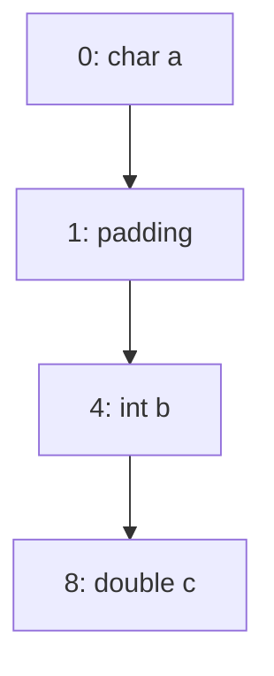

## 介绍

在C语言中，内存对齐（Memory Alignment）是指数据在内存中的存储位置需要满足特定的对齐要求。这些要求通常由硬件架构决定，目的是为了提高内存访问的效率。如果数据没有按照对齐要求存储，可能会导致性能下降，甚至在某些硬件上引发错误。

内存对齐的概念对于初学者来说可能有些抽象，但它非常重要，尤其是在处理结构体、数组和指针时。理解内存对齐可以帮助你编写更高效、更安全的代码。

## 为什么需要内存对齐？

现代计算机的CPU通常以固定大小的块（例如4字节或8字节）从内存中读取数据。如果数据没有按照这些块的大小对齐，CPU可能需要多次访问内存才能读取完整的数据，这会显著降低性能。此外，某些硬件架构（如ARM）要求数据必须对齐，否则会引发硬件异常。

## 内存对齐的基本规则

在C语言中，内存对齐的规则通常由编译器决定，但我们可以通过以下规则来理解它：

1. **基本数据类型的对齐要求**：每个基本数据类型（如`int`、`char`、`double`等）都有其自身的对齐要求。例如，`int`通常需要4字节对齐，`double`需要8字节对齐。
2. **结构体的对齐要求**：结构体的对齐要求是其成员中对齐要求最严格的那个。结构体的大小通常会填充（padding）以满足对齐要求。

## 代码示例

让我们通过一个简单的例子来理解内存对齐。

```c
#include <stdio.h>

struct Example {
    char a;    // 1字节
    int b;     // 4字节
    double c;  // 8字节
};

int main() {
    printf("Size of struct Example: %lu\n", sizeof(struct Example));
    return 0;
}
```

**输出：**
```
Size of struct Example: 16
```

在这个例子中，`struct Example`的大小是16字节，而不是简单的1 + 4 + 8 = 13字节。这是因为编译器在`char a`和`int b`之间插入了3字节的填充，以确保`int b`从4字节对齐的位置开始存储。

## 结构体的内存布局

为了更好地理解内存对齐，我们可以使用Mermaid图表来展示`struct Example`的内存布局。



在这个图表中，`char a`占据了第0字节，接下来的3字节是填充，`int b`从第4字节开始，`double c`从第8字节开始。

## 实际应用场景

内存对齐在实际编程中有很多应用场景，尤其是在以下情况下：

1. **性能优化**：在编写高性能代码时，确保数据对齐可以显著提高内存访问速度。
2. **硬件接口**：某些硬件设备要求数据必须按照特定的对齐方式存储，否则无法正常工作。
3. **跨平台开发**：不同平台的对齐要求可能不同，了解内存对齐可以帮助你编写可移植的代码。

## 总结

内存对齐是C语言中一个重要的概念，它影响着程序的性能和正确性。通过理解内存对齐的基本规则和实际应用场景，你可以编写出更高效、更安全的代码。

## 附加资源

- [C语言内存对齐详解](https://en.wikipedia.org/wiki/Data_structure_alignment)
- [GCC对齐属性](https://gcc.gnu.org/onlinedocs/gcc-4.9.2/gcc/Variable-Attributes.html)
- [ARM架构内存对齐要求](https://developer.arm.com/documentation/den0013/d/Memory-Ordering/Memory-alignment)

## 练习

1. 修改上面的代码，尝试调整结构体成员的顺序，观察结构体大小的变化。
2. 编写一个程序，使用`#pragma pack`指令改变结构体的对齐方式，观察输出结果。

:::tip
在编写涉及内存对齐的代码时，始终使用`sizeof`运算符来检查结构体的大小，以确保内存布局符合预期。
:::