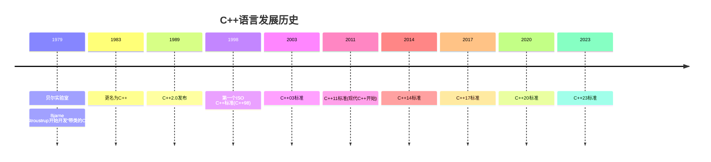
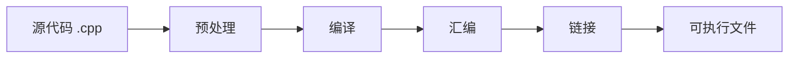

# C++ 简介

## 什么是C++？

<div style={{
    "width": "20%",
    "margin": "0 auto",
    "text-align": "center"
}}>
    
</div>

C++是一种通用型、高效、面向对象的编程语言，由Bjarne Stroustrup于1979年在贝尔实验室开发。C++最初被称为"带类的C"（C with Classes），后来在1983年更名为C++。

C++扩展了C语言的功能，增加了面向对象编程、泛型编程、异常处理等特性，使其成为一种功能强大且灵活的编程语言。C++广泛应用于系统软件、应用软件、设备驱动程序、嵌入式系统、高性能服务器和客户端应用程序以及娱乐软件（如视频游戏）等领域。

:::note
C++中的"++"来源于C语言的递增运算符，象征着C语言的增强版。
:::

## C++ 的发展历史



## C++ 的主要特点

C++作为一种综合性编程语言，具有以下几个主要特点：

1. **兼容C语言**：C++几乎完全兼容C语言，这意味着大多数C语言程序可以直接编译为C++。

2. **面向对象**：支持封装、继承和多态等面向对象编程概念。

3. **性能高效**：提供"接近硬件"的控制能力，能够进行底层操作。

4. **静态类型**：在编译时进行类型检查，有助于提前发现错误。

5. **模板支持**：通过泛型编程实现代码复用。

6. **标准库丰富**：提供大量现成的库函数和数据结构（STL）。

7. **内存管理灵活**：支持手动内存管理和RAII（资源获取即初始化）模式。

## C++ 的应用场景

C++因其高效和灵活性，在多个领域有广泛应用：

- **系统软件**：操作系统、编译器、数据库等
- **游戏开发**：游戏引擎、3D游戏等
- **嵌入式系统**：智能设备、物联网设备等
- **高性能计算**：科学计算、金融分析等
- **桌面应用**：Adobe Photoshop、Microsoft Office等
- **网络编程**：服务器开发、网络协议实现等
- **图形处理**：3D建模软件、CAD系统等

:::tip
由于其执行效率高和对资源控制精细，C++常被用于对性能要求较高的场景。
:::

## 第一个C++程序

让我们通过一个简单的"Hello, World!"程序来了解C++的基本语法结构：

```cpp
#include <iostream>

int main() {
    std::cout << "Hello, World!" << std::endl;
    return 0;
}
```

**输出结果：**
```
Hello, World!
```

### 程序解析：

1. `#include <iostream>` - 包含标准输入输出库，提供了`cout`、`cin`等功能。
2. `int main()` - 程序的主函数，程序从这里开始执行。
3. `std::cout << "Hello, World!" << std::endl;` - 输出"Hello, World!"到控制台。
   - `std::cout` 表示标准输出流
   - `<<` 是输出运算符
   - `std::endl` 表示换行并刷新缓冲区
4. `return 0;` - 返回0表示程序正常结束。

## C++ 基本语法元素

### 1. 注释

C++中有两种注释方式：

```cpp
// 这是单行注释

/* 这是多行注释
   可以跨越多行
   非常方便 */
```

### 2. 变量和数据类型

C++是强类型语言，每个变量都需要声明类型：

```cpp
#include <iostream>

int main() {
    // 整型变量
    int age = 25;
    
    // 浮点型变量
    double salary = 5000.50;
    
    // 字符型变量
    char grade = 'A';
    
    // 布尔型变量
    bool isEmployed = true;
    
    // 字符串(C++风格)
    std::string name = "John Doe";
    
    std::cout << "Name: " << name << std::endl;
    std::cout << "Age: " << age << std::endl;
    std::cout << "Salary: $" << salary << std::endl;
    std::cout << "Grade: " << grade << std::endl;
    std::cout << "Employed: " << (isEmployed ? "Yes" : "No") << std::endl;
    
    return 0;
}
```

**输出结果：**
```
Name: John Doe
Age: 25
Salary: $5000.5
Grade: A
Employed: Yes
```

### 3. 运算符

C++提供了丰富的运算符：

- **算术运算符**：`+`, `-`, `*`, `/`, `%`
- **关系运算符**：`==`, `!=`, `>`, `<`, `>=`, `<=`
- **逻辑运算符**：`&&`, `||`, `!`
- **赋值运算符**：`=`, `+=`, `-=`, `*=`, `/=`, `%=`
- **自增自减**：`++`, `--`
- **位运算符**：`&`, `|`, `^`, `~`, `<<`, `>>`

### 4. 控制流语句

```cpp
#include <iostream>

int main() {
    int score = 85;
    
    // if-else语句
    if (score >= 90) {
        std::cout << "成绩优秀！" << std::endl;
    } else if (score >= 60) {
        std::cout << "成绩及格！" << std::endl;
    } else {
        std::cout << "成绩不及格！" << std::endl;
    }
    
    // switch语句
    int day = 3;
    switch (day) {
        case 1:
            std::cout << "星期一" << std::endl;
            break;
        case 2:
            std::cout << "星期二" << std::endl;
            break;
        case 3:
            std::cout << "星期三" << std::endl;
            break;
        default:
            std::cout << "其他日子" << std::endl;
    }
    
    // 循环语句
    // for循环
    std::cout << "For循环: ";
    for (int i = 0; i < 5; i++) {
        std::cout << i << " ";
    }
    std::cout << std::endl;
    
    // while循环
    std::cout << "While循环: ";
    int j = 0;
    while (j < 5) {
        std::cout << j << " ";
        j++;
    }
    std::cout << std::endl;
    
    return 0;
}
```

**输出结果：**
```
成绩及格！
星期三
For循环: 0 1 2 3 4 
While循环: 0 1 2 3 4 
```

## C++ 编译和执行过程

C++程序从源代码到可执行程序要经过以下几个步骤：



1. **预处理**：处理所有以#开头的预处理指令（如#include, #define等）
2. **编译**：将预处理后的代码转换成汇编代码
3. **汇编**：将汇编代码转换成机器代码（目标文件）
4. **链接**：将目标文件与库文件链接，生成可执行程序

:::caution
不同操作系统上，C++的编译器和编译命令可能有所不同：
- Windows: 通常使用Visual C++, MinGW等
- Linux/macOS: 通常使用GCC或Clang
:::

## 实际应用案例

### 案例1：学生成绩管理系统

下面是一个简单的学生成绩管理系统，展示了C++的基本功能：

```cpp
#include <iostream>
#include <string>
#include <vector>
#include <algorithm>

// 学生结构体
struct Student {
    std::string name;
    int id;
    double score;
};

// 显示所有学生信息
void displayStudents(const std::vector<Student>& students) {
    std::cout << "\n学生列表：" << std::endl;
    std::cout << "----------------------------------------" << std::endl;
    std::cout << "ID\t姓名\t\t成绩" << std::endl;
    std::cout << "----------------------------------------" << std::endl;
    
    for (const auto& student : students) {
        std::cout << student.id << "\t" 
                  << student.name << "\t\t" 
                  << student.score << std::endl;
    }
    std::cout << "----------------------------------------" << std::endl;
}

int main() {
    // 创建学生容器
    std::vector<Student> students;
    
    // 添加几个学生
    students.push_back({.name = "张三", .id = 1001, .score = 85.5});
    students.push_back({.name = "李四", .id = 1002, .score = 92.0});
    students.push_back({.name = "王五", .id = 1003, .score = 78.5});
    students.push_back({.name = "赵六", .id = 1004, .score = 96.5});
    
    // 显示所有学生
    displayStudents(students);
    
    // 计算平均分
    double totalScore = 0.0;
    for (const auto& student : students) {
        totalScore += student.score;
    }
    double averageScore = totalScore / students.size();
    
    // 查找最高分和最低分
    auto maxScoreStudent = std::max_element(students.begin(), students.end(),
        [](const Student& a, const Student& b) {
            return a.score < b.score;
        });
        
    auto minScoreStudent = std::min_element(students.begin(), students.end(),
        [](const Student& a, const Student& b) {
            return a.score < b.score;
        });
    
    // 输出统计信息
    std::cout << "\n统计信息：" << std::endl;
    std::cout << "学生总数：" << students.size() << std::endl;
    std::cout << "平均分：" << averageScore << std::endl;
    std::cout << "最高分：" << maxScoreStudent->score 
              << " (学生：" << maxScoreStudent->name << ")" << std::endl;
    std::cout << "最低分：" << minScoreStudent->score 
              << " (学生：" << minScoreStudent->name << ")" << std::endl;
    
    return 0;
}
```

**输出结果：**
```
学生列表：
----------------------------------------
ID      姓名            成绩
----------------------------------------
1001    张三            85.5
1002    李四            92
1003    王五            78.5
1004    赵六            96.5
----------------------------------------

统计信息：
学生总数：4
平均分：88.125
最高分：96.5 (学生：赵六)
最低分：78.5 (学生：王五)
```

这个例子展示了C++的多种特性：
- 结构体定义
- 向量容器使用
- 范围for循环
- Lambda表达式
- 算法库使用

## 总结

C++是一种功能强大、灵活且高效的编程语言，它具有以下特点：

1. **兼容C语言**，同时提供面向对象编程支持
2. **高效性能**，适用于各种系统级和性能敏感的应用
3. **丰富的标准库**，提供了大量实用工具
4. **灵活的编程范式**，支持过程式、面向对象和泛型编程
5. **持续发展**，新标准不断增强语言功能

尽管C++有一定的学习曲线，但掌握它将使你能够开发各种类型的高性能应用程序，从简单的控制台应用到复杂的图形界面程序、游戏和系统软件。

## 练习题

1. 编写一个C++程序，计算并输出1到100之间所有偶数的和。
2. 创建一个简单的计算器程序，能够执行加、减、乘、除四种基本运算。
3. 编写一个程序，判断用户输入的年份是否为闰年。
4. 实现一个程序，生成并打印10×10的乘法表。
5. 创建一个温度转换程序，能够在摄氏度和华氏度之间相互转换。

## 进一步学习资源

- **书籍**: 
  - 《C++ Primer》by Stanley B. Lippman
  - 《Effective C++》by Scott Meyers
  - 《C++程序设计语言》by Bjarne Stroustrup

- **在线资源**:
  - [cppreference.com](https://en.cppreference.com/) - C++官方参考
  - [learncpp.com](https://www.learncpp.com/) - 免费C++教程
  - [C++ Core Guidelines](https://isocpp.github.io/CppCoreGuidelines/CppCoreGuidelines) - C++代码规范指南

在接下来的教程中，我们将深入探索C++的各个方面，包括函数、类、继承、多态、模板和标准库等高级特性。