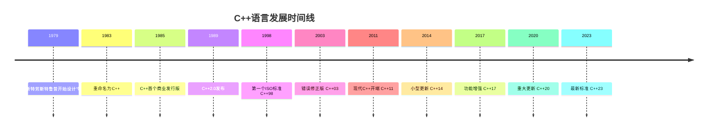

# C++ 的历史

## 引言

C++是一种通用编程语言，在全球编程语言排行榜中始终占据着重要地位。作为C语言的扩展，C++增加了面向对象编程、泛型编程等多种编程范式支持，使其成为一种功能强大且灵活的语言。了解C++的历史演进不仅能帮助初学者理解这门语言的设计理念，还能深入理解其各项功能特性背后的原因。

## C++ 的诞生

C++由丹麦计算机科学家比雅尼·斯特劳斯特鲁普(Bjarne Stroustrup)于1979年开始设计和开发。当时，他在贝尔实验室工作，需要一种能够进行系统编程同时支持更高级抽象的语言。

:::note 历史小知识
C++最初被称为"带类的C"(C with Classes)，直到1983年才正式命名为C++。名称中的"++"借用了C语言中的自增运算符，暗示它是C语言的增强版本。
:::

## 早期发展(1979-1989)

斯特劳斯特鲁普在C语言的基础上添加了类、虚函数、运算符重载、引用、常量、用户控制的内存分配和释放、改进的类型检查等特性，创建了"带类的C"。

1983年，语言被重命名为C++，并开始加入更多特性：

- 虚函数
- 函数重载
- 引用
- const关键字
- 单行注释（//）
- 内存分配/释放操作符(new/delete)

1985年，C++的第一个商业版本发布，随后在1989年C++2.0版本发布，增加了多重继承、抽象类等特性。

## 标准化时代的开始(1990-1998)

随着C++的普及，标准化工作变得必要。1990年，美国国家标准协会(ANSI)成立了一个委员会来制定C++标准，后来合并到国际标准化组织(ISO)的工作中。

1998年，第一个国际标准C++98(ISO/IEC 14882:1998)正式发布，确立了C++的核心特性：

- 标准模板库(STL)
- 异常处理
- 命名空间
- 动态类型转换
- 布尔类型

下面是一个简单的C++98代码示例：

```cpp
#include <iostream>
#include <vector>
#include <string>

int main() {
    std::vector<std::string> messages;
    messages.push_back("Hello");
    messages.push_back("C++");
    messages.push_back("98!");
    
    for(size_t i = 0; i < messages.size(); ++i) {
        std::cout << messages[i] << " ";
    }
    
    return 0;
}

// 输出: Hello C++ 98!
```

## 现代C++(2003-至今)

### C++ 03

2003年，C++标准进行了小幅修订，被称为C++03(ISO/IEC 14882:2003)，主要修复了C++98中的缺陷。

### C++ 11

2011年，C++经历了一次重大更新，C++11(ISO/IEC 14882:2011)引入了众多新特性，这被视为现代C++的开始：

- 自动类型推导(`auto`)
- 范围基于for循环
- Lambda表达式
- 智能指针
- 右值引用和移动语义
- `constexpr`关键字
- 初始化列表
- 线程支持库
- 正则表达式库
- 统一初始化语法

C++11的代码示例：

```cpp
#include <iostream>
#include <vector>
#include <memory>
#include <algorithm>

int main() {
    // 自动类型推导
    auto message = "Welcome to Modern C++";
    
    // 使用智能指针
    auto ptr = std::make_shared<std::vector<int>>();
    ptr->push_back(11);
    ptr->push_back(14);
    ptr->push_back(17);
    
    // 使用Lambda表达式和范围for循环
    std::for_each(ptr->begin(), ptr->end(), [](int x) {
        std::cout << x << " ";
    });
    
    std::cout << "\n";
    
    // 范围基于for循环
    for(const auto& num : *ptr) {
        std::cout << num << " ";
    }
    
    return 0;
}

// 输出:
// 11 14 17
// 11 14 17
```

### C++ 14

2014年，C++14(ISO/IEC 14882:2014)作为C++11的一个小增量更新发布，添加了一些便利特性：

- 泛型Lambda
- 返回类型推导
- 变量模板
- 改进的`constexpr`

### C++ 17

2017年，C++17(ISO/IEC 14882:2017)带来了更多重要更新：

- 结构化绑定
- if和switch语句中的初始化器
- 折叠表达式
- `std::optional`、`std::variant`、`std::any`
- 并行算法
- 文件系统库

C++17代码示例：

```cpp
#include <iostream>
#include <map>
#include <string>
#include <optional>

std::optional<std::string> find_value(const std::map<int, std::string>& m, int key) {
    auto it = m.find(key);
    if (it != m.end()) {
        return it->second;
    }
    return std::nullopt;
}

int main() {
    std::map<int, std::string> versions = {
        {11, "C++11"},
        {14, "C++14"},
        {17, "C++17"}
    };
    
    // 结构化绑定
    for (const auto& [key, value] : versions) {
        std::cout << key << ": " << value << "\n";
    }
    
    // if语句初始化器和std::optional
    if (auto value = find_value(versions, 17); value) {
        std::cout << "Found: " << *value << "\n";
    } else {
        std::cout << "Not found\n";
    }
    
    return 0;
}

// 输出:
// 11: C++11
// 14: C++14
// 17: C++17
// Found: C++17
```

### C++ 20

2020年，C++20(ISO/IEC 14882:2020)发布，这是自C++11以来最大的一次更新：

- 概念(Concepts)
- 协程(Coroutines)
- 范围(Ranges)
- 模块(Modules)
- 三向比较运算符(`<=>`)
- 格式化库(std::format)

C++20代码示例：

```cpp
#include <iostream>
#include <concepts>
#include <string>

// 使用概念(Concepts)定义约束
template<typename T>
concept Printable = requires(T x) {
    { std::cout << x } -> std::same_as<std::ostream&>;
};

// 使用概念约束模板函数
template<Printable T>
void print(const T& value) {
    std::cout << value << std::endl;
}

int main() {
    print("C++20 introduced concepts!");
    print(20);
    
    // 使用三向比较运算符
    auto result = (20 <=> 10);
    if (result > 0) {
        std::cout << "20 is greater than 10" << std::endl;
    }
    
    return 0;
}

// 输出:
// C++20 introduced concepts!
// 20
// 20 is greater than 10
```

### C++ 23

C++23(ISO/IEC 14882:2023)是最新的标准，包含了许多新特性：

- 标准库中的模块
- `std::expected`
- 对并发编程的改进
- 多维下标运算符

## C++ 语言发展时间线

以下是C++主要版本发布的时间线：



## C++ 的影响和应用

C++在众多领域有着广泛的应用：

1. **系统软件和操作系统**：
   - Windows操作系统的大部分内核和驱动程序
   - macOS和iOS的部分内核组件
   - 许多Linux内核驱动程序

2. **游戏开发**：
   - 大多数游戏引擎(如Unreal Engine、Unity的部分组件)
   - 3D图形API(如DirectX)
   
3. **嵌入式系统**：
   - 汽车电子系统
   - 医疗设备
   - 航空电子设备
   
4. **高性能计算**：
   - 科学模拟
   - 金融建模
   - 机器学习框架(如TensorFlow的C++ API)
   
5. **数据库**：
   - MongoDB
   - MySQL
   - Redis

6. **Web浏览器**：
   - Chromium(Chrome, Edge等基于此)
   - Firefox

:::caution 实际应用中的C++
在实际应用中，C++通常被用于性能要求高、资源受限或需要精确控制内存管理的场景。例如，一个视频游戏引擎需要高效处理物理模拟、3D渲染和AI，这些都是C++的强项。
:::

## 总结

C++自1979年诞生以来，已经走过了40多年的发展历程。从最初的"带类的C"到如今支持多种编程范式的成熟语言，C++不断吸收新的编程理念和实践，同时保持着对高效率和灵活性的追求。

C++的发展史反映了计算机科学和软件工程领域的进步。从早期简单的面向对象扩展，到后来融入泛型编程、函数式编程元素，再到最新标准中的概念和协程支持，C++始终在演进。

尽管C++有时被批评过于复杂，但它的设计理念"你不需要为你不使用的功能付出代价"(You don't pay for what you don't use)使其成为许多关键系统和应用的首选语言。

## 练习与资源

### 练习

1. 研究并列出C++98与C++11之间的五个主要区别，并解释这些变化如何影响程序开发。
2. 编写一个简短的程序，展示C++11引入的至少三个新特性。
3. 找出一个你经常使用的软件，查询它是否使用了C++，如果是，尝试了解为什么开发者选择了C++。

### 额外资源

- 《C++程序设计语言》 - 比雅尼·斯特劳斯特鲁普著
- [CPPReference](https://en.cppreference.com) - C++语言完整参考
- [ISO C++委员会官方网站](https://isocpp.org)
- [C++标准草案](https://github.com/cplusplus/draft)
- [CppCon会议视频](https://www.youtube.com/user/CppCon)

通过学习C++的历史，你不仅能理解这门语言的设计决策，还能更好地把握C++的精神实质，从而在实践中更有效地运用这一工具。