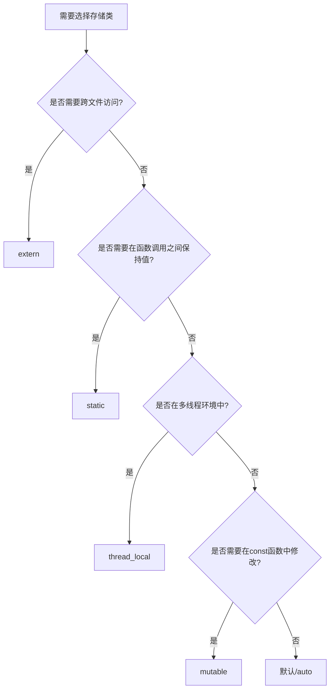

# C++ 存储类

在C++编程中，存储类定义了变量和函数的范围（可见性）和生命周期。了解这些存储类可以帮助你更好地控制程序中变量的行为，优化内存使用，并解决复杂的编程问题。

## 什么是存储类？

存储类是用来指定变量或函数的存储方式、可见性（作用域）和生命周期的关键字。C++提供了以下几种存储类：

- auto（C++11之前）
- register
- static
- extern
- mutable
- thread_local（C++11引入）

## auto存储类

:::note
在C++11之前，`auto`关键字用作存储类说明符，表示变量是自动存储的局部变量。
在C++11及以后版本中，`auto`关键字的作用发生了变化，用于自动类型推导。
:::

### C++ 11之前的auto

在C++11之前，`auto`关键字表示变量是具有自动存储持续时间的局部变量，也就是说，变量在进入其定义所在的块时创建，在退出该块时销毁。

```cpp
void function() {
    auto int x = 10;  // 旧版C++中的用法，现在不推荐
    // x的作用域仅限于此函数内部
}
```

### C++ 11之后的auto

在现代C++中，`auto`关键字用于自动类型推导，编译器会根据变量的初始化表达式自动确定其类型。

```cpp
#include <iostream>
#include <vector>
#include <string>

int main() {
    auto i = 42;           // i是int类型
    auto d = 3.14;         // d是double类型
    auto s = "Hello";      // s是const char*类型
    
    std::vector<int> v = {1, 2, 3};
    auto it = v.begin();   // it是std::vector<int>::iterator类型
    
    return 0;
}
```

## register存储类

`register`关键字用于请求编译器将变量存储在CPU的寄存器中，而不是内存中，以提高访问速度。然而，在现代C++中，编译器通常会自动进行优化，决定哪些变量适合放入寄存器，因此这个关键字的使用变得不那么重要。

:::caution
在C++17中，`register`关键字被废弃，仅保留作为保留字，不再具有特殊含义。
:::

```cpp
#include <iostream>

int main() {
    register int counter = 0;  // 建议编译器将counter存放在寄存器中
    
    for(counter = 0; counter < 1000; counter++) {
        // 频繁访问的变量，放在寄存器中可能会提高性能
    }
    
    std::cout << "Counter: " << counter << std::endl;
    return 0;
}
```

## static存储类

`static`关键字在C++中有两种主要用途：

1. 静态局部变量：在函数内部声明的静态变量在函数多次调用期间保持其值。
2. 静态全局变量/函数：限制变量或函数的可见性只在声明它的文件内。

### 静态局部变量

```cpp
#include <iostream>

void count() {
    static int counter = 0;  // 只初始化一次
    counter++;
    std::cout << "Function called " << counter << " times" << std::endl;
}

int main() {
    for (int i = 0; i < 5; i++) {
        count();  // 调用5次count函数
    }
    return 0;
}
```

**输出：**
```
Function called 1 times
Function called 2 times
Function called 3 times
Function called 4 times
Function called 5 times
```

### 静态全局变量/函数

**文件1: file1.cpp**
```cpp
// 静态全局变量，只在本文件可见
static int count = 0;

// 静态函数，只在本文件可见
static void incrementCount() {
    count++;
}

// 非静态函数，可以从其他文件访问
int getCount() {
    incrementCount();
    return count;
}
```

**文件2: file2.cpp**
```cpp
#include <iostream>

// 声明外部函数
extern int getCount();

// 尝试访问静态函数或变量将导致错误
// extern void incrementCount();  // 错误：无法访问file1.cpp中的静态函数
// extern int count;             // 错误：无法访问file1.cpp中的静态变量

int main() {
    std::cout << "Count: " << getCount() << std::endl;
    return 0;
}
```

## extern存储类

`extern`关键字用于声明在其他文件中定义的全局变量或函数，实现跨文件共享变量。

**文件1: globals.cpp**
```cpp
// 定义一个全局变量
int globalVar = 100;

// 定义一个全局函数
void globalFunction() {
    globalVar += 10;
}
```

**文件2: main.cpp**
```cpp
#include <iostream>

// 声明外部变量和函数
extern int globalVar;
extern void globalFunction();

int main() {
    std::cout << "初始值: " << globalVar << std::endl;
    globalFunction();
    std::cout << "调用函数后: " << globalVar << std::endl;
    return 0;
}
```

**输出：**
```
初始值: 100
调用函数后: 110
```

## mutable存储类

`mutable`关键字用于声明类的成员变量可以在const成员函数中被修改。

```cpp
#include <iostream>

class Counter {
private:
    int value;
    mutable int accessCount;  // 即使在const对象中也可以修改

public:
    Counter(int v = 0) : value(v), accessCount(0) {}
    
    int getValue() const {
        accessCount++;  // 可以在const函数中修改mutable成员
        return value;
    }
    
    int getAccessCount() const {
        return accessCount;
    }
};

int main() {
    const Counter c(10);  // 创建const对象
    
    std::cout << "值: " << c.getValue() << std::endl;
    std::cout << "访问次数: " << c.getAccessCount() << std::endl;
    
    std::cout << "值: " << c.getValue() << std::endl;
    std::cout << "访问次数: " << c.getAccessCount() << std::endl;
    
    return 0;
}
```

**输出：**
```
值: 10
访问次数: 1
值: 10
访问次数: 2
```

## thread_local存储类（C++11）

`thread_local`声明的变量在每个线程中都有其自己的副本，这对于编写多线程应用程序非常有用。

```cpp
#include <iostream>
#include <thread>
#include <vector>

thread_local int counter = 0;  // 每个线程都有自己的counter副本

void threadFunction(int id) {
    counter += id;  // 修改当前线程的counter副本
    std::cout << "线程 " << id << " 的counter值: " << counter << std::endl;
}

int main() {
    std::vector<std::thread> threads;
    
    for (int i = 1; i <= 5; ++i) {
        threads.push_back(std::thread(threadFunction, i));
    }
    
    for (auto& t : threads) {
        t.join();
    }
    
    std::cout << "主线程的counter值: " << counter << std::endl;  // 仍然是0
    
    return 0;
}
```

**可能的输出（顺序可能不同）：**
```
线程 1 的counter值: 1
线程 2 的counter值: 2
线程 3 的counter值: 3
线程 4 的counter值: 4
线程 5 的counter值: 5
主线程的counter值: 0
```

## 存储类选择指南

以下是选择适当存储类的一般指南：



## 实际应用案例

### 计数器类

这个例子展示了使用静态成员变量实现一个对象计数器：

```cpp
#include <iostream>
#include <string>

class User {
private:
    std::string name;
    static int userCount;  // 所有对象共享的静态成员

public:
    User(const std::string& n) : name(n) {
        userCount++;
        std::cout << "创建用户: " << name << ", 当前用户数: " << userCount << std::endl;
    }
    
    ~User() {
        userCount--;
        std::cout << "删除用户: " << name << ", 当前用户数: " << userCount << std::endl;
    }
    
    static int getUserCount() {
        return userCount;
    }
};

// 静态成员变量需要在类外初始化
int User::userCount = 0;

int main() {
    std::cout << "初始用户数: " << User::getUserCount() << std::endl;
    
    {
        User u1("Alice");
        User u2("Bob");
        
        std::cout << "块内用户数: " << User::getUserCount() << std::endl;
        
        {
            User u3("Charlie");
            std::cout << "嵌套块用户数: " << User::getUserCount() << std::endl;
        }  // u3被销毁
        
        std::cout << "内部块结束后用户数: " << User::getUserCount() << std::endl;
    }  // u1和u2被销毁
    
    std::cout << "最终用户数: " << User::getUserCount() << std::endl;
    
    return 0;
}
```

**输出：**
```
初始用户数: 0
创建用户: Alice, 当前用户数: 1
创建用户: Bob, 当前用户数: 2
块内用户数: 2
创建用户: Charlie, 当前用户数: 3
嵌套块用户数: 3
删除用户: Charlie, 当前用户数: 2
内部块结束后用户数: 2
删除用户: Bob, 当前用户数: 1
删除用户: Alice, 当前用户数: 0
最终用户数: 0
```

### 单例模式实现

使用静态局部变量实现线程安全的单例模式：

```cpp
#include <iostream>
#include <string>

class Singleton {
private:
    Singleton() {
        std::cout << "Singleton实例已创建" << std::endl;
    }
    
    // 禁止拷贝和赋值
    Singleton(const Singleton&) = delete;
    Singleton& operator=(const Singleton&) = delete;

public:
    static Singleton& getInstance() {
        // C++11保证静态局部变量的初始化是线程安全的
        static Singleton instance;
        return instance;
    }
    
    void doSomething() {
        std::cout << "Singleton正在执行某些操作" << std::endl;
    }
};

int main() {
    // 第一次调用getInstance()会创建实例
    Singleton& s1 = Singleton::getInstance();
    s1.doSomething();
    
    // 第二次调用返回相同的实例
    Singleton& s2 = Singleton::getInstance();
    s2.doSomething();
    
    // s1和s2是同一个实例
    std::cout << "s1和s2是" << (&s1 == &s2 ? "相同" : "不同") << "的实例" << std::endl;
    
    return 0;
}
```

**输出：**
```
Singleton实例已创建
Singleton正在执行某些操作
Singleton正在执行某些操作
s1和s2是相同的实例
```

## 总结

理解C++的存储类是提高编程效率和代码质量的重要一步。不同的存储类具有不同的用途：

- 现代C++中的`auto`用于自动类型推导（不再作为存储类使用）
- `register`用于优化性能（在现代C++中已被弃用）
- `static`用于控制变量生命周期和可见性
- `extern`用于在多个文件之间共享变量和函数
- `mutable`允许const成员函数修改特定成员
- `thread_local`保证每个线程拥有变量的独立副本

根据你的需求选择适当的存储类可以帮助你创建更加高效、安全和可维护的代码。

## 练习

1. 创建一个使用静态变量的函数，每次调用时返回一个递增的数字。
2. 实现一个类，使用mutable成员变量来跟踪类方法的调用次数。
3. 使用thread_local创建一个线程ID管理系统，每个线程可以独立获取自己的唯一ID。
4. 创建两个文件，演示如何使用extern关键字在它们之间共享变量。
5. 编写一个使用静态成员实现的资源池类，限制可以创建的实例数量。

:::tip
尝试这些练习将帮助你巩固对C++存储类的理解，并学会在实际编程中合理运用它们！
:::