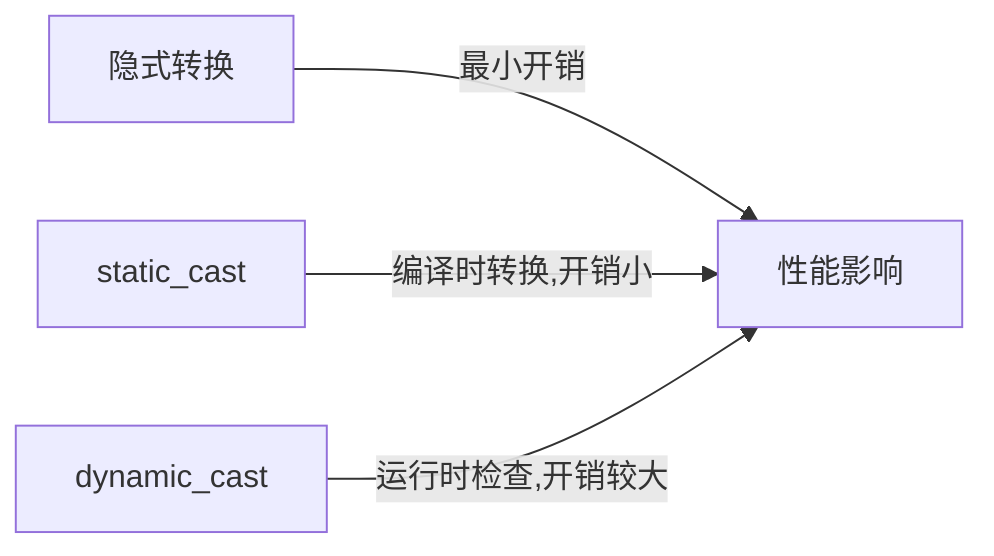

# C++ 类型转换

在C++编程中，类型转换是指将一种数据类型的值转换为另一种数据类型。类型转换在不同数据类型之间传递数据时非常有用，但如果使用不当，也可能导致数据丢失或程序错误。本文将全面介绍C++中的类型转换机制。

## 类型转换的基本概念

类型转换可以分为两大类：

1. **隐式类型转换**：由编译器自动执行的转换
2. **显式类型转换**：由程序员明确指定的转换

## 隐式类型转换

隐式类型转换（也称为自动类型转换）是编译器在不需要显式指令的情况下自动执行的转换。

### 数值提升

当较小的整数类型参与运算时，它们会被提升为较大的整数类型：

```cpp
short a = 10;
int b = 20;
auto result = a + b;  // a 被提升为 int，result 的类型为 int
```

### 数值转换

不同数值类型之间的转换：

```cpp
int i = 42;
double d = i;  // int 转换为 double，不会丢失数据
```

### 可能导致精度损失的转换

```cpp
double d = 3.14159;
int i = d;  // double 转换为 int，小数部分被截断，i = 3
```

:::caution 警告
隐式转换可能导致数据丢失或精度损失，特别是当从更大或精度更高的类型转换为较小或精度较低的类型时。
:::

## 显式类型转换（C风格）

C++继承了C语言的类型转换语法，即使用括号来指定目标类型：

```cpp
double pi = 3.14159;
int intPi = (int)pi;  // C风格的类型转换，intPi = 3
```

或者使用函数式语法：

```cpp
int intPi = int(pi);  // 函数式语法，结果同上
```

:::warning 注意
C风格的类型转换功能强大但危险，因为它可以执行任何类型之间的转换而不进行安全检查。
:::

## 现代C++类型转换运算符

为了解决C风格类型转换的安全问题，C++引入了四种专门的类型转换运算符：

### 1. static_cast

`static_cast` 用于执行非多态类型之间的转换，它在编译时执行类型检查：

```cpp
double d = 3.14159;
int i = static_cast<int>(d);  // 转换为整型，i = 3

int j = 10;
double e = static_cast<double>(j);  // 整型转换为浮点型，e = 10.0
```

适用场景：
- 基本数据类型之间的转换
- 子类指针转换为父类指针（向上转型）
- 明确安全的类型转换

### 2. dynamic_cast

`dynamic_cast` 主要用于在继承层次结构中进行安全的向下转型：

```cpp
class Base { 
public:
    virtual ~Base() {}  // 必须有至少一个虚函数才能使用dynamic_cast
};

class Derived : public Base { };

Base* basePtr = new Derived();
// 安全地将基类指针转换为派生类指针
Derived* derivedPtr = dynamic_cast<Derived*>(basePtr);

if (derivedPtr) {
    // 转换成功
} else {
    // 转换失败
}
```

适用场景：
- 检查继承关系中的对象类型
- 只能用于含有虚函数的类层次结构中

### 3. const_cast

`const_cast` 用于添加或移除变量的const或volatile属性：

```cpp
const int c = 10;
int* nonConstPtr = const_cast<int*>(&c);  // 移除const属性
```

:::caution 警告
虽然通过`const_cast`移除了const限定符，但修改原始const对象仍是未定义行为！
:::

适用场景：
- 调用需要非const参数的函数，但你只有const变量
- 临时去除const限定，但不应修改原始const对象

### 4. reinterpret_cast

`reinterpret_cast` 执行低级别的重新解释转换，它可以将任何指针类型转换为任何其他指针类型：

```cpp
int i = 42;
// 将int指针重新解释为char指针
char* charPtr = reinterpret_cast<char*>(&i);
```

:::warning 危险
`reinterpret_cast` 是最危险的转换操作符，它的结果通常是平台相关的，可能导致不可预测的行为。
:::

适用场景：
- 指针和整数之间的转换
- 完全不相关的指针类型之间的转换
- 底层系统编程或与硬件交互

## 类型转换的实际应用场景

### 数值处理

```cpp
// 整数除法中获取精确结果
int a = 5;
int b = 2;
double result = static_cast<double>(a) / b;  // 2.5，而不是2
```

### 用户输入处理

```cpp
#include <iostream>
#include <string>

int main() {
    std::string input;
    std::cout << "请输入一个数字: ";
    std::cin >> input;
    
    try {
        int number = std::stoi(input);  // 字符串转换为整数
        std::cout << "您输入的数字是: " << number << std::endl;
    } catch (const std::invalid_argument&) {
        std::cout << "输入无效，不是一个数字" << std::endl;
    } catch (const std::out_of_range&) {
        std::cout << "数字超出整数范围" << std::endl;
    }
    
    return 0;
}
```

### 多态和类层次结构

```cpp
class Animal {
public:
    virtual void makeSound() = 0;
    virtual ~Animal() {}
};

class Dog : public Animal {
public:
    void makeSound() override { std::cout << "汪汪!" << std::endl; }
    void wagTail() { std::cout << "摇尾巴" << std::endl; }
};

class Cat : public Animal {
public:
    void makeSound() override { std::cout << "喵喵!" << std::endl; }
};

void petAnimal(Animal* animal) {
    animal->makeSound();
    
    // 尝试将animal转换为Dog以调用特定方法
    Dog* dog = dynamic_cast<Dog*>(animal);
    if (dog) {
        dog->wagTail();
    }
}
```

## 类型转换的最佳实践

1. **优先使用现代C++的转换操作符**，避免使用C风格转换
2. **避免依赖隐式转换**，尤其是在可能导致数据丢失的情况下
3. **谨慎使用`const_cast`和`reinterpret_cast`**，这些通常是特殊需求的解决方案
4. **使用`dynamic_cast`检查运行时类型**，而不是假设对象是某种类型

## 类型转换的性能考虑

类型转换通常有少量性能开销：



`dynamic_cast` 的运行时类型检查会引入额外开销，特别是在性能关键的代码中应谨慎使用。

## 总结

类型转换是C++编程中的基础概念，正确掌握各种类型转换方法对编写健壮的程序至关重要：

- **隐式转换**由编译器自动执行
- **C风格转换**(int)x 功能强大但不安全
- **现代C++转换操作符**提供了更安全、更明确的类型转换方式：
  - `static_cast` 用于一般类型转换
  - `dynamic_cast` 用于多态类型的安全向下转型
  - `const_cast` 用于修改类型的const或volatile限定符
  - `reinterpret_cast` 用于底层的重新解释转换

为了编写安全、可维护的代码，应该优先使用现代C++转换操作符而非C风格转换，并尽量避免可能导致未定义行为的危险转换。

## 练习

1. 编写一个程序，将浮点数转换为整数，并比较不同转换方法的结果（四舍五入、向上取整、向下取整）。
2. 创建一个多态类层次结构，并使用`dynamic_cast`安全地在不同类型之间转换。
3. 尝试使用`static_cast`和C风格转换执行相同的转换，比较两者的差异。

## 进一步阅读

- C++标准库中的数值转换函数（如std::stoi, std::stod等）
- RTTI (Run-Time Type Information) 和`typeid`操作符
- C++20中的新概念约束和requires表达式

通过深入理解C++的类型转换机制，你将能够编写更加安全、可靠的代码，并避免许多常见的编程陷阱。