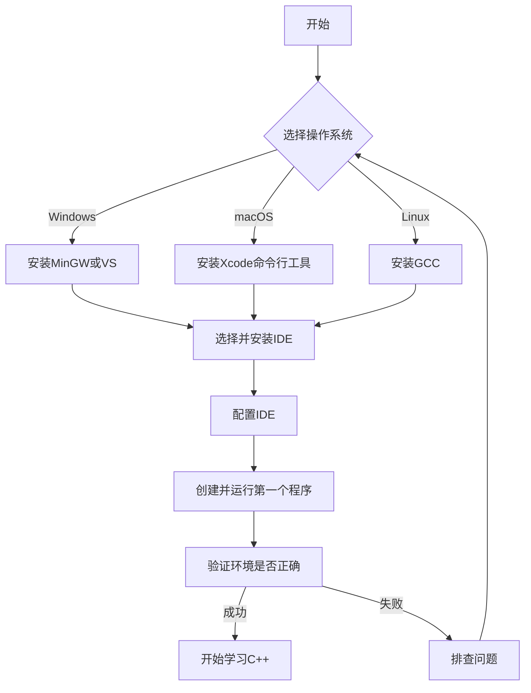

# C++ 环境设置

## 介绍

在开始学习C++编程之前，我们需要先搭建一个适合的开发环境。正确的环境设置不仅能让你顺利编写、编译和运行C++程序，还能提高开发效率。本文将详细介绍如何在不同操作系统上设置C++开发环境，包括编译器的安装、集成开发环境(IDE)的选择与配置等内容。

## C++ 编译器

C++是一种需要编译的编程语言，这意味着我们编写的代码需要通过编译器转换成计算机能够理解和执行的机器代码。以下是几种主流的C++编译器：

1. **GCC (GNU Compiler Collection)**：Linux系统自带，也可用于Windows和macOS
2. **Clang**：支持多平台，性能优秀
3. **Microsoft Visual C++ (MSVC)**：Windows平台的主流编译器

## 在不同操作系统上安装C++编译器

### Windows系统

在Windows上，我们有几种选择：

#### 1. MinGW-w64 (GCC的Windows版本)

1. 访问[MinGW-w64官网](https://mingw-w64.org/doku.php)下载安装程序
2. 运行安装程序，选择适合的版本（通常选择最新版本）
3. 将MinGW的bin目录添加到系统环境变量Path中

#### 2. Visual Studio Community Edition

1. 下载并安装[Visual Studio Community Edition](https://visualstudio.microsoft.com/vs/community/)
2. 在安装过程中，选择"使用C++的桌面开发"工作负载
3. 完成安装后，Visual Studio将包含MSVC编译器

### macOS系统

在macOS上，可以使用以下方法：

1. 安装Xcode命令行工具（包含Clang编译器）：
   ```bash
   xcode-select --install
   ```

2. 或者通过Homebrew安装GCC：
   ```bash
   brew install gcc
   ```

### Linux系统

大多数Linux发行版已预装GCC。如果需要安装：

1. Ubuntu/Debian：
   ```bash
   sudo apt-get update
   sudo apt-get install build-essential
   ```

2. Fedora/RHEL/CentOS：
   ```bash
   sudo dnf install gcc-c++
   ```

## 验证编译器安装

安装完成后，打开命令行/终端，输入以下命令验证编译器是否正确安装：

```bash
g++ --version  # 对于GCC
clang++ --version  # 对于Clang
cl  # 对于MSVC（在Visual Studio开发者命令提示符中）
```

## 选择集成开发环境(IDE)

虽然可以使用任何文本编辑器编写C++代码，但一个好的IDE能大大提高开发效率。以下是一些流行的C++ IDE选择：

### 1. Visual Studio

- **优点**：功能全面，包含编译器、调试器等
- **适用平台**：Windows，macOS（有限功能）
- **适合人群**：初学者到专业开发者

### 2. Visual Studio Code

- **优点**：轻量级，高度可定制，丰富的插件
- **适用平台**：Windows，macOS，Linux
- **适合人群**：喜欢简洁界面的开发者

### 3. CLion

- **优点**：智能代码助手，强大的重构工具
- **适用平台**：Windows，macOS，Linux
- **适合人群**：专业开发者（需付费）

### 4. Code::Blocks

- **优点**：开源免费，易于使用
- **适用平台**：Windows，macOS，Linux
- **适合人群**：初学者

## IDE配置指南

下面以Visual Studio Code（VS Code）为例，介绍如何配置C++开发环境：

### 1. 安装VS Code

从[VS Code官网](https://code.visualstudio.com/)下载并安装。

### 2. 安装C++扩展

1. 打开VS Code
2. 进入扩展视图（按Ctrl+Shift+X）
3. 搜索并安装"C/C++"扩展（由Microsoft提供）

### 3. 配置VS Code

在VS Code中创建一个项目文件夹，然后需要两个配置文件：

#### tasks.json（构建任务配置）

在VS Code中，按Ctrl+Shift+P，输入"Tasks: Configure Default Build Task"，选择"Create tasks.json file from template"，然后选择"Others"。将生成的文件修改为：

```json
{
    "version": "2.0.0",
    "tasks": [
        {
            "label": "build",
            "type": "shell",
            "command": "g++",
            "args": [
                "-g",
                "${file}",
                "-o",
                "${fileDirname}/${fileBasenameNoExtension}"
            ],
            "group": {
                "kind": "build",
                "isDefault": true
            }
        }
    ]
}
```

#### launch.json（调试配置）

按Ctrl+Shift+P，输入"Debug: Open launch.json"，选择"C++ (GDB/LLDB)"。修改生成的文件：

```json
{
    "version": "0.2.0",
    "configurations": [
        {
            "name": "g++ build and debug active file",
            "type": "cppdbg",
            "request": "launch",
            "program": "${fileDirname}/${fileBasenameNoExtension}",
            "args": [],
            "stopAtEntry": false,
            "cwd": "${workspaceFolder}",
            "environment": [],
            "externalConsole": false,
            "MIMode": "gdb",
            "setupCommands": [
                {
                    "description": "Enable pretty-printing for gdb",
                    "text": "-enable-pretty-printing",
                    "ignoreFailures": true
                }
            ],
            "preLaunchTask": "build",
            "miDebuggerPath": "gdb"
        }
    ]
}
```

:::note
Windows用户可能需要将 `program` 的值修改为 `"${fileDirname}\\${fileBasenameNoExtension}.exe"`，并根据GDB的实际安装路径调整 `miDebuggerPath`。
:::

## 第一个C++程序

现在，让我们创建并运行一个简单的C++程序以验证环境设置是否正确：

1. 在VS Code中，创建一个名为`hello.cpp`的新文件
2. 输入以下代码：

```cpp
#include <iostream>

int main() {
    std::cout << "Hello, C++ World!" << std::endl;
    return 0;
}
```

3. 保存文件（Ctrl+S）
4. 构建并运行程序（在VS Code中按F5）

如果一切设置正确，程序将编译并运行，输出：

```
Hello, C++ World!
```

## 环境设置流程图

下面是一个简化的C++环境设置流程图：



## 实际应用场景

### 场景1：学生项目

小明是一名大学生，需要为编程课程完成C++项目。他在Windows笔记本上安装了MinGW和VS Code，配置好环境后，能够编写、编译和调试他的课程作业，这为他提供了良好的学习体验。

### 场景2：跨平台开发

张工程师需要开发一个能够在Windows和Linux上运行的应用程序。她在两个操作系统上都安装了相同的开发环境（GCC编译器和VS Code），这样就能确保代码在不同平台上的一致性。

### 场景3：团队协作

一个开发团队决定统一使用相同的IDE和编译器，以确保所有成员都能在相同的环境中工作。他们选择了VS Code加GCC的组合，并创建了一个详细的环境设置文档，使新加入的成员能够快速搭建开发环境。

## 总结

本文介绍了如何在不同操作系统上设置C++开发环境，包括：

1. 安装适合的C++编译器（GCC、Clang或MSVC）
2. 选择并配置IDE（如VS Code、Visual Studio等）
3. 创建并运行第一个C++程序

正确设置开发环境是学习C++的第一步，它将为你后续的编程学习提供良好的基础。随着你对C++的深入学习，可以根据需要进一步优化开发环境。

## 练习与资源

### 练习

1. 尝试在你的计算机上安装不同的编译器，比较它们的性能和使用体验
2. 使用不同的IDE编写并运行同一个C++程序，体验不同IDE的特点
3. 学习如何使用命令行手动编译C++程序

### 附加资源

- [C++ 编译器和IDE比较](https://www.stroustrup.com/compilers.html) - 由C++创始人Bjarne Stroustrup维护
- [VS Code C++文档](https://code.visualstudio.com/docs/languages/cpp)
- [GCC官方文档](https://gcc.gnu.org/onlinedocs/)

:::tip
对于初学者来说，最好选择一个编译器和IDE组合并坚持使用，直到熟悉C++基础。这样可以避免在工具使用上花费过多时间，而将更多精力投入到学习语言本身。
:::