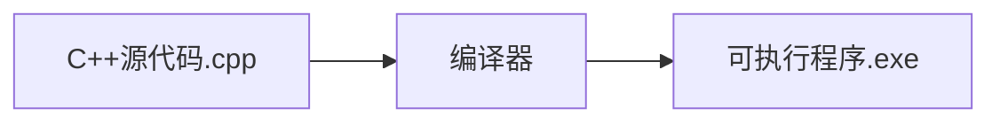

# C++ 编译器安装

## 什么是C++编译器？

C++编译器是一种将你编写的C++源代码转换为计算机可执行程序的软件工具。在开始C++编程之旅之前，安装一个适合的编译器是第一步。编译器的作用是将你的高级C++代码翻译成机器能够理解和执行的低级指令。



## 为什么需要编译器？

与Python等解释型语言不同，C++是一种编译型语言，这意味着：

1. 你的代码必须先被编译成机器可执行的格式
2. 编译后的程序通常运行更快
3. 编译过程会捕获许多潜在错误

## 不同平台的编译器选择

### Windows平台

#### 1. Visual Studio

Visual Studio是微软开发的集成开发环境(IDE)，它包含了C++编译器(Visual C++)和丰富的开发工具。

**安装步骤：**

1. 访问[Visual Studio下载页面](https://visualstudio.microsoft.com/)
2. 下载"Visual Studio Community"版本(免费)
3. 运行安装程序
4. 在工作负载选择界面，选择"使用C++的桌面开发"
5. 点击安装

:::tip
Visual Studio包含完整的IDE，如果你只需要编译器，可以选择只安装"MSVC编译器工具集"。
:::

#### 2. MinGW-w64 (GCC for Windows)

MinGW-w64是GCC编译器的Windows版本，体积较小，适合轻量级开发。

**安装步骤：**

1. 访问[MinGW-w64下载页面](https://www.mingw-w64.org/)
2. 下载适合你系统的安装包
3. 运行安装程序，选择安装路径
4. 安装完成后，将bin目录添加到系统PATH环境变量

**验证安装：**
打开命令提示符，输入：

```bash
g++ --version
```

如果显示版本信息，则安装成功。

### macOS平台

#### 1. Xcode Command Line Tools

macOS上最简单的方法是安装Xcode Command Line Tools，它包含了GCC/Clang编译器。

**安装步骤：**

1. 打开终端
2. 输入以下命令：

```bash
xcode-select --install
```

3. 在弹出的对话框中点击"安装"

**验证安装：**
在终端输入：

```bash
g++ --version
# 或
clang++ --version
```

#### 2. Homebrew安装GCC

如果你需要最新版本的GCC，可以通过Homebrew安装：

```bash
brew install gcc
```

### Linux平台

Linux平台通常预装了GCC编译器，如果没有，可以通过包管理器安装。

**Ubuntu/Debian：**

```bash
sudo apt update
sudo apt install build-essential
```

**Fedora/RHEL：**

```bash
sudo dnf install gcc-c++ make
```

**验证安装：**
在终端输入：

```bash
g++ --version
```

## 配置集成开发环境(IDE)

虽然你可以使用任何文本编辑器编写C++代码，但IDE能提供更多便利功能。

### 1. Visual Studio Code (跨平台)

VS Code是一个轻量级但功能强大的代码编辑器，可通过插件支持C++开发。

**安装步骤：**

1. 从[VS Code官网](https://code.visualstudio.com/)下载并安装
2. 安装C/C++扩展：
   - 打开VS Code
   - 转到Extensions(Ctrl+Shift+X)
   - 搜索"C++"并安装Microsoft的C/C++扩展

**配置步骤：**

1. 创建一个C++文件，例如`hello.cpp`
2. VS Code会提示配置编译器
3. 按照向导完成配置，选择已安装的编译器

### 2. Code::Blocks (跨平台)

Code::Blocks是一个专门为C/C++设计的开源IDE。

**安装步骤：**

1. 访问[Code::Blocks下载页面](http://www.codeblocks.org/downloads/)
2. Windows用户：下载包含MinGW的版本
3. 其他平台：下载适合的版本并安装

## 创建并运行第一个C++程序

现在你已经安装并配置了编译器，让我们创建一个简单的"Hello World"程序：

1. 创建一个名为`hello.cpp`的文件，内容如下：

```cpp
#include <iostream>

int main() {
    std::cout << "Hello, C++ World!" << std::endl;
    return 0;
}
```

2. 使用命令行编译并运行(以GCC为例)：

```bash
g++ hello.cpp -o hello
./hello  # Linux/macOS
hello.exe  # Windows
```

3. 输出结果：

```
Hello, C++ World!
```

## 常见问题解决

### 1. 找不到编译器

**症状：** 命令行提示"命令未找到"

**解决方案：**
- 确保编译器安装正确
- 检查PATH环境变量是否包含编译器路径
- Windows用户可能需要重启命令提示符或电脑

### 2. 编译错误

**症状：** 编译时显示错误信息

**解决方案：**
- 仔细阅读错误信息，它通常会指出问题所在
- 检查代码中的语法错误，如缺少分号、括号不匹配等
- 确保所有必要的库都已包含

### 3. IDE无法找到编译器

**症状：** IDE报告无法找到编译器

**解决方案：**
- 在IDE设置中手动指定编译器路径
- 确保编译器版本与IDE兼容
- 重新安装编译器或IDE

## 编译器进阶知识

### 编译器选项

gcc/g++编译器有许多有用的选项：

```bash
g++ -Wall -Wextra -std=c++17 hello.cpp -o hello
```

- `-Wall -Wextra`: 启用警告
- `-std=c++17`: 使用C++17标准
- `-o hello`: 指定输出文件名

### 多文件编译

对于由多个源文件组成的项目：

```bash
g++ main.cpp utils.cpp -o program
```

## 总结

安装C++编译器是开始C++编程的第一步。在本教程中，我们学习了：

- 什么是C++编译器及其作用
- 如何在Windows、macOS和Linux上安装编译器
- 如何配置常用IDE
- 如何创建并运行第一个C++程序
- 如何解决常见问题

随着你对C++的深入学习，你可能会探索更多编译器功能，如优化选项、调试工具等。但现在，你已经准备好了开始你的C++学习之旅！

## 练习

1. 安装适合你操作系统的C++编译器
2. 配置一个IDE或文本编辑器
3. 创建、编译并运行"Hello World"程序
4. 尝试修改程序，让它打印你的名字
5. 探索编译器的一些基本选项，如`-Wall`和`-std=c++17`

## 进一步学习资源

- [C++ Reference](https://en.cppreference.com/w/) - C++语言和标准库的综合参考
- [Learn C++](https://www.learncpp.com/) - 免费的C++教程
- [Compiler Explorer](https://godbolt.org/) - 在线工具，可以查看不同编译器生成的汇编代码

:::caution
请记住，不同编译器可能会有略微不同的行为和支持的语言特性。如果你正在学习使用特定教程或课程，最好使用与教程相同的编译器版本。
:::