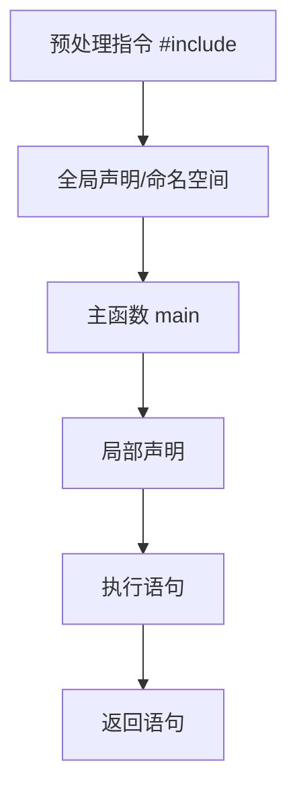

# C++ 第一个程序

在编程学习的道路上，第一个程序往往是最令人难忘的。本文将带领你完成C++的"Hello World"程序，这是踏入C++编程世界的第一步。通过这个简单的例子，你将了解C++程序的基本结构和运行过程。

## 什么是"Hello World"程序？

"Hello World"是几乎所有编程语言入门教程中的第一个示例程序。它的目标很简单：在屏幕上显示"Hello World"这个文本信息。虽然看起来非常简单，但它包含了运行一个完整程序所需的所有基本元素。

## 环境准备

在开始编写C++程序之前，你需要：

1. 一个文本编辑器（如Notepad++, Visual Studio Code等）
2. 一个C++编译器（如GCC, MinGW, Visual C++等）

:::tip
如果你不想安装专门的软件，可以使用在线C++编译器如[https://www.programiz.com/cpp-programming/online-compiler/](https://www.programiz.com/cpp-programming/online-compiler/)进行学习。
:::

## 编写你的第一个C++程序

现在，让我们开始编写第一个C++程序：

```cpp
#include <iostream>

int main() {
    std::cout << "Hello, World!" << std::endl;
    return 0;
}
```

保存这个文件，命名为`hello.cpp`。

## 代码解析

让我们逐行分析这个看似简单的程序：

1. `#include <iostream>`
   - 这是一个**预处理指令**，告诉编译器包含`iostream`头文件
   - `iostream`提供了输入/输出功能，如`cout`（用于输出）和`cin`（用于输入）

2. `int main()`
   - 这定义了程序的**主函数**
   - 每个C++程序必须有且只有一个`main`函数
   - `int`表示函数会返回一个整数值

3. 大括号`{` `}`
   - 它们界定了函数的内容（代码块）

4. `std::cout << "Hello, World!" << std::endl;`
   - `std::`表示使用标准命名空间
   - `cout`是用于输出的对象
   - `<<`是输出操作符，将右侧内容发送到左侧
   - `"Hello, World!"`是要显示的文本字符串
   - `std::endl`表示换行并刷新输出缓冲区

5. `return 0;`
   - 函数结束时返回值0，表示程序成功执行
   - 操作系统通常使用这个返回值来确定程序是否正常结束

## 编译与运行程序

程序编写完成后，需要进行编译和运行：

### 使用命令行编译（以GCC为例）

1. 打开命令提示符或终端
2. 导航到保存`hello.cpp`的目录
3. 输入编译命令：
   ```bash
   g++ hello.cpp -o hello
   ```
4. 运行编译后的程序：
   ```bash
   ./hello  # 在Linux/Mac上
   hello.exe  # 在Windows上
   ```

### 输出结果

当程序成功运行后，你会看到以下输出：

```
Hello, World!
```

恭喜！你已经成功创建并运行了你的第一个C++程序。

## 简化版本

在很多C++教程中，你可能会看到使用`using namespace std;`来简化代码：

```cpp
#include <iostream>
using namespace std;

int main() {
    cout << "Hello, World!" << endl;
    return 0;
}
```

:::caution
虽然这种方式看起来更简洁，但在大型项目中可能导致命名冲突。作为初学者，了解两种写法都是有益的。
:::

## 实际应用场景

虽然"Hello World"程序看起来非常简单，但它包含的元素是构建复杂C++程序的基础：

1. **嵌入式系统测试** - 在编程微控制器时，"Hello World"常被用来验证开发环境配置是否正确
2. **软件安装验证** - 安装新的编译器或IDE后，运行此程序可以验证环境是否正常工作
3. **基础教学** - 它展示了程序结构、编译流程和基本输出操作

## C++ 程序的基本结构



## 常见问题与解决方案

### 编译错误

如果你看到类似于以下的错误：

```
hello.cpp:4:10: error: 'cout' was not declared in this scope
```

可能是因为你忘记了包含`iostream`头文件或没有使用`std::`前缀。

### 运行错误

如果程序编译成功但没有输出，检查：
- 是否正确使用了`cout`
- 文本是否被正确包含在引号中
- 程序是否包含正确的分号

## 拓展知识：Hello World的历史

"Hello World"程序的概念源自1978年Brian Kernighan和Dennis Ritchie的经典著作《C程序设计语言》。从那时起，它就成为了几乎所有编程语言教程的标准入门程序。

## 总结

在这篇教程中，我们：
- 创建了第一个C++程序
- 了解了C++程序的基本结构
- 学习了如何编译和运行C++程序
- 分析了代码的每个部分及其功能

这只是C++编程的开始。随着学习的深入，你将了解更复杂的概念和功能。但记住，即使是最复杂的程序也是由这些基础构建块组成的。

## 练习

1. 修改程序，使其输出你的名字
2. 尝试在一行中输出多个不同的文本
3. 使用多个`cout`语句输出一个简单的图形（如星号组成的三角形）
4. 探索如何使用`cin`获取用户输入，并输出一个个性化的问候语

## 进一步阅读

- C++标准库文档，特别是关于`<iostream>`的部分
- C++编译过程的更多细节
- C++中的命名空间概念

现在，你已经迈出了C++编程的第一步。继续前进，更多精彩等待你去发现！