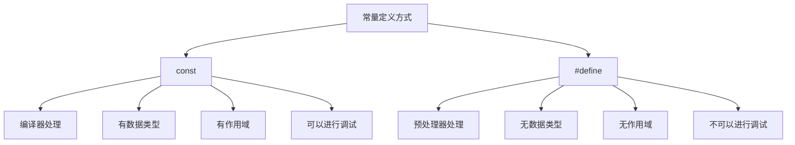

# C++ 常量

在编程世界中，常量是一种一旦定义后其值就不能被改变的数据。C++中的常量对于编写安全、可靠的代码非常重要，它们确保程序中的某些值保持不变。本文将全面介绍C++中常量的概念、类型以及使用方法。

## 什么是常量？

常量是指在程序执行过程中值不会发生变化的数据。与变量不同，常量一旦被定义，其值就不能被修改。使用常量可以：

- 提高程序的可读性
- 减少编码错误
- 便于程序维护
- 提高编译优化效率

## C++ 中的常量类型

### 字面常量

字面常量是直接出现在程序中的数值、字符或字符串，例如：

```cpp
int main() {
    // 以下都是字面常量
    42;      // 整型常量
    3.14;    // 浮点型常量
    'A';     // 字符常量
    "Hello"; // 字符串常量
    true;    // 布尔常量
    
    return 0;
}
```

### 使用`const`关键字定义常量

`const`关键字用于声明一个具名常量，其值在程序运行期间不能被改变。

```cpp
#include <iostream>
using namespace std;

int main() {
    const int MAX_SCORE = 100;
    const double PI = 3.14159;
    const char GRADE = 'A';
    const string MESSAGE = "Welcome";
    
    cout << "最大分数: " << MAX_SCORE << endl;
    cout << "圆周率: " << PI << endl;
    cout << "等级: " << GRADE << endl;
    cout << "信息: " << MESSAGE << endl;
    
    // 以下代码会导致编译错误
    // MAX_SCORE = 99; // 错误：不能修改常量
    
    return 0;
}
```

输出：
```
最大分数: 100
圆周率: 3.14159
等级: A
信息: Welcome
```

### 使用`#define`预处理指令定义常量

除了`const`关键字外，C++还保留了C语言中使用`#define`定义常量的方式：

```cpp
#include <iostream>
using namespace std;

// 使用#define定义常量
#define PI 3.14159
#define MAX_STUDENTS 30
#define COMPANY_NAME "ABC Corp"

int main() {
    cout << "圆周率: " << PI << endl;
    cout << "最大学生数: " << MAX_STUDENTS << endl;
    cout << "公司名称: " << COMPANY_NAME << endl;
    
    return 0;
}
```

输出：
```
圆周率: 3.14159
最大学生数: 30
公司名称: ABC Corp
```

:::caution
虽然`#define`可以定义常量，但在C++中更推荐使用`const`关键字，因为`const`提供了类型检查，而且可以限制作用域，更加安全。
:::

## `const`和`#define`的区别

尽管两者都可以定义常量，但它们有着显著的区别：



## 常量的高级用法

### 枚举常量

枚举是一种用户自定义类型，可以定义一组相关的常量：

```cpp
#include <iostream>
using namespace std;

int main() {
    enum Days { SUNDAY, MONDAY, TUESDAY, WEDNESDAY, THURSDAY, FRIDAY, SATURDAY };
    
    Days today = FRIDAY;
    
    cout << "今天是周几(数字表示): " << today << endl; // 输出5
    
    if (today == FRIDAY) {
        cout << "周五快乐!" << endl;
    }
    
    return 0;
}
```

输出：
```
今天是周几(数字表示): 5
周五快乐!
```

### 常量指针和指针常量

C++中，常量与指针结合使用时有两种情况：

```cpp
#include <iostream>
using namespace std;

int main() {
    int x = 10;
    int y = 20;
    
    // 指向常量的指针 - 指针指向的值不能通过该指针修改
    const int* p1 = &x;
    // *p1 = 30; // 错误：不能通过p1修改x的值
    p1 = &y;     // 正确：可以改变p1指向的地址
    
    // 常量指针 - 指针本身的值(即指向的地址)不能改变
    int* const p2 = &x;
    *p2 = 30;    // 正确：可以通过p2修改x的值
    // p2 = &y;  // 错误：不能改变p2指向的地址
    
    // 指向常量的常量指针 - 既不能改变指向的地址，也不能修改指向的值
    const int* const p3 = &x;
    // *p3 = 40; // 错误
    // p3 = &y;  // 错误
    
    cout << "x = " << x << endl;
    cout << "y = " << y << endl;
    
    return 0;
}
```

输出：
```
x = 30
y = 20
```

## 常量表达式和`constexpr`

C++11引入了`constexpr`关键字，用于编译时常量表达式：

```cpp
#include <iostream>
using namespace std;

// 常量表达式函数
constexpr int square(int n) {
    return n * n;
}

int main() {
    // 编译时计算
    constexpr int result = square(5);
    cout << "5的平方是: " << result << endl;
    
    // 数组大小必须是常量表达式
    int arr[square(3)]; // 有效：数组大小为9
    
    return 0;
}
```

输出：
```
5的平方是: 25
```

## 实际应用案例

### 案例1：配置常量

在实际项目中，常量常用于存储配置信息：

```cpp
#include <iostream>
using namespace std;

// 游戏配置常量
const int SCREEN_WIDTH = 1024;
const int SCREEN_HEIGHT = 768;
const string GAME_TITLE = "Adventure Quest";
const int MAX_PLAYERS = 4;
const float GRAVITY = 9.8f;

int main() {
    cout << "游戏初始化中..." << endl;
    cout << "标题: " << GAME_TITLE << endl;
    cout << "分辨率: " << SCREEN_WIDTH << " x " << SCREEN_HEIGHT << endl;
    cout << "最大玩家数: " << MAX_PLAYERS << endl;
    cout << "重力系数: " << GRAVITY << endl;
    
    return 0;
}
```

输出：
```
游戏初始化中...
标题: Adventure Quest
分辨率: 1024 x 768
最大玩家数: 4
重力系数: 9.8
```

### 案例2：数学计算库

常量在数学计算中非常重要：

```cpp
#include <iostream>
#include <cmath>
using namespace std;

// 数学常量
const double PI = 3.14159265358979323846;
const double E = 2.71828182845904523536;
const double GOLDEN_RATIO = 1.61803398874989484820;

// 使用常量的函数
double circleArea(double radius) {
    return PI * radius * radius;
}

double cylinderVolume(double radius, double height) {
    return PI * radius * radius * height;
}

int main() {
    double radius = 5.0;
    double height = 10.0;
    
    cout << "圆面积(半径为" << radius << "): " << circleArea(radius) << endl;
    cout << "圆柱体积(半径为" << radius << ", 高为" << height << "): " 
         << cylinderVolume(radius, height) << endl;
    cout << "自然对数的底: " << E << endl;
    cout << "黄金比例: " << GOLDEN_RATIO << endl;
    
    return 0;
}
```

输出：
```
圆面积(半径为5): 78.5398
圆柱体积(半径为5, 高为10): 785.398
自然对数的底: 2.71828
黄金比例: 1.61803
```

## 最佳实践

使用常量时，请遵循以下最佳实践：

1. 对于简单常量，优先使用`const`而不是`#define`
2. 常量名通常全部大写，单词间用下划线分隔
3. 将多个相关常量放在一起，例如使用枚举或命名空间
4. 对于编译时求值的常量，考虑使用`constexpr`
5. 适当使用注释解释复杂常量的含义

:::tip
养成使用常量而非魔法数字（magic numbers）的习惯，这样可以使代码更易读、易维护。
:::

## 总结

本文详细介绍了C++中常量的概念、类型和使用方法：

- 字面常量：直接出现在代码中的值
- `const`关键字定义的常量：有类型、有作用域的常量
- `#define`预处理指令定义的常量：无类型、全局作用域的常量
- 枚举常量：用于表示一组相关常量的方式
- 常量指针和指针常量：与指针相关的常量概念
- `constexpr`：编译时常量表达式

常量是C++编程中一个简单但重要的概念，合理使用常量可以提高代码的可读性、可维护性和安全性。

## 练习

1. 定义一组表示一周七天的枚举常量，并编写程序判断给定的日子是否是周末。
2. 创建一个简单的温度转换程序，使用常量定义转换公式中的固定值。
3. 实现一个使用常量指针的函数，该函数可以显示数组元素但不能修改它们。
4. 编写一个使用`constexpr`函数计算斐波那契数列第n项的程序。
5. 创建一个小型配置系统，使用常量存储应用程序的配置信息。

## 进一步学习资源

- C++官方文档中关于常量的部分
- 《C++ Primer》第2章：变量和基本类型
- 《Effective C++》条款2：尽量以const, enum, inline代替#define

通过掌握常量的使用，你将能够编写更加健壮和可维护的C++代码。希望本文能帮助你更好地理解C++中的常量概念！