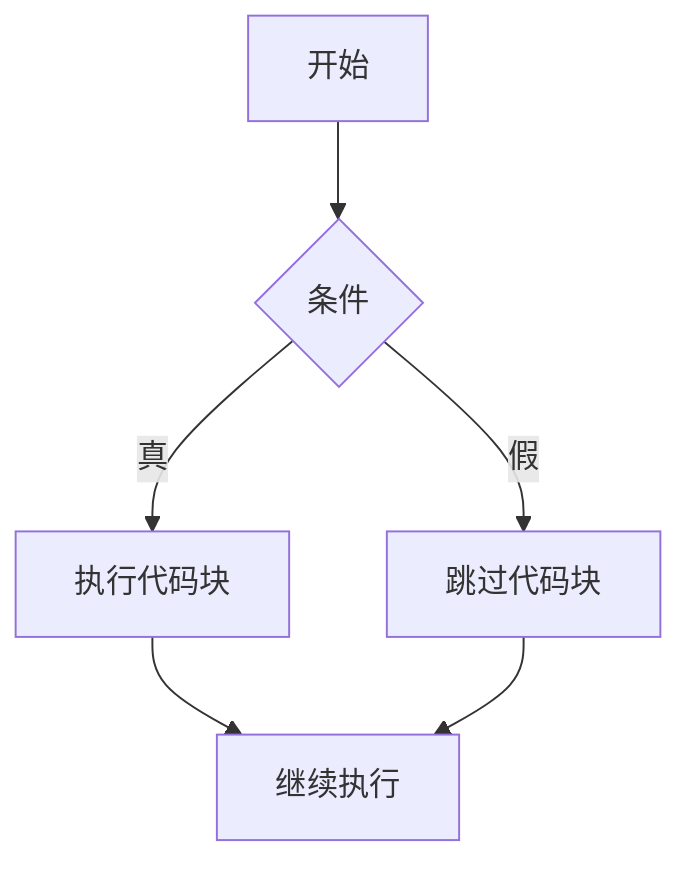
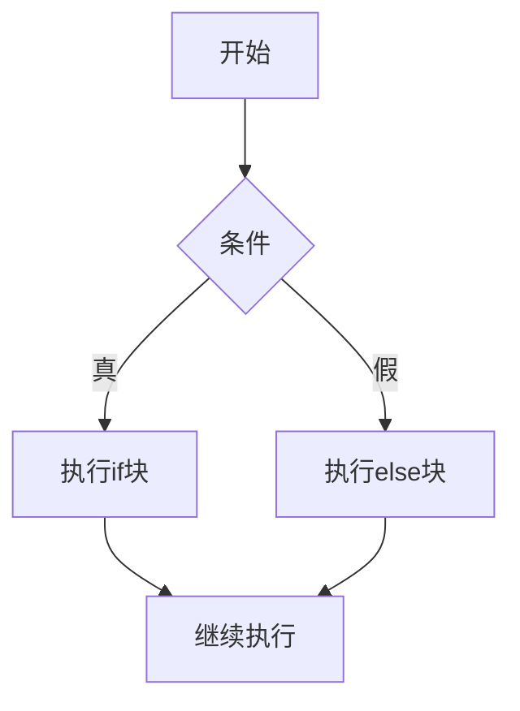
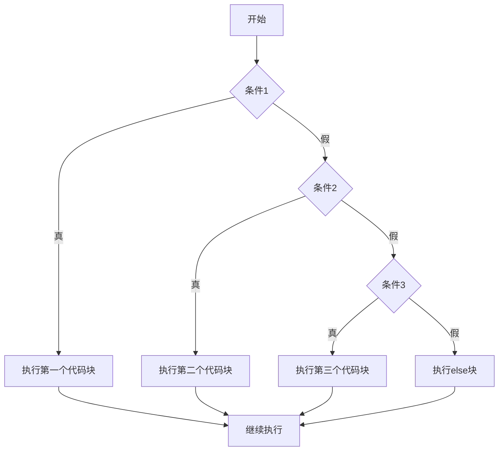

# C++ 条件语句

在编程中，我们经常需要根据不同的条件执行不同的代码块。C++提供了多种条件语句，允许程序根据特定条件的真假来选择执行路径。本文将全面介绍C++中的条件语句，帮助初学者掌握这一基本且重要的编程概念。

## 什么是条件语句？

条件语句是控制程序流程的基本结构，它根据给定条件的评估结果（真或假）来决定执行哪部分代码。在C++中，主要的条件语句包括：

1. `if` 语句
2. `if-else` 语句
3. `if-else if-else` 嵌套语句
4. `switch` 语句

## if 语句

`if` 语句是最简单的条件语句，当指定条件为真时，执行代码块。

### 语法

```cpp
if (条件) {
    // 当条件为真时执行的代码
}
```

### 示例

```cpp
#include <iostream>
using namespace std;

int main() {
    int age = 18;
    
    if (age >= 18) {
        cout << "你已经成年了！" << endl;
    }
    
    return 0;
}
```

**输出：**
```
你已经成年了！
```

在这个例子中，因为 `age` 的值是 18，满足条件 `age >= 18`，所以 `if` 块内的代码被执行。

:::tip
条件语句中的条件必须产生布尔值（`true` 或 `false`）。在C++中，非零值被视为 `true`，零被视为 `false`。
:::

## if-else 语句

`if-else` 语句提供了一个二选一的结构：当条件为真时执行一段代码，否则执行另一段代码。

### 语法

```cpp
if (条件) {
    // 当条件为真时执行的代码
} else {
    // 当条件为假时执行的代码
}
```

### 示例

```cpp
#include <iostream>
using namespace std;

int main() {
    int number = 7;
    
    if (number % 2 == 0) {
        cout << number << " 是偶数。" << endl;
    } else {
        cout << number << " 是奇数。" << endl;
    }
    
    return 0;
}
```

**输出：**
```
7 是奇数。
```

在这个例子中，因为 7 不能被 2 整除，所以条件 `number % 2 == 0` 为假，程序执行 `else` 块内的代码。

## if-else if-else 嵌套语句

当需要检查多个条件时，可以使用 `if-else if-else` 结构。

### 语法

```cpp
if (条件1) {
    // 当条件1为真时执行的代码
} else if (条件2) {
    // 当条件1为假且条件2为真时执行的代码
} else if (条件3) {
    // 当条件1和条件2均为假且条件3为真时执行的代码
} else {
    // 当以上所有条件均为假时执行的代码
}
```

### 示例

```cpp
#include <iostream>
using namespace std;

int main() {
    int score = 75;
    
    if (score >= 90) {
        cout << "成绩等级：A" << endl;
    } else if (score >= 80) {
        cout << "成绩等级：B" << endl;
    } else if (score >= 70) {
        cout << "成绩等级：C" << endl;
    } else if (score >= 60) {
        cout << "成绩等级：D" << endl;
    } else {
        cout << "成绩等级：F" << endl;
    }
    
    return 0;
}
```

**输出：**
```
成绩等级：C
```

在这个例子中，分数是 75，它不满足前两个条件，但满足第三个条件 `score >= 70`，因此输出对应的等级 C。

:::caution
在 `if-else if-else` 结构中，一旦某个条件为真并执行了对应的代码块，后续的条件将不再被检查。
:::

## 嵌套的 if 语句

在C++中，可以在一个条件语句内部放置另一个条件语句，这种结构称为嵌套的 if 语句。

### 语法

```cpp
if (条件1) {
    // 外部if的代码
    if (条件2) {
        // 嵌套if的代码
    }
}
```

### 示例

```cpp
#include <iostream>
using namespace std;

int main() {
    int age = 25;
    bool hasLicense = true;
    
    if (age >= 18) {
        cout << "你已经成年了。" << endl;
        
        if (hasLicense) {
            cout << "你可以开车。" << endl;
        } else {
            cout << "你需要考取驾照才能开车。" << endl;
        }
    } else {
        cout << "你还未成年，不能开车。" << endl;
    }
    
    return 0;
}
```

**输出：**
```
你已经成年了。
你可以开车。
```

在这个例子中，首先检查年龄是否达到18岁，然后在满足这个条件的情况下，进一步检查是否拥有驾照。

## switch 语句

`switch` 语句是一种多分支选择结构，适用于根据一个表达式的值进行多路分支。

### 语法

```cpp
switch (表达式) {
    case 常量1:
        // 当表达式等于常量1时执行的代码
        break;
    case 常量2:
        // 当表达式等于常量2时执行的代码
        break;
    // 更多的case...
    default:
        // 当表达式不等于任何case中的常量时执行的代码
}
```

### 示例

```cpp
#include <iostream>
using namespace std;

int main() {
    int day = 4;
    
    switch (day) {
        case 1:
            cout << "星期一" << endl;
            break;
        case 2:
            cout << "星期二" << endl;
            break;
        case 3:
            cout << "星期三" << endl;
            break;
        case 4:
            cout << "星期四" << endl;
            break;
        case 5:
            cout << "星期五" << endl;
            break;
        case 6:
            cout << "星期六" << endl;
            break;
        case 7:
            cout << "星期日" << endl;
            break;
        default:
            cout << "无效的日期" << endl;
    }
    
    return 0;
}
```

**输出：**
```
星期四
```

在这个例子中，`day` 的值是 4，所以程序执行 `case 4` 对应的代码块，输出"星期四"。

:::warning
在 `switch` 语句中，如果忘记在每个 `case` 后添加 `break`，程序将继续执行下一个 `case` 的代码，这种情况称为"fall through"。这有时是有意为之，但往往是编程错误的来源。
:::

## 条件运算符（三元运算符）

除了上述条件语句外，C++还提供一种简洁的方式来表达条件逻辑——条件运算符（也称为三元运算符）。

### 语法

```cpp
条件 ? 表达式1 : 表达式2;
```

如果条件为真，整个表达式的值为表达式1的值；如果条件为假，整个表达式的值为表达式2的值。

### 示例

```cpp
#include <iostream>
using namespace std;

int main() {
    int a = 10, b = 20;
    int max = (a > b) ? a : b;
    
    cout << "较大的数是: " << max << endl;
    
    return 0;
}
```

**输出：**
```
较大的数是: 20
```

这个例子使用条件运算符来确定两个数中的较大值。由于 `a > b` 为假，所以 `max` 被赋值为 `b` 的值，即 20。

## 实际应用场景

### 场景一：登录系统

```cpp
#include <iostream>
#include <string>
using namespace std;

int main() {
    string username = "admin";
    string password = "123456";
    
    string inputUsername, inputPassword;
    
    cout << "请输入用户名: ";
    cin >> inputUsername;
    
    cout << "请输入密码: ";
    cin >> inputPassword;
    
    if (inputUsername == username && inputPassword == password) {
        cout << "登录成功！欢迎管理员。" << endl;
    } else if (inputUsername == username) {
        cout << "密码错误，请重试。" << endl;
    } else {
        cout << "用户名不存在，请先注册。" << endl;
    }
    
    return 0;
}
```

这个例子模拟了一个简单的登录系统，根据用户输入的用户名和密码，给出相应的反馈。

### 场景二：简易计算器

```cpp
#include <iostream>
using namespace std;

int main() {
    double num1, num2, result;
    char op;
    
    cout << "请输入第一个数: ";
    cin >> num1;
    
    cout << "请输入操作符 (+, -, *, /): ";
    cin >> op;
    
    cout << "请输入第二个数: ";
    cin >> num2;
    
    switch(op) {
        case '+':
            result = num1 + num2;
            break;
        case '-':
            result = num1 - num2;
            break;
        case '*':
            result = num1 * num2;
            break;
        case '/':
            if (num2 != 0) {
                result = num1 / num2;
            } else {
                cout << "错误：除数不能为零！" << endl;
                return 1;
            }
            break;
        default:
            cout << "无效的操作符！" << endl;
            return 1;
    }
    
    cout << num1 << " " << op << " " << num2 << " = " << result << endl;
    
    return 0;
}
```

这个简易计算器根据用户输入的两个数和一个运算符，执行相应的数学运算并显示结果。

## 条件语句的执行流程

下面的流程图展示了不同条件语句的执行路径：



上图展示了单个 `if` 语句的执行流程。



上图展示了 `if-else` 语句的执行流程。



上图展示了 `if-else if-else` 结构的执行流程。

## 总结

条件语句是C++中控制程序流程的基本工具，掌握这些语句可以让你的程序根据不同情况做出不同的反应：

1. `if` 语句：当条件为真时执行代码块。
2. `if-else` 语句：提供两个选择路径，根据条件选择其一执行。
3. `if-else if-else` 结构：提供多个选择路径，按顺序检查条件。
4. 嵌套的 `if` 语句：在一个条件语句内部包含另一个条件语句。
5. `switch` 语句：基于一个表达式的值选择执行路径。
6. 条件运算符：提供简洁的条件表达式。

正确使用条件语句是编写高效、灵活程序的关键。随着你编程经验的增长，你将学会如何组合这些基本结构来解决更复杂的问题。

## 练习

为了加深你对条件语句的理解，尝试完成以下练习：

1. 编写一个程序，判断一个年份是否为闰年。（提示：一个闰年能被4整除，但如果它能被100整除，它还必须能被400整除。）
2. 实现一个简单的成绩转换程序，将百分制分数转换为字母等级（A、B、C、D、F）。
3. 编写一个程序，根据BMI值（体重(kg)/身高(m)²）判断一个人的体重状况（低重、正常、过重、肥胖）。
4. 使用 `switch` 语句编写一个月份天数查询程序（考虑闰年的2月）。

祝你编程愉快！

:::note
记住，条件语句的魅力在于它们能让程序变得"智能"，根据不同情况做出不同决策。多练习，多思考，你会发现它们在解决实际问题时的强大威力。
:::