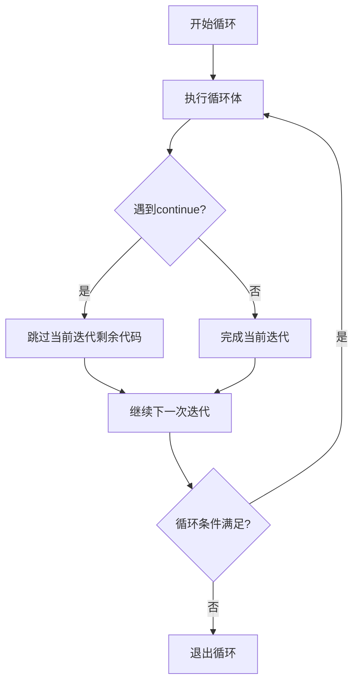

# C++ Continue 语句

在C++编程中，循环控制语句让我们能够更灵活地控制程序的执行流程。其中，`continue` 语句是一个重要的循环控制工具，它允许我们跳过循环中的特定迭代，直接进入下一轮循环。

## Continue 语句的基本概念

`continue` 语句用于循环结构内部（如`for`、`while`和`do-while`循环），当程序执行到 `continue` 语句时，它会立即跳过当前迭代的剩余部分，开始循环的下一次迭代。

:::note
与 `break` 语句不同，`continue` 不会终止整个循环的执行，而只是跳过当前迭代。
:::

## Continue 语句的语法

`continue` 语句的语法非常简单：

```cpp
continue;
```

## Continue 语句的工作原理

根据不同的循环类型，`continue` 语句的行为略有不同：

1. 在 `for` 循环中：跳到更新表达式（第三部分），然后进行条件检查
2. 在 `while` 和 `do-while` 循环中：直接跳到条件检查部分



## Continue 语句的基本示例

### 在 for 循环中使用 continue

```cpp
#include <iostream>
using namespace std;

int main() {
    // 输出1到10之间的所有非4的倍数
    cout << "1到10中非4的倍数有：";
    for (int i = 1; i <= 10; i++) {
        // 如果i是4的倍数，跳过当前迭代
        if (i % 4 == 0) {
            continue;
        }
        cout << i << " ";
    }
    cout << endl;
    
    return 0;
}
```

**输出：**
```
1到10中非4的倍数有：1 2 3 5 6 7 9 10
```

### 在 while 循环中使用 continue

```cpp
#include <iostream>
using namespace std;

int main() {
    int i = 0;
    
    // 输出1到10之间的所有奇数
    cout << "1到10的奇数有：";
    while (i < 10) {
        i++;
        if (i % 2 == 0) {  // 如果是偶数，跳过
            continue;
        }
        cout << i << " ";
    }
    cout << endl;
    
    return 0;
}
```

**输出：**
```
1到10的奇数有：1 3 5 7 9
```

## Continue 语句的高级用法

### 在嵌套循环中使用 continue

在嵌套循环中，`continue` 语句只会影响包含它的最内层循环：

```cpp
#include <iostream>
using namespace std;

int main() {
    cout << "打印特定模式：" << endl;
    
    for (int i = 1; i <= 3; i++) {
        for (int j = 1; j <= 5; j++) {
            // 跳过内层循环中j为3的情况
            if (j == 3) {
                continue;
            }
            cout << i << "," << j << " ";
        }
        cout << endl;
    }
    
    return 0;
}
```

**输出：**
```
打印特定模式：
1,1 1,2 1,4 1,5 
2,1 2,2 2,4 2,5 
3,1 3,2 3,4 3,5
```

### 使用标签式 continue（C++不支持）

:::caution
C++中不支持带标签的 continue 语句，这与 Java 等其他语言有所不同。在C++中，continue 只能跳转到最内层循环的下一次迭代。
:::

## Continue 语句的实际应用场景

### 场景1：数据过滤

`continue` 语句常用于数据处理中，当某些数据不符合处理条件时，可以跳过这些数据：

```cpp
#include <iostream>
#include <vector>
using namespace std;

int main() {
    vector<int> numbers = {1, -2, 3, -4, 5, -6, 7, -8, 9, -10};
    int positiveSum = 0;
    
    cout << "处理以下数据: ";
    for (int num : numbers) {
        cout << num << " ";
    }
    cout << endl;
    
    // 计算正数之和，忽略负数
    for (int num : numbers) {
        if (num < 0) {
            continue;  // 跳过负数
        }
        positiveSum += num;
    }
    
    cout << "正数之和为: " << positiveSum << endl;
    return 0;
}
```

**输出：**
```
处理以下数据: 1 -2 3 -4 5 -6 7 -8 9 -10
正数之和为: 25
```

### 场景2：错误处理

在处理用户输入或文件操作时，可以用 `continue` 跳过无效数据：

```cpp
#include <iostream>
#include <string>
using namespace std;

int main() {
    string input;
    int sum = 0;
    int count = 0;
    
    cout << "请输入5个整数（每行一个）:" << endl;
    
    while (count < 5) {
        getline(cin, input);
        
        // 检查输入是否为有效整数
        bool valid = true;
        for (char c : input) {
            if (!isdigit(c) && c != '-' && c != '+') {
                valid = false;
                break;
            }
        }
        
        if (!valid) {
            cout << "无效输入，请重新输入一个整数" << endl;
            continue;  // 跳过当前迭代，不计数
        }
        
        int number = stoi(input);
        sum += number;
        count++;
    }
    
    cout << "5个整数的总和为: " << sum << endl;
    return 0;
}
```

在上面的示例中，如果用户输入的不是有效整数，程序会提示重新输入，并使用 `continue` 跳过当前迭代，不增加计数。

## Continue 与 Break 的比较

了解 `continue` 和 `break` 之间的区别非常重要：

| 语句 | 作用 | 适用场景 |
|------|------|----------|
| `continue` | 跳过当前迭代中的剩余代码，进入下一次迭代 | 当满足特定条件时需要跳过当前迭代 |
| `break` | 完全终止循环 | 当找到所需结果或满足特定条件时需要提前结束循环 |

## 使用 Continue 的最佳实践

1. **保持代码简洁**：使用 `continue` 可以减少嵌套的 if-else 结构，提高代码可读性。

```cpp
// 使用 continue 的简洁写法
for (int i = 0; i < n; i++) {
    if (不符合条件) {
        continue;
    }
    // 处理符合条件的情况
}

// 不使用 continue 的复杂写法
for (int i = 0; i < n; i++) {
    if (符合条件) {
        // 处理符合条件的情况
    }
}
```

2. **避免过度使用**：过多使用 `continue` 可能导致程序流程难以理解。

3. **注意循环更新**：在 `while` 和 `do-while` 循环中使用 `continue` 时，确保在 `continue` 之前更新循环控制变量，否则可能导致无限循环。

```cpp
// 错误示范 - 可能导致无限循环
int i = 0;
while (i < 10) {
    if (某条件) {
        continue;  // 如果条件满足，i永远不会增加
    }
    i++;
}

// 正确示范
int i = 0;
while (i < 10) {
    if (某条件) {
        i++;  // 确保循环变量更新
        continue;
    }
    // 其他操作
    i++;
}
```

## 总结

`continue` 语句是C++中一个强大的循环控制工具，它允许我们：

- 跳过循环的当前迭代中的剩余代码
- 直接进入循环的下一次迭代
- 在数据过滤、错误处理等场景中灵活控制程序流程

掌握 `continue` 语句的使用可以让你写出更加简洁、高效的代码。与其他控制流语句（如 `break` 和 `return`）结合使用，能够更好地控制程序的执行路径。

## 练习

为了巩固对 `continue` 语句的理解，尝试完成以下练习：

1. 编写一个程序，打印出1到100之间所有不是3和7的倍数的数字。
2. 编写一个程序，读取用户输入的10个整数，忽略所有负数，计算并输出正数的平均值。
3. 编写一个嵌套循环，生成一个10x10的乘法表，但跳过所有结果为偶数的乘法。

:::tip
记住，`continue` 语句是一个工具，而不是目标。始终追求代码的可读性和维护性，选择最合适的控制流方式来解决问题。
:::