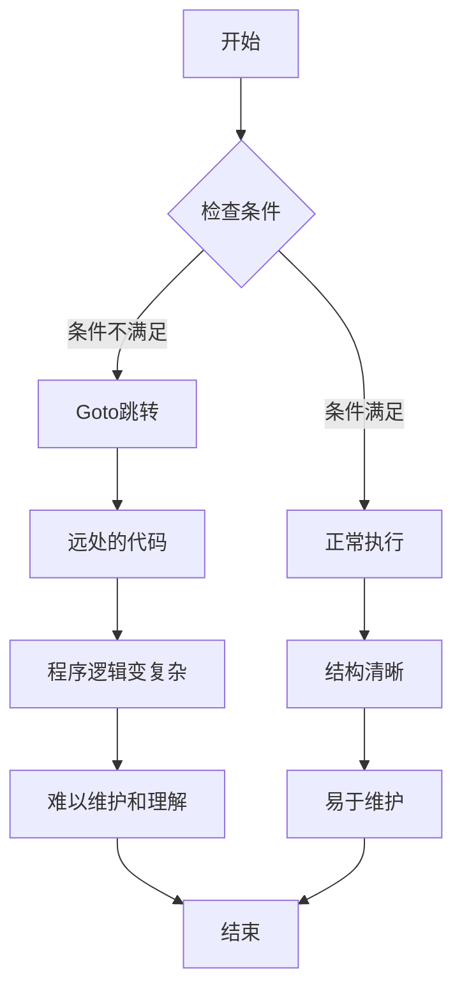

# C++ Goto语句

在C++编程中，控制流语句决定了程序执行的路径。虽然大多数时候我们使用条件语句（如`if-else`）和循环语句（如`for`、`while`），但C++还提供了一个特殊的控制流语句：`goto`语句。本文将全面介绍`goto`语句的用法、优缺点以及在实际编程中的适用场景。

## 什么是Goto语句？

`goto`语句是一种无条件跳转语句，它使程序的执行流程直接跳转到程序中标记的另一个位置。这个标记被称为"标签"（label），必须位于同一函数内部。

### 语法

```cpp
goto label;
// 其他代码...
label:
// 标签后的代码
```

在上面的语法中：
- `goto`是关键字
- `label`是用户自定义的标识符
- 标签后跟冒号`:`

## 基本用法示例

下面是一个简单的`goto`语句使用示例：

```cpp
#include <iostream>
using namespace std;

int main() {
    int i = 0;
    
start: // 标签
    cout << "i = " << i << endl;
    i++;
    
    if (i < 5) {
        goto start; // 跳转到start标签
    }
    
    cout << "循环结束" << endl;
    return 0;
}
```

**输出结果**：
```
i = 0
i = 1
i = 2
i = 3
i = 4
循环结束
```

在这个例子中，程序使用`goto`语句创建了一个循环结构，每次`i`小于5时，程序都会跳转回`start`标签，继续执行。

:::note
上面的循环完全可以用`for`或`while`循环代替，通常这样做更好。这里只是为了演示`goto`的基本工作方式。
:::

## Goto语句的作用域

`goto`语句只能在同一函数内跳转，不能从一个函数跳转到另一个函数。此外，`goto`不能跳过变量的初始化。

```cpp
#include <iostream>
using namespace std;

int main() {
    goto label; // 错误：不能跳过变量的初始化
    int x = 10;
    
label:
    cout << "x = " << x << endl; // 如果允许跳转，x将是未初始化的
    return 0;
}
```

## Goto的实际应用场景

尽管`goto`语句通常被视为不良编程实践，但在某些特定情况下，它仍然有其用途：

### 1. 错误处理和资源清理

在某些复杂的函数中，如果出现错误需要提前退出，但又需要执行一系列清理操作，`goto`可以简化这个过程。

```cpp
#include <iostream>
#include <fstream>
using namespace std;

int processFile(const char* filename) {
    ifstream file(filename);
    if (!file.is_open()) {
        cout << "无法打开文件" << endl;
        return -1;
    }
    
    // 分配资源
    int* buffer = new int[100];
    if (!buffer) {
        cout << "内存分配失败" << endl;
        file.close();
        return -2;
    }
    
    // 其他操作...
    if (/* 出现错误 */) {
        goto cleanup; // 跳转到清理代码
    }
    
    // 更多操作...
    if (/* 另一个错误 */) {
        goto cleanup; // 跳转到清理代码
    }
    
    // 成功处理
    delete[] buffer;
    file.close();
    return 0;
    
cleanup:
    // 清理资源
    delete[] buffer;
    file.close();
    return -3;
}
```

### 2. 跳出嵌套循环

当需要从多层嵌套循环中跳出时，`goto`可以提供简洁的解决方案。

```cpp
#include <iostream>
using namespace std;

int main() {
    int matrix[3][3] = {{1, 2, 3}, {4, 5, 6}, {7, 8, 9}};
    int target = 5;
    
    for (int i = 0; i < 3; i++) {
        for (int j = 0; j < 3; j++) {
            if (matrix[i][j] == target) {
                cout << "找到目标值 " << target << " 在位置: (" << i << ", " << j << ")" << endl;
                goto found; // 找到后直接跳出两层循环
            }
        }
    }
    cout << "未找到目标值" << endl;
    goto end;
    
found:
    cout << "搜索完成" << endl;
    
end:
    return 0;
}
```

**输出结果**：
```
找到目标值 5 在位置: (1, 1)
搜索完成
```

:::tip
虽然使用`goto`可以跳出嵌套循环，但更好的方式是使用函数或者引入布尔标志变量。上面的示例主要是为了说明用法。
:::

## Goto的缺点与危害

虽然`goto`语句有时可以简化代码，但它也有许多缺点：

1. **降低代码可读性**：过度使用`goto`会使代码逻辑难以理解，变成所谓的"意大利面条代码"。

2. **容易引入错误**：随意跳转可能导致意外的程序行为和难以发现的bug。

3. **妨碍编译器优化**：某些`goto`结构可能会阻碍编译器进行代码优化。

4. **阻碍结构化编程**：`goto`违背了结构化编程的原则，使代码维护更加困难。



## Goto的替代方案

在大多数情况下，`goto`语句可以被以下结构替代：

1. **条件语句**：使用`if-else`结构代替简单的前向或后向跳转。

2. **循环结构**：使用`for`、`while`或`do-while`循环代替循环跳转。

3. **异常处理**：使用`try-catch`块处理异常情况。

4. **函数**：将复杂逻辑封装到函数中，使用return语句提前退出。

5. **break和continue**：在循环中使用这些语句控制流程。

## 最佳实践

如果你决定在代码中使用`goto`，请遵循以下最佳实践：

1. **尽量避免使用**：大多数情况下，有更清晰的替代方案。

2. **只向前跳转**：避免向后跳转，这样可以减少创建无限循环的风险。

3. **限制在小范围内使用**：`goto`跳转的距离越短，代码越容易理解。

4. **仅用于特殊场合**：如错误处理或跳出深度嵌套循环。

5. **提供清晰的注释**：解释为什么在这里使用`goto`而不是其他控制结构。

## 总结

`goto`语句是C++中的一种控制流语句，允许程序无条件地跳转到函数内的另一位置。虽然它在某些特定情况下（如复杂的错误处理或跳出嵌套循环）可能有用，但通常被认为是不良编程实践。

现代C++编程中，我们有许多更结构化、更清晰的替代方案，如条件语句、循环结构、异常处理等。作为一名初学者，理解`goto`的工作原理是有益的，但在实际编程中应尽量避免使用它。

## 练习

1. 编写一个使用`goto`语句的程序，然后尝试用其他控制结构（如循环或条件语句）重写它。

2. 思考一个场景，其中使用`goto`语句可能是合理的。实现这个场景，并与一个不使用`goto`的版本进行比较。

3. 阅读一些开源项目的代码，找出其中使用`goto`语句的实例，并分析为什么作者选择使用`goto`而不是其他控制结构。

## 扩展阅读

- Edsger W. Dijkstra的论文《Go To Statement Considered Harmful》
- C++核心准则对于控制流的建议
- 结构化编程的原则和实践