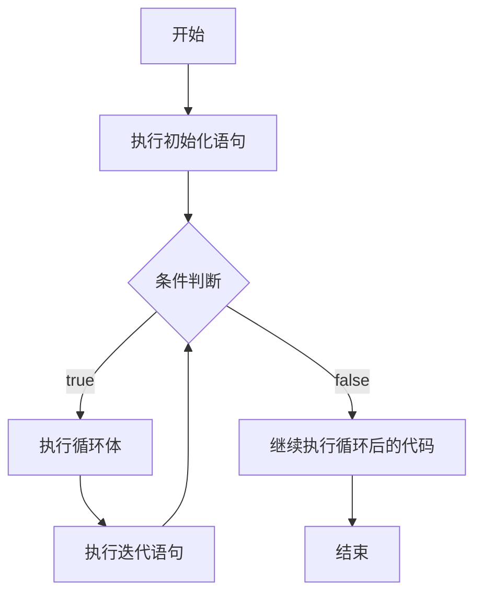
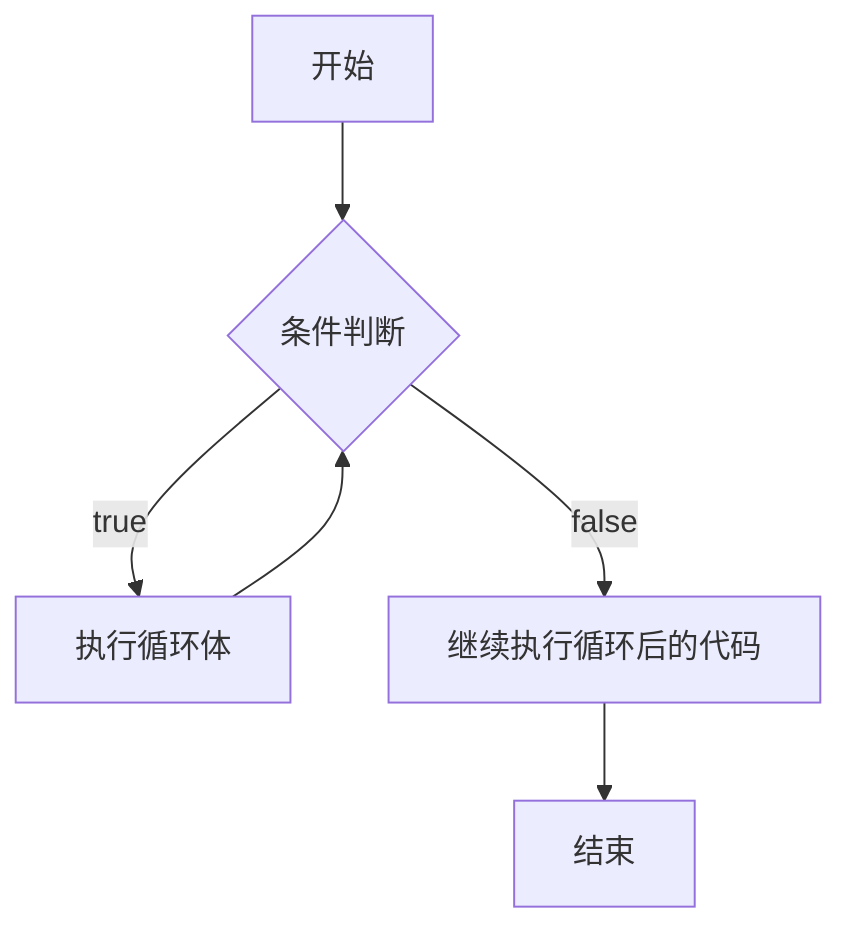
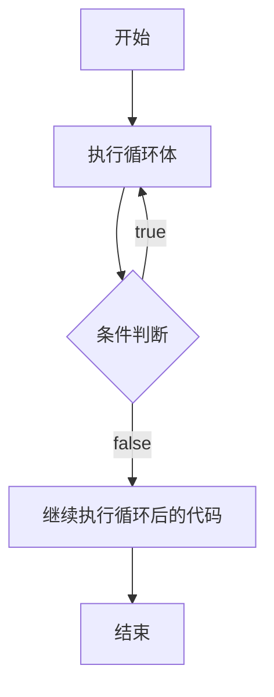

# C++ 循环控制

在编程中，我们经常需要重复执行某些操作。比如，当我们想打印出1到100的所有数字，或者处理数组中的每个元素时，手动编写100次或多次相同的代码显然不是明智的选择。这时候，**循环**就成为了我们的得力助手。

## 什么是循环？

循环是一种控制流结构，允许代码块重复执行，直到满足特定条件。C++提供了三种主要的循环类型：

1. **for循环** - 当你知道循环需要执行的次数时使用
2. **while循环** - 当你不知道循环需要执行的次数，但知道退出条件时使用
3. **do-while循环** - 类似while循环，但至少执行一次循环体

## for循环

for循环是最常用的循环类型之一，特别适合当你知道需要重复执行的次数时。

### 基本语法

```cpp
for (初始化语句; 条件判断; 迭代语句) {
    // 循环体，需要重复执行的代码
}
```

- **初始化语句**：在循环开始前执行一次
- **条件判断**：每次循环前检查，如果为true则执行循环体，否则退出循环
- **迭代语句**：每次循环结束后执行

### 示例

```cpp
#include <iostream>

int main() {
    // 打印1到5
    for (int i = 1; i <= 5; i++) {
        std::cout << i << " ";
    }
    return 0;
}
```

输出：
```
1 2 3 4 5
```

### for循环的执行流程



### for循环变体

C++11引入了范围for循环，可以更简洁地遍历集合：

```cpp
#include <iostream>
#include <vector>

int main() {
    std::vector<int> numbers = {1, 2, 3, 4, 5};
    
    // 使用范围for循环遍历vector
    for (int num : numbers) {
        std::cout << num << " ";
    }
    return 0;
}
```

输出：
```
1 2 3 4 5
```

## while循环

while循环在条件为真时重复执行代码块。它适合当你不确定循环需要执行多少次时使用。

### 基本语法

```cpp
while (条件判断) {
    // 循环体
}
```

### 示例

```cpp
#include <iostream>

int main() {
    int i = 1;
    while (i <= 5) {
        std::cout << i << " ";
        i++;
    }
    return 0;
}
```

输出：
```
1 2 3 4 5
```

### while循环的执行流程



:::caution
如果while循环的条件一直为真，且循环体内没有改变这个条件的代码，就会形成**无限循环**。确保循环内有代码能最终使条件变为假。
:::

## do-while循环

do-while循环与while循环类似，但是它至少会执行一次循环体，然后再检查条件。

### 基本语法

```cpp
do {
    // 循环体
} while (条件判断);
```

### 示例

```cpp
#include <iostream>

int main() {
    int i = 1;
    do {
        std::cout << i << " ";
        i++;
    } while (i <= 5);
    return 0;
}
```

输出：
```
1 2 3 4 5
```

### 与while循环的区别

do-while循环至少执行一次，即使条件一开始就为假：

```cpp
#include <iostream>

int main() {
    int i = 6;
    
    // 条件立即为假，不会执行
    while (i <= 5) {
        std::cout << "while: " << i << std::endl;
        i++;
    }
    
    i = 6;
    // 无论条件如何，先执行一次
    do {
        std::cout << "do-while: " << i << std::endl;
        i++;
    } while (i <= 5);
    
    return 0;
}
```

输出：
```
do-while: 6
```

### do-while循环的执行流程



## 循环控制语句

C++提供了两种特殊语句来控制循环的执行流程：

1. **break** - 立即退出循环
2. **continue** - 跳过当前迭代，继续下一次迭代

### break语句

break语句用于在满足某个条件时提前结束循环。

```cpp
#include <iostream>

int main() {
    for (int i = 1; i <= 10; i++) {
        if (i == 6) {
            break; // 当i等于6时，退出循环
        }
        std::cout << i << " ";
    }
    return 0;
}
```

输出：
```
1 2 3 4 5
```

### continue语句

continue语句用于跳过循环的当前迭代，直接进入下一次迭代。

```cpp
#include <iostream>

int main() {
    for (int i = 1; i <= 10; i++) {
        if (i % 2 == 0) {
            continue; // 当i是偶数时，跳过此次迭代
        }
        std::cout << i << " ";
    }
    return 0;
}
```

输出：
```
1 3 5 7 9
```

## 嵌套循环

循环可以嵌套使用，即在一个循环内部包含另一个循环。

```cpp
#include <iostream>

int main() {
    // 打印一个5x5的星号矩阵
    for (int i = 0; i < 5; i++) {
        for (int j = 0; j < 5; j++) {
            std::cout << "* ";
        }
        std::cout << std::endl;
    }
    return 0;
}
```

输出：
```
* * * * * 
* * * * * 
* * * * * 
* * * * * 
* * * * * 
```

:::tip
嵌套循环的执行次数是各层循环次数的乘积。上例中，内部循环执行了5×5=25次。
:::

## 实际应用案例

### 案例1：计算斐波那契数列

斐波那契数列是一个经典序列，每个数是前两个数的和：0, 1, 1, 2, 3, 5, 8...

```cpp
#include <iostream>

int main() {
    int n = 10; // 计算前10个斐波那契数
    int a = 0, b = 1;
    
    std::cout << "斐波那契数列的前" << n << "个数：" << std::endl;
    std::cout << a << " " << b << " ";
    
    for (int i = 2; i < n; i++) {
        int c = a + b;
        std::cout << c << " ";
        a = b;
        b = c;
    }
    
    return 0;
}
```

输出：
```
斐波那契数列的前10个数：
0 1 1 2 3 5 8 13 21 34
```

### 案例2：猜数字游戏

使用循环实现一个简单的猜数字游戏：

```cpp
#include <iostream>
#include <cstdlib>
#include <ctime>

int main() {
    // 初始化随机数生成器
    std::srand(static_cast<unsigned int>(std::time(0)));
    
    // 生成1到100之间的随机数
    int secretNumber = (std::rand() % 100) + 1;
    int guess;
    int attempts = 0;
    
    std::cout << "欢迎玩猜数字游戏！我已经想好了一个1到100之间的数。" << std::endl;
    
    do {
        std::cout << "请输入你的猜测：";
        std::cin >> guess;
        attempts++;
        
        if (guess < secretNumber) {
            std::cout << "太小了！再试一次。" << std::endl;
        } else if (guess > secretNumber) {
            std::cout << "太大了！再试一次。" << std::endl;
        } else {
            std::cout << "恭喜你猜对了！答案是" << secretNumber << "。" << std::endl;
            std::cout << "你总共猜了" << attempts << "次。" << std::endl;
        }
    } while (guess != secretNumber);
    
    return 0;
}
```

输出示例：
```
欢迎玩猜数字游戏！我已经想好了一个1到100之间的数。
请输入你的猜测：50
太大了！再试一次。
请输入你的猜测：25
太小了！再试一次。
请输入你的猜测：37
太大了！再试一次。
请输入你的猜测：31
恭喜你猜对了！答案是31。
你总共猜了4次。
```

## 总结

循环是编程中的基本构造，使我们能够重复执行代码块，大大提高了编程效率。本文介绍了C++中的三种主要循环类型：

1. **for循环** - 适用于已知迭代次数的场景
2. **while循环** - 适用于基于条件的未知次数迭代
3. **do-while循环** - 类似while循环，但至少执行一次

以及两种循环控制语句：

- **break** - 用于提前退出循环
- **continue** - 用于跳过当前迭代

选择合适的循环类型对于编写高效、可读的代码至关重要。练习使用不同类型的循环以及循环控制语句，将帮助你成为更好的C++程序员。

## 练习

1. 编写一个程序，打印出1到100之间的所有偶数。
2. 使用嵌套循环打印一个10行的三角形，第一行有1个星号，第二行有2个，以此类推。
3. 编写一个程序，要求用户输入一个正整数，然后计算并打印该数的阶乘。
4. 使用循环结构实现一个简单的菜单系统，让用户可以重复选择不同的选项，直到选择退出。
5. 使用do-while循环编写一个程序，要求用户输入一个介于1和10之间的数字，如果输入错误，程序会一直要求重新输入。

:::tip
记住，掌握循环结构需要大量的实践。尝试解决这些练习题，并创建自己的项目来应用这些概念！
:::