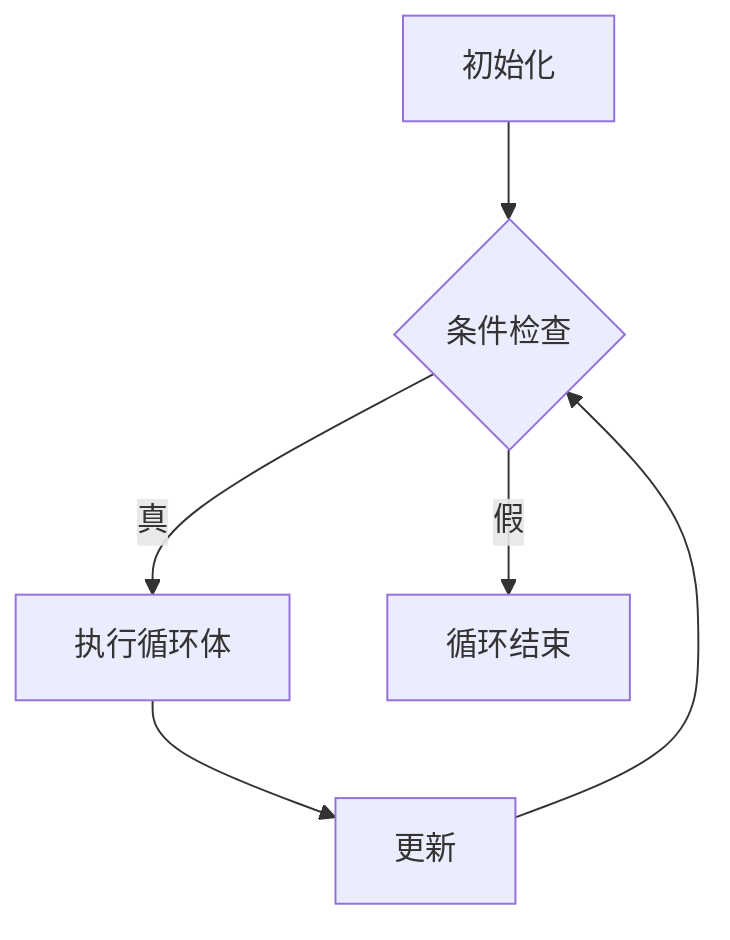
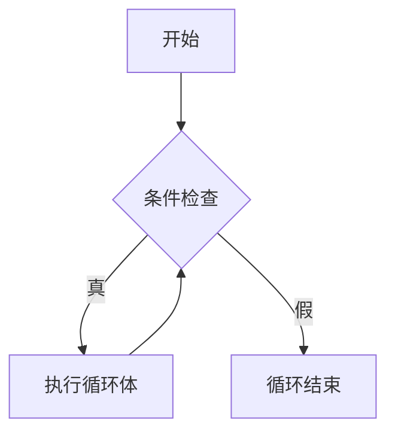
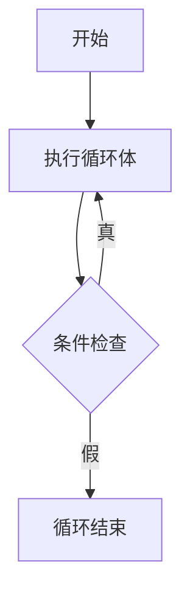

# C++ 循环

## 循环的基本概念

在编程中，循环是一种重复执行代码块的控制结构，直到满足特定条件为止。循环是程序设计中最强大的工具之一，它使我们能够用简洁的代码处理重复任务，而不必编写多行重复的代码。

C++提供了三种主要的循环类型：
- for循环
- while循环
- do-while循环

让我们逐一了解这些循环结构以及如何有效地使用它们。

## for循环

for循环是最常用的循环类型之一，特别适合当你知道循环需要执行的次数时。

### 基本语法

```cpp
for (初始化; 条件; 更新) {
    // 循环体：当条件为真时执行的代码
}
```

for循环的执行流程如下：



### 示例：基本for循环

```cpp
#include <iostream>
using namespace std;

int main() {
    // 打印1到5的数字
    for (int i = 1; i <= 5; i++) {
        cout << i << " ";
    }
    cout << endl;
    return 0;
}
```

**输出：**
```
1 2 3 4 5
```

### for循环的变体

#### 1. 无限for循环

```cpp
for (;;) {
    // 无限循环，需要使用break语句退出
}
```

#### 2. 多变量初始化和更新

```cpp
for (int i = 0, j = 10; i < j; i++, j--) {
    cout << "i = " << i << ", j = " << j << endl;
}
```

**输出：**
```
i = 0, j = 10
i = 1, j = 9
i = 2, j = 8
i = 3, j = 7
i = 4, j = 6
```

#### 3. 基于范围的for循环（C++11及以上版本）

```cpp
#include <iostream>
#include <vector>
using namespace std;

int main() {
    vector<int> numbers = {1, 2, 3, 4, 5};
    
    // 使用基于范围的for循环遍历vector
    for (int num : numbers) {
        cout << num << " ";
    }
    cout << endl;
    
    return 0;
}
```

**输出：**
```
1 2 3 4 5
```

:::tip 提示
使用`auto`关键字可以更方便地处理不同类型的容器元素：
```cpp
for (auto num : numbers) {
    cout << num << " ";
}
```
:::

## while循环

while循环在每次迭代开始前检查条件，只要条件为真，就会继续执行循环体。适用于不确定循环次数，但知道继续条件的场景。

### 基本语法

```cpp
while (条件) {
    // 循环体：当条件为真时执行的代码
}
```

while循环的执行流程：



### 示例：基本while循环

```cpp
#include <iostream>
using namespace std;

int main() {
    int i = 1;
    
    // 打印1到5的数字
    while (i <= 5) {
        cout << i << " ";
        i++;
    }
    cout << endl;
    
    return 0;
}
```

**输出：**
```
1 2 3 4 5
```

## do-while循环

do-while循环与while循环类似，但它在每次迭代结束后检查条件。这意味着do-while循环至少会执行一次，无论条件是否为真。

### 基本语法

```cpp
do {
    // 循环体：至少执行一次
} while (条件);  // 注意这里有分号
```

do-while循环的执行流程：



### 示例：基本do-while循环

```cpp
#include <iostream>
using namespace std;

int main() {
    int i = 1;
    
    // 打印1到5的数字
    do {
        cout << i << " ";
        i++;
    } while (i <= 5);
    cout << endl;
    
    return 0;
}
```

**输出：**
```
1 2 3 4 5
```

### do-while和while的区别示例

```cpp
#include <iostream>
using namespace std;

int main() {
    int j = 10;
    
    // while循环：条件为假，不执行循环体
    while (j < 10) {
        cout << "这行不会被执行" << endl;
        j++;
    }
    
    j = 10;
    // do-while循环：即使条件为假，也会执行一次循环体
    do {
        cout << "这行会被执行一次" << endl;
        j++;
    } while (j < 10);
    
    return 0;
}
```

**输出：**
```
这行会被执行一次
```

## 循环控制语句

C++提供了几种控制循环执行流程的语句：

### 1. break语句

`break`语句用于立即退出当前循环，程序将继续执行循环后的代码。

```cpp
#include <iostream>
using namespace std;

int main() {
    // 当i等于3时退出循环
    for (int i = 1; i <= 5; i++) {
        if (i == 3) {
            cout << "遇到3，退出循环" << endl;
            break;
        }
        cout << i << " ";
    }
    cout << "循环结束" << endl;
    
    return 0;
}
```

**输出：**
```
1 2 遇到3，退出循环
循环结束
```

### 2. continue语句

`continue`语句跳过当前迭代的剩余部分，直接进入下一次迭代。

```cpp
#include <iostream>
using namespace std;

int main() {
    // 跳过打印3
    for (int i = 1; i <= 5; i++) {
        if (i == 3) {
            cout << "跳过3 " << endl;
            continue;
        }
        cout << i << " ";
    }
    cout << endl;
    
    return 0;
}
```

**输出：**
```
1 2 跳过3
4 5
```

### 3. goto语句

虽然C++支持`goto`语句，但在现代编程中应避免使用它，因为它会使代码结构混乱难以理解。这里只作了解：

```cpp
#include <iostream>
using namespace std;

int main() {
    int i = 1;
    
start:  // 标签
    if (i <= 5) {
        cout << i << " ";
        i++;
        goto start;  // 跳转到标签位置
    }
    cout << endl;
    
    return 0;
}
```

:::caution 警告
避免使用`goto`语句！它会导致"意大利面条式"代码，难以维护和理解。现代编程应使用结构化控制流语句（if-else、循环等）。
:::

## 嵌套循环

循环可以嵌套在其他循环内部，形成嵌套循环结构。这在处理多维数据或需要多层迭代时非常有用。

### 示例：打印乘法表

```cpp
#include <iostream>
using namespace std;

int main() {
    // 打印9x9乘法表
    for (int i = 1; i <= 9; i++) {
        for (int j = 1; j <= i; j++) {
            // 格式化输出，保持对齐
            cout << j << "×" << i << "=" << i*j << "\t";
        }
        cout << endl;  // 每行结束后换行
    }
    
    return 0;
}
```

**输出（部分）：**
```
1×1=1
1×2=2   2×2=4
1×3=3   2×3=6   3×3=9
...
```

## 实际应用案例

### 案例1：计算斐波那契数列

斐波那契数列是一个经典序列，每个数都是前两个数的和。我们可以使用循环来计算这个数列。

```cpp
#include <iostream>
using namespace std;

int main() {
    int n;
    cout << "请输入要生成的斐波那契数列的项数：";
    cin >> n;
    
    // 处理特殊情况
    if (n <= 0) {
        cout << "请输入正整数" << endl;
        return 0;
    }
    
    long long a = 0, b = 1, c;
    
    cout << "斐波那契数列的前 " << n << " 项：" << endl;
    
    // 处理第一项的特殊情况
    if (n >= 1)
        cout << a << " ";
        
    // 处理第二项的特殊情况
    if (n >= 2)
        cout << b << " ";
        
    // 使用循环生成剩余项
    for (int i = 3; i <= n; i++) {
        c = a + b;
        cout << c << " ";
        a = b;
        b = c;
    }
    cout << endl;
    
    return 0;
}
```

**输入示例：**
```
10
```

**输出：**
```
斐波那契数列的前 10 项：
0 1 1 2 3 5 8 13 21 34
```

### 案例2：数字猜谜游戏

这个案例结合了循环和条件语句，创建一个简单的猜数字游戏。

```cpp
#include <iostream>
#include <cstdlib>  // 用于rand()和srand()
#include <ctime>    // 用于time()
using namespace std;

int main() {
    // 初始化随机数生成器
    srand(static_cast<unsigned int>(time(0)));
    
    // 生成1到100之间的随机数
    int secretNumber = rand() % 100 + 1;
    int guess, tries = 0;
    bool hasWon = false;
    
    cout << "欢迎来到猜数字游戏！" << endl;
    cout << "我想了一个1到100之间的数，请你猜一猜。" << endl;
    
    // 使用while循环直到猜对或达到最大尝试次数
    const int maxTries = 7;
    while (tries < maxTries && !hasWon) {
        cout << "请输入你的猜测（第" << tries + 1 << "次）：";
        cin >> guess;
        tries++;
        
        if (guess < secretNumber) {
            cout << "太小了！再试一次。" << endl;
        } else if (guess > secretNumber) {
            cout << "太大了！再试一次。" << endl;
        } else {
            hasWon = true;
            cout << "恭喜你猜对了！答案就是" << secretNumber << "。" << endl;
            cout << "你用了" << tries << "次就猜到了！" << endl;
        }
    }
    
    if (!hasWon) {
        cout << "很遗憾，你已用完所有" << maxTries << "次机会。" << endl;
        cout << "正确答案是：" << secretNumber << endl;
    }
    
    return 0;
}
```

**互动输出示例：**
```
欢迎来到猜数字游戏！
我想了一个1到100之间的数，请你猜一猜。
请输入你的猜测（第1次）：50
太大了！再试一次。
请输入你的猜测（第2次）：25
太小了！再试一次。
请输入你的猜测（第3次）：37
太大了！再试一次。
请输入你的猜测（第4次）：31
太大了！再试一次。
请输入你的猜测（第5次）：28
恭喜你猜对了！答案就是28。
你用了5次就猜到了！
```

## 循环性能和优化

在实际编程中，循环效率会直接影响程序性能，尤其是处理大数据集时。以下是一些优化技巧：

1. **避免循环内的不必要计算**：将不依赖于循环变量的计算移到循环外。

```cpp
// 低效
for (int i = 0; i < vector.size(); i++) {  // size()在每次迭代都会被调用
    // 循环体
}

// 优化
int size = vector.size();  // 只计算一次
for (int i = 0; i < size; i++) {
    // 循环体
}
```

2. **合适的循环类型**：根据场景选择合适的循环结构。
3. **循环展开**：在特定情况下，手动展开循环可以减少循环控制开销。
4. **使用适当的数据结构**：某些数据结构在特定循环操作中性能更好。

:::note
循环优化是高级话题，初学者应先专注于编写正确的循环，随着经验积累再逐步关注性能优化。
:::

## 总结

循环是C++编程中不可或缺的控制结构，能够大大提高代码的效率和简洁性。本文介绍了三种基本循环类型：

- **for循环**：适用于已知迭代次数的情况
- **while循环**：适用于基于条件的迭代，条件在循环开始前检查
- **do-while循环**：至少执行一次的循环，条件在循环结束后检查

此外，我们还学习了循环控制语句（break、continue）以及嵌套循环的使用方法，并通过实际案例展示了循环在实际应用中的价值。

掌握循环结构对编写高效C++程序至关重要，无论是处理数据集、实现算法还是创建交互式程序，循环都能发挥重要作用。

## 练习

1. 编写一个程序，使用for循环计算1到100的所有偶数的和。
2. 实现一个程序，使用while循环打印出10到1的倒计时。
3. 创建一个程序，接受用户输入的正整数n，然后使用do-while循环计算并打印n的阶乘。
4. 编写一个程序，使用嵌套循环打印以下图案：
   ```
   *
   **
   ***
   ****
   *****
   ```
5. 实现一个简单的菜单系统，使用循环来允许用户重复执行不同的操作，直到选择退出。

## 进一步学习资源

- 《C++ Primer》- Stanley B. Lippman、Josée Lajoie、Barbara E. Moo
- 《Effective C++》- Scott Meyers
- [cppreference.com](https://en.cppreference.com/w/cpp/language/statements#Iteration_statements)
- [C++ Tutorials](http://www.cplusplus.com/doc/tutorial/)
- [LearnCpp.com](https://www.learncpp.com/)

通过持续练习和实验，你将能够熟练掌握C++中的循环结构，并在实际项目中灵活运用它们！