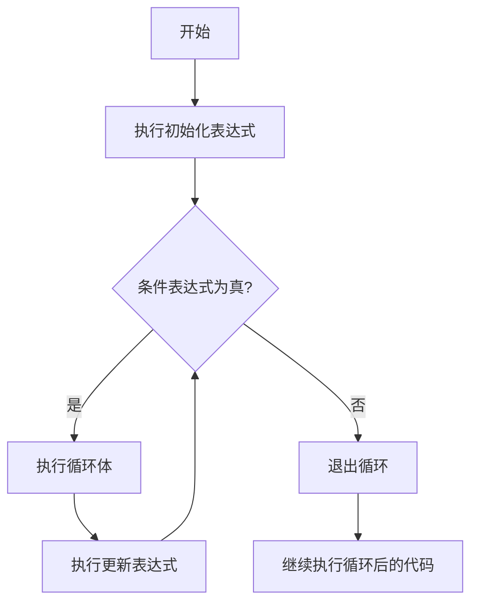

# C++ For循环

## 什么是For循环？

For循环是C++中最常用的循环结构之一，它提供了一种简洁的方式来重复执行代码块，直到满足特定条件为止。For循环特别适合于当你事先知道循环需要执行的次数时使用。

For循环的语法结构简洁明了，将初始化、条件测试和更新操作集中在一起，使代码更加紧凑和易读。

## For循环的基本语法

C++中For循环的基本语法如下：

```cpp
for (初始化表达式; 条件表达式; 更新表达式) {
    // 循环体
    // 要重复执行的代码
}
```

其中：
- **初始化表达式**：在循环开始前执行一次，通常用于初始化循环计数器
- **条件表达式**：在每次循环迭代前评估，如果为true则执行循环体，如果为false则退出循环
- **更新表达式**：在每次循环迭代后执行，通常用于更新循环计数器

## For循环执行流程

下面是For循环的执行流程：



## 基本For循环示例

让我们看一个简单的For循环示例，打印数字1到5：

```cpp
#include <iostream>
using namespace std;

int main() {
    for (int i = 1; i <= 5; i++) {
        cout << i << " ";
    }
    cout << endl;
    return 0;
}
```

输出：
```
1 2 3 4 5
```

在这个例子中：
- `int i = 1`：初始化变量i为1
- `i <= 5`：只要i小于等于5，循环就会继续
- `i++`：每次循环后，i的值加1

## For循环的变体

### 1. 多个初始化或更新表达式

可以使用逗号运算符在For循环的初始化或更新部分包含多个表达式：

```cpp
#include <iostream>
using namespace std;

int main() {
    for (int i = 0, j = 10; i <= 5; i++, j--) {
        cout << "i = " << i << ", j = " << j << endl;
    }
    return 0;
}
```

输出：
```
i = 0, j = 10
i = 1, j = 9
i = 2, j = 8
i = 3, j = 7
i = 4, j = 5
i = 5, j = 5
```

### 2. 省略表达式

For循环中的任何表达式都可以省略，但分号必须保留：

```cpp
#include <iostream>
using namespace std;

int main() {
    int i = 1;
    
    // 省略初始化表达式
    for (; i <= 5; i++) {
        cout << i << " ";
    }
    cout << endl;
    
    // 省略更新表达式
    for (int j = 5; j > 0;) {
        cout << j << " ";
        j--;
    }
    cout << endl;
    
    // 省略条件表达式(创建无限循环)
    int k = 1;
    for (;;) {
        cout << k << " ";
        k++;
        if (k > 5) break;  // 需要手动跳出循环
    }
    cout << endl;
    
    return 0;
}
```

输出：
```
1 2 3 4 5
5 4 3 2 1
1 2 3 4 5
```

### 3. 范围For循环（C++11及更高版本）

C++11引入了范围For循环，使得遍历容器更简洁：

```cpp
#include <iostream>
#include <vector>
using namespace std;

int main() {
    vector<int> numbers = {1, 2, 3, 4, 5};
    
    // 使用范围for循环遍历vector
    for (int num : numbers) {
        cout << num << " ";
    }
    cout << endl;
    
    // 使用引用可以修改元素
    for (int &num : numbers) {
        num *= 2;
    }
    
    // 再次打印，显示修改后的值
    for (int num : numbers) {
        cout << num << " ";
    }
    cout << endl;
    
    return 0;
}
```

输出：
```
1 2 3 4 5
2 4 6 8 10
```

## For循环嵌套

For循环可以嵌套使用，非常适合处理多维数据结构：

```cpp
#include <iostream>
using namespace std;

int main() {
    // 打印5x5的乘法表
    for (int i = 1; i <= 5; i++) {
        for (int j = 1; j <= 5; j++) {
            cout << i * j << "\t";
        }
        cout << endl;
    }
    return 0;
}
```

输出：
```
1    2    3    4    5
2    4    6    8    10
3    6    9    12   15
4    8    12   16   20
5    10   15   20   25
```

## For循环中的控制语句

可以使用`break`和`continue`语句来控制For循环的执行流程：

- **break**：立即退出循环
- **continue**：跳过当前迭代的剩余部分，直接进入下一次迭代

```cpp
#include <iostream>
using namespace std;

int main() {
    // 使用break
    cout << "使用break的例子：" << endl;
    for (int i = 1; i <= 10; i++) {
        if (i == 6) break;
        cout << i << " ";
    }
    cout << endl;
    
    // 使用continue
    cout << "使用continue的例子：" << endl;
    for (int i = 1; i <= 10; i++) {
        if (i % 2 == 0) continue;  // 跳过偶数
        cout << i << " ";
    }
    cout << endl;
    
    return 0;
}
```

输出：
```
使用break的例子：
1 2 3 4 5
使用continue的例子：
1 3 5 7 9
```

## 实际应用案例

### 案例1：计算斐波那契数列

```cpp
#include <iostream>
#include <vector>
using namespace std;

int main() {
    int n = 10;  // 计算前10个斐波那契数
    vector<int> fibonacci(n);
    
    // 初始化前两个数
    fibonacci[0] = 0;
    fibonacci[1] = 1;
    
    // 使用for循环计算后续斐波那契数
    for (int i = 2; i < n; i++) {
        fibonacci[i] = fibonacci[i-1] + fibonacci[i-2];
    }
    
    // 打印结果
    cout << "前" << n << "个斐波那契数：" << endl;
    for (int num : fibonacci) {
        cout << num << " ";
    }
    cout << endl;
    
    return 0;
}
```

输出：
```
前10个斐波那契数：
0 1 1 2 3 5 8 13 21 34
```

### 案例2：查找质数

```cpp
#include <iostream>
#include <vector>
using namespace std;

int main() {
    int n = 50;  // 查找50以内的质数
    vector<bool> isPrime(n+1, true);
    
    // 使用埃拉托斯特尼筛法查找质数
    isPrime[0] = isPrime[1] = false;
    
    for (int i = 2; i * i <= n; i++) {
        if (isPrime[i]) {
            // 将i的所有倍数标记为非质数
            for (int j = i * i; j <= n; j += i) {
                isPrime[j] = false;
            }
        }
    }
    
    // 打印所有质数
    cout << n << "以内的质数：" << endl;
    for (int i = 2; i <= n; i++) {
        if (isPrime[i]) {
            cout << i << " ";
        }
    }
    cout << endl;
    
    return 0;
}
```

输出：
```
50以内的质数：
2 3 5 7 11 13 17 19 23 29 31 37 41 43 47
```

### 案例3：绘制简单图案

```cpp
#include <iostream>
using namespace std;

int main() {
    int n = 5;  // 设置金字塔高度
    
    // 打印金字塔
    for (int i = 1; i <= n; i++) {
        // 打印空格
        for (int j = 1; j <= n - i; j++) {
            cout << " ";
        }
        
        // 打印星号
        for (int k = 1; k <= 2 * i - 1; k++) {
            cout << "*";
        }
        
        cout << endl;
    }
    
    return 0;
}
```

输出：
```
    *
   ***
  *****
 *******
*********
```

## For循环性能考虑

For循环是C++中效率最高的循环结构之一，但在实际应用中还需注意以下几点：

1. **避免在循环内进行不必要的计算**：将不依赖于循环计数器的计算移到循环外
2. **注意变量作用域**：在For循环内声明的变量只在循环内有效
3. **考虑使用前置递增(++i)而不是后置递增(i++)**：在某些情况下可能会带来微小的性能提升
4. **适当使用循环展开技术**：对于简单循环，编译器通常会进行优化

:::tip 最佳实践
在处理容器时，尽量使用范围for循环而不是传统for循环，代码更简洁且不易出错。
:::

:::caution 小心
无限循环可能导致程序崩溃。确保循环条件最终会为false，或者在循环内有break语句。
:::

## 总结

For循环是C++中强大而灵活的控制流结构，用于重复执行代码块直到满足特定条件。它的主要特点包括：

- 语法简洁，将初始化、条件检查和更新操作集中在一起
- 可以省略任何表达式部分，增加灵活性
- 支持多个初始化和更新表达式
- C++11引入的范围For循环使集合迭代更加简单
- 可以与break和continue语句结合使用以控制执行流

掌握For循环是成为熟练C++程序员的基础步骤之一。随着你的编程经验增长，你会发现For循环在各种应用场景中的价值，从简单的迭代到复杂的算法实现。

## 练习

1. 编写一个程序，使用For循环计算1到100之间所有偶数的和。
2. 使用嵌套For循环打印一个10x10的乘法表。
3. 编写一个程序，找出100到1000之间的所有Armstrong数（一个n位数，其各位数字的n次方之和等于该数本身）。
4. 使用范围For循环计算一个整数数组的平均值。
5. 编写一个程序，使用For循环找出一个整数数组中的最大值和最小值。

## 进一步阅读

- 学习C++ `while`循环和`do-while`循环，了解它们与For循环的区别和应用场景
- 深入了解C++迭代器，以便更有效地与容器和算法交互
- 研究C++标准库中的算法，如`std::for_each`，它们提供了更高级的迭代功能