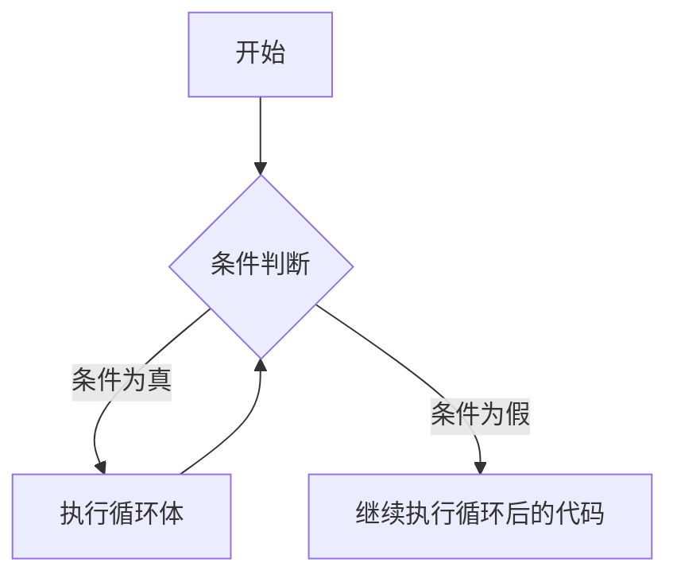

# C++ While循环

## 循环的概念

在编程中，我们经常需要重复执行某些代码块直到满足特定条件。C++提供了几种循环结构来实现这一目标，其中**while循环**是最基本的循环结构之一。

While循环允许我们根据特定条件重复执行代码块。只要条件为真，循环就会继续执行；一旦条件变为假，循环就会终止。

## While循环的语法

在C++中，while循环的基本语法如下：

```cpp
while (condition) {
    // 循环体：条件为真时执行的代码
}
```

流程图表示：



### 循环执行过程解析

1. 首先，程序会评估条件表达式。
2. 如果条件为真（非零值），则执行循环体中的代码。
3. 执行完循环体后，程序会再次回到条件判断。
4. 重复步骤1-3，直到条件变为假。
5. 当条件变为假（零值）时，程序跳出循环，执行循环后的代码。

## 基本示例

让我们看一个简单的例子，使用while循环打印数字1到5：

```cpp
#include <iostream>

int main() {
    int i = 1; // 初始化循环计数器
    
    while (i <= 5) { // 条件：i小于等于5
        std::cout << i << " "; // 打印当前值
        i++; // 增加计数器值
    }
    
    std::cout << "\n循环结束后i的值: " << i << std::endl;
    return 0;
}
```

输出：
```
1 2 3 4 5 
循环结束后i的值: 6
```

:::note
注意循环后`i`的值是6，因为当`i`增加到6时，条件`i <= 5`变为假，循环终止。
:::

## While循环的关键要点

### 1. 循环变量

通常，while循环需要一个循环变量（如上例中的`i`）来控制循环的进行。这个变量需要在循环外部初始化，并在循环内部更新。

### 2. 循环条件

条件表达式决定循环是否继续执行。如果忘记在循环体内更新影响条件的变量，可能会导致无限循环。

:::caution
确保在某个时刻循环条件会变为假，否则会导致无限循环，使程序永远不会终止。
:::

### 3. 循环体

循环体是条件为真时将被重复执行的代码块。它可以是单个语句或用花括号`{}`括起来的语句块。

## 无限循环

如果循环条件始终为真，将导致无限循环。在某些情况下，这可能是故意的：

```cpp
while (true) {
    // 永远执行的代码
    // 通常需要内部有某种中断机制
}
```

要从无限循环中退出，可以使用`break`语句或使条件变为假。

## 特殊情况：do-while循环

与while循环相关但略有不同的是do-while循环，它会至少执行一次循环体：

```cpp
do {
    // 循环体：至少执行一次
} while (condition);
```

do-while循环会先执行循环体，然后再检查条件。

## 实际应用案例

### 案例1：用户输入验证

以下示例使用while循环来验证用户输入，直到用户输入有效值：

```cpp
#include <iostream>

int main() {
    int userInput;
    bool validInput = false;
    
    while (!validInput) {
        std::cout << "请输入一个1到10之间的数字: ";
        std::cin >> userInput;
        
        if (userInput >= 1 && userInput <= 10) {
            validInput = true;
            std::cout << "有效输入！你输入的是: " << userInput << std::endl;
        } else {
            std::cout << "无效输入，请重试。\n";
        }
    }
    
    return 0;
}
```

### 案例2：菜单系统

以下是一个简单的菜单系统，使用while循环重复显示菜单，直到用户选择退出：

```cpp
#include <iostream>

int main() {
    int choice = 0;
    
    while (choice != 3) {
        // 显示菜单
        std::cout << "\n=== 菜单 ===\n";
        std::cout << "1. 显示消息\n";
        std::cout << "2. 计算平方\n";
        std::cout << "3. 退出\n";
        std::cout << "请选择: ";
        std::cin >> choice;
        
        // 处理用户选择
        switch (choice) {
            case 1:
                std::cout << "你好，C++程序员！\n";
                break;
            case 2:
                int number;
                std::cout << "输入一个数字: ";
                std::cin >> number;
                std::cout << number << "的平方是: " << number * number << "\n";
                break;
            case 3:
                std::cout << "程序退出，再见！\n";
                break;
            default:
                std::cout << "无效选择，请重试。\n";
        }
    }
    
    return 0;
}
```

### 案例3：数字求和

使用while循环计算1到N的和：

```cpp
#include <iostream>

int main() {
    int n, sum = 0, i = 1;
    
    std::cout << "请输入一个正整数N: ";
    std::cin >> n;
    
    while (i <= n) {
        sum += i; // 累加当前数字
        i++;      // 移到下一个数字
    }
    
    std::cout << "1到" << n << "的和是: " << sum << std::endl;
    return 0;
}
```

## While循环与For循环比较

在C++中，while循环和for循环都可以用来实现重复执行代码的功能，但适用场景有所不同：

- **while循环**：当循环次数事先不确定，依赖于条件判断时适用。
- **for循环**：当循环次数确定或需要严格控制初始化、条件和递增三个部分时更适用。

例如，前面打印1到5的例子用for循环可以更简洁地表达：

```cpp
for (int i = 1; i <= 5; i++) {
    std::cout << i << " ";
}
```

## 常见错误与最佳实践

### 常见错误

1. **无限循环**：忘记更新循环条件中使用的变量。

```cpp
// 错误示例 - 无限循环
int i = 1;
while (i <= 5) {
    std::cout << i << " ";
    // 忘记增加i的值，导致条件永远为真
}
```

2. **循环永不执行**：如果初始条件就为假，while循环一次都不会执行。

```cpp
int i = 10;
while (i < 5) {
    // 这段代码永远不会执行
    std::cout << i << std::endl;
    i++;
}
```

### 最佳实践

1. **始终确保有退出条件**：每个循环必须在某个时刻能够终止。

2. **避免在循环条件中进行复杂计算**：这可能会影响性能。

3. **考虑边界条件**：特别是在处理数组或集合时，确保不会越界。

4. **使用有意义的变量名**：如`counter`、`index`等，而不是简单的`i`、`j`，以提高代码可读性。

## 总结

while循环是C++中一种强大的控制流结构，它允许程序根据特定条件重复执行代码。它特别适合于事先不知道需要循环多少次的情况。

关键要点回顾：
- while循环先检查条件，然后执行循环体
- 循环体会一直执行，直到条件变为假
- 必须确保循环内部有使条件最终变为假的代码，否则会导致无限循环
- do-while循环是while循环的变体，保证至少执行一次循环体

## 练习

为了加深对while循环的理解，尝试完成以下练习：

1. 编写一个程序，使用while循环计算并打印出10的阶乘（10!）。
2. 创建一个猜数字游戏，程序随机生成一个1到100之间的数字，用户通过输入来猜这个数字，程序给出"太高"或"太低"的提示，直到猜对为止。
3. 使用while循环实现一个简单的倒计时程序，从用户输入的数字开始倒数到1。

:::tip
当你在学习循环时，使用纸笔跟踪变量值的变化往往非常有帮助。这种"手动追踪"可以帮助你更好地理解循环的工作原理。
:::

## 附加资源

- C++标准库文档：[cppreference.com](https://en.cppreference.com/w/)
- 《C++ Primer》书籍对循环的详细讲解
- 在线C++编译器如[godbolt.org](https://godbolt.org/)，可以在线尝试和调试代码

掌握while循环后，你就可以开始学习更复杂的控制流技术，如嵌套循环、循环与条件语句的组合等。祝学习愉快！