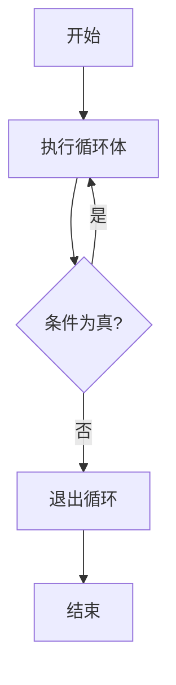

# C++ Do While 循环

在C++编程中，循环结构是控制程序执行流程的重要工具之一。`do-while`循环是C++提供的三种主要循环结构（`for`、`while`和`do-while`）之一，它有其独特的执行特点和适用场景。

## 什么是 Do While 循环？

`do-while`循环是一种**后测试循环**（post-test loop），这意味着循环体至少会执行一次，然后再检查循环条件。这与`while`循环（先测试循环）不同，后者可能一次都不执行循环体。

### 基本语法

```cpp
do {
    // 循环体（要重复执行的代码）
} while (条件表达式);
```

执行流程：
1. 首先执行循环体内的语句
2. 然后检查条件表达式
3. 如果条件为真（true），则返回步骤1继续执行
4. 如果条件为假（false），则退出循环，执行循环后的代码

:::note
注意语法细节：`do-while`循环末尾需要一个分号(`;`)，这是很多初学者容易忽略的地方。
:::

## Do While 循环的执行流程图



## 简单示例

让我们通过一个简单的例子来理解`do-while`循环的基本用法：

```cpp
#include <iostream>
using namespace std;

int main() {
    int i = 1;
    
    do {
        cout << "i = " << i << endl;
        i++;
    } while (i <= 5);
    
    return 0;
}
```

**输出：**
```
i = 1
i = 2
i = 3
i = 4
i = 5
```

在这个例子中，循环体先执行，打印并递增变量`i`，然后检查`i <= 5`的条件。当`i`的值变为6时，条件不再满足，循环结束。

## Do While vs While 循环

`do-while`和`while`循环的主要区别在于条件检查的时机：

```cpp
// while循环
while (条件) {
    // 循环体
}

// do-while循环
do {
    // 循环体
} while (条件);
```

让我们通过一个对比示例来看两者的区别：

```cpp
#include <iostream>
using namespace std;

int main() {
    int i = 6;
    
    cout << "使用while循环：" << endl;
    while (i <= 5) {
        cout << "i = " << i << endl;
        i++;
    }
    
    i = 6; // 重置i的值
    
    cout << "使用do-while循环：" << endl;
    do {
        cout << "i = " << i << endl;
        i++;
    } while (i <= 5);
    
    return 0;
}
```

**输出：**
```
使用while循环：
使用do-while循环：
i = 6
```

从输出可以看出：
- `while`循环一次都没有执行，因为初始条件`i <= 5`就不满足
- `do-while`循环执行了一次，尽管条件不满足，因为它是先执行后检查

## 实际应用场景

### 1. 用户输入验证

`do-while`循环非常适合验证用户输入，因为我们至少需要获取一次输入：

```cpp
#include <iostream>
using namespace std;

int main() {
    int number;
    
    do {
        cout << "请输入一个正数: ";
        cin >> number;
        
        if (number <= 0) {
            cout << "输入无效，请重试！" << endl;
        }
    } while (number <= 0);
    
    cout << "你输入的正数是: " << number << endl;
    
    return 0;
}
```

**示例交互：**
```
请输入一个正数: -5
输入无效，请重试！
请输入一个正数: 0
输入无效，请重试！
请输入一个正数: 10
你输入的正数是: 10
```

### 2. 菜单驱动的程序

`do-while`循环常用于创建菜单驱动的程序：

```cpp
#include <iostream>
using namespace std;

int main() {
    int choice;
    
    do {
        cout << "\n===== 计算器菜单 =====" << endl;
        cout << "1. 加法" << endl;
        cout << "2. 减法" << endl;
        cout << "3. 乘法" << endl;
        cout << "4. 除法" << endl;
        cout << "0. 退出" << endl;
        cout << "请选择操作: ";
        cin >> choice;
        
        // 根据用户选择执行相应操作
        switch (choice) {
            case 1:
                cout << "你选择了加法运算" << endl;
                // 加法运算代码
                break;
            case 2:
                cout << "你选择了减法运算" << endl;
                // 减法运算代码
                break;
            case 3:
                cout << "你选择了乘法运算" << endl;
                // 乘法运算代码
                break;
            case 4:
                cout << "你选择了除法运算" << endl;
                // 除法运算代码
                break;
            case 0:
                cout << "感谢使用，再见！" << endl;
                break;
            default:
                cout << "无效选择，请重试！" << endl;
        }
    } while (choice != 0);
    
    return 0;
}
```

### 3. 游戏循环

在游戏开发中，`do-while`循环常用于实现游戏的主循环：

```cpp
#include <iostream>
using namespace std;

int main() {
    bool gameRunning = true;
    char playAgain;
    
    do {
        cout << "游戏进行中..." << endl;
        // 游戏逻辑代码
        
        cout << "游戏结束！是否再玩一次？(y/n): ";
        cin >> playAgain;
        
        if (playAgain != 'y' && playAgain != 'Y') {
            gameRunning = false;
        }
    } while (gameRunning);
    
    cout << "感谢游玩，再见！" << endl;
    
    return 0;
}
```

## 使用 Do While 循环时的注意事项

1. **无限循环风险**：确保循环条件最终会变为假，否则会导致无限循环。

```cpp
do {
    // 如果这里没有改变影响条件的值
} while (true); // 这将是一个无限循环
```

2. **循环变量更新**：确保在循环体内正确更新控制循环的变量。

```cpp
int i = 1;
do {
    cout << i << " ";
    // 忘记增加i会导致无限循环
    i++; // 不要忘记这一行
} while (i <= 5);
```

3. **分号位置**：不要忘记`do-while`循环末尾的分号。

```cpp
do {
    // 循环体
} while (条件); // 这里的分号是必需的
```

## 何时选择 Do While 循环？

- 当你希望循环体至少执行一次时
- 用户输入验证场景
- 菜单驱动的程序
- 需要在循环结束前显示提示或执行操作的情况

:::tip
记住：`do-while`循环是"先执行，后检查"的循环结构。如果你不确定是否需要执行循环体，应该考虑使用`while`循环而非`do-while`循环。
:::

## 总结

`do-while`循环是C++中一种特殊的循环结构，它保证循环体至少执行一次。其关键特点是先执行循环体，然后再检查条件。这种循环结构在处理用户输入验证、创建菜单驱动程序和需要至少执行一次操作的场景中特别有用。

理解`do-while`循环与其他循环结构（如`while`和`for`循环）的区别，有助于你在编程中选择最合适的控制流结构，编写更高效、更易读的代码。

## 练习

1. 编写一个程序，使用`do-while`循环计算用户输入的正整数的阶乘。
2. 创建一个简单的猜数字游戏，使用`do-while`循环让用户一直猜，直到猜对为止。
3. 实现一个简单的ATM菜单系统，允许用户查询余额、存款、取款和退出。
4. 编写一个程序，使用`do-while`循环从用户获取一系列数字，直到用户输入0为止，然后计算这些数字的平均值。

通过这些实际练习，你将更好地掌握`do-while`循环的使用技巧和应用场景。

## 进一步学习资源

- 尝试将这些练习与其他控制流语句（如`if-else`、`switch`）结合使用
- 探索嵌套的`do-while`循环
- 比较`for`、`while`和`do-while`循环的性能和适用场景