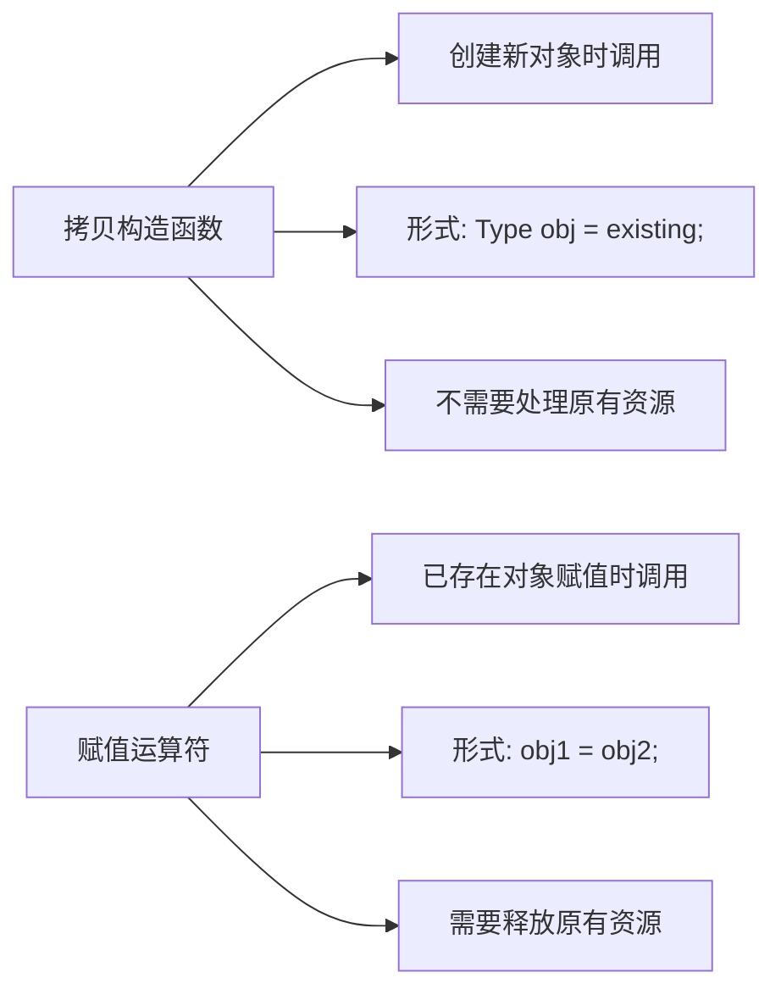

# C++ 赋值运算符重载

## 概述

在C++中，赋值运算符(`=`)是我们经常使用的运算符之一。当我们处理自定义类时，如果不重载赋值运算符，编译器会为我们生成一个默认版本，但这个默认版本可能无法满足我们的需求，特别是当类中包含动态分配的内存时。

赋值运算符重载允许我们自定义对象间赋值的行为，是C++面向对象编程中的重要概念。

:::note
赋值运算符与拷贝构造函数不同：
- 拷贝构造函数在**创建新对象时**初始化
- 赋值运算符在**已存在的对象间**赋值时调用
:::

## 为什么需要重载赋值运算符？

考虑以下情况：

```cpp
class MyString {
private:
    char* data;
    int length;
public:
    // 构造函数
    MyString(const char* str = nullptr);
    // 析构函数
    ~MyString();
};

MyString s1("Hello");
MyString s2 = s1;  // 使用默认的赋值运算符
```

如果不重载赋值运算符，编译器生成的默认版本会执行**浅拷贝**，即直接复制指针而不是指针指向的内容。这可能导致：

1. 内存泄漏：原对象的资源没有被正确释放
2. 重复释放：两个对象指向相同的内存，在析构时会导致重复释放
3. 数据一致性问题：一个对象修改了数据，会影响另一个对象

## 基本语法

赋值运算符重载的基本语法如下：

```cpp
Type& operator=(const Type& other) {
    // 检查自赋值
    if (this != &other) {
        // 释放当前对象已有的资源
        // 分配新的资源
        // 复制数据
    }
    return *this;  // 返回对当前对象的引用
}
```

## 详细实现步骤

让我们通过一个完整的例子来理解赋值运算符的重载：

```cpp
#include <iostream>
#include <cstring>

class MyString {
private:
    char* data;
    int length;

public:
    // 构造函数
    MyString(const char* str = nullptr) {
        if (str == nullptr) {
            length = 0;
            data = new char[1];
            data[0] = '\0';
        } else {
            length = strlen(str);
            data = new char[length + 1];
            strcpy(data, str);
        }
    }

    // 析构函数
    ~MyString() {
        delete[] data;
    }

    // 赋值运算符重载
    MyString& operator=(const MyString& other) {
        // 检查自赋值
        if (this == &other) {
            return *this;
        }

        // 释放原有资源
        delete[] data;

        // 分配新资源并复制数据
        length = other.length;
        data = new char[length + 1];
        strcpy(data, other.data);

        // 返回当前对象的引用
        return *this;
    }

    // 用于打印的函数
    void print() const {
        std::cout << data << std::endl;
    }
};

int main() {
    MyString s1("Hello");
    MyString s2;
    
    s2 = s1;  // 调用赋值运算符
    
    std::cout << "s1: ";
    s1.print();
    std::cout << "s2: ";
    s2.print();
    
    return 0;
}
```

**输出**：
```
s1: Hello
s2: Hello
```

## 深入理解赋值运算符重载

### 1. 自赋值检查

`if (this == &other)` 是对自赋值情况的检查。自赋值是指形如 `a = a` 的语句。如果不检查自赋值，可能会导致在重新分配内存前删除了原有数据。

### 2. 资源管理

赋值运算符需要正确管理资源：先释放当前对象的资源，然后分配新的资源并复制数据。这确保了不会发生内存泄漏。

### 3. 返回引用

赋值运算符应该返回对当前对象的引用，这样可以支持连续赋值，如 `a = b = c`。

## 赋值运算符 vs 拷贝构造函数

虽然赋值运算符和拷贝构造函数都涉及对象间的复制，但它们有明显的区别：



## 移动赋值运算符

C++11引入了移动语义，我们也可以重载移动赋值运算符，用于提高性能：

```cpp
// 移动赋值运算符
MyString& operator=(MyString&& other) noexcept {
    if (this != &other) {
        // 释放原有资源
        delete[] data;
        
        // 窃取资源
        data = other.data;
        length = other.length;
        
        // 将源对象置为安全状态
        other.data = nullptr;
        other.length = 0;
    }
    return *this;
}
```

## 实际应用案例

### 智能指针类实现

赋值运算符重载在实现智能指针类时非常重要：

```cpp
template<typename T>
class SmartPointer {
private:
    T* ptr;
    int* refCount;

public:
    // 构造函数
    SmartPointer(T* p = nullptr) : ptr(p), refCount(new int(1)) {}
    
    // 析构函数
    ~SmartPointer() {
        decreaseCount();
    }
    
    // 拷贝构造函数
    SmartPointer(const SmartPointer& other) : ptr(other.ptr), refCount(other.refCount) {
        (*refCount)++;
    }
    
    // 赋值运算符重载
    SmartPointer& operator=(const SmartPointer& other) {
        if (this != &other) {
            // 减少当前指针的引用计数
            decreaseCount();
            
            // 增加新指针的引用计数
            ptr = other.ptr;
            refCount = other.refCount;
            (*refCount)++;
        }
        return *this;
    }
    
    // 减少引用计数的辅助函数
    void decreaseCount() {
        (*refCount)--;
        if (*refCount == 0) {
            delete ptr;
            delete refCount;
        }
    }
    
    // 访问原始指针
    T* get() const {
        return ptr;
    }
    
    // 获取引用计数
    int getCount() const {
        return *refCount;
    }
};
```

### 应用示例

```cpp
#include <iostream>

int main() {
    // 创建智能指针
    SmartPointer<int> sp1(new int(5));
    std::cout << "sp1指向的值: " << *sp1.get() << std::endl;
    std::cout << "sp1的引用计数: " << sp1.getCount() << std::endl;
    
    // 使用赋值运算符
    SmartPointer<int> sp2;
    sp2 = sp1;
    
    std::cout << "赋值后:" << std::endl;
    std::cout << "sp1指向的值: " << *sp1.get() << std::endl;
    std::cout << "sp1的引用计数: " << sp1.getCount() << std::endl;
    std::cout << "sp2指向的值: " << *sp2.get() << std::endl;
    std::cout << "sp2的引用计数: " << sp2.getCount() << std::endl;
    
    return 0;
}
```

**输出**：
```
sp1指向的值: 5
sp1的引用计数: 1
赋值后:
sp1指向的值: 5
sp1的引用计数: 2
sp2指向的值: 5
sp2的引用计数: 2
```

## 最佳实践

1. **总是检查自赋值**：防止在赋值过程中无意中损坏对象
2. **遵循三/五法则**：如果需要定义析构函数、拷贝构造函数或赋值运算符中的任何一个，通常也需要定义其他两个
3. **考虑异常安全**：赋值操作应该是异常安全的，即使在赋值过程中抛出异常，对象也应保持一致状态
4. **使用拷贝-交换习惯用法**：简化赋值运算符实现，提高异常安全性

### 拷贝-交换习惯用法

```cpp
// 使用拷贝-交换习惯用法的赋值运算符
MyString& operator=(MyString other) {  // 注意：按值传递
    // 交换*this和other的数据
    std::swap(data, other.data);
    std::swap(length, other.length);
    
    // other离开作用域时会销毁原始数据
    return *this;
}
```

:::tip
按值传递参数会调用拷贝构造函数创建一个临时对象，然后与当前对象交换资源。这样既简化了代码，又提高了异常安全性。
:::

## 总结

赋值运算符重载是C++中管理资源的重要机制，特别是对于包含动态分配内存的类。正确实现赋值运算符可以避免内存泄漏、重复释放和数据一致性问题。

关键点回顾：
- 检查自赋值
- 释放原有资源
- 分配新资源并复制数据
- 返回对象引用
- 考虑移动赋值运算符
- 采用最佳实践如拷贝-交换习惯用法

## 练习题

1. 实现一个简单的动态数组类`Vector`，包括构造函数、析构函数、拷贝构造函数和赋值运算符。
2. 修改上面的`MyString`类，添加移动构造函数和移动赋值运算符。
3. 使用拷贝-交换习惯用法重写`MyString`类的赋值运算符。
4. 实现一个简单的智能指针类，类似于`std::shared_ptr`。

## 进一步阅读

- 《Effective C++》第10-12条
- 《C++ Primer》第13章：拷贝控制
- C++标准库中`std::shared_ptr`和`std::unique_ptr`的实现

通过深入理解和正确实现赋值运算符重载，你将能够更好地管理C++中的资源，编写更加健壮和高效的代码。