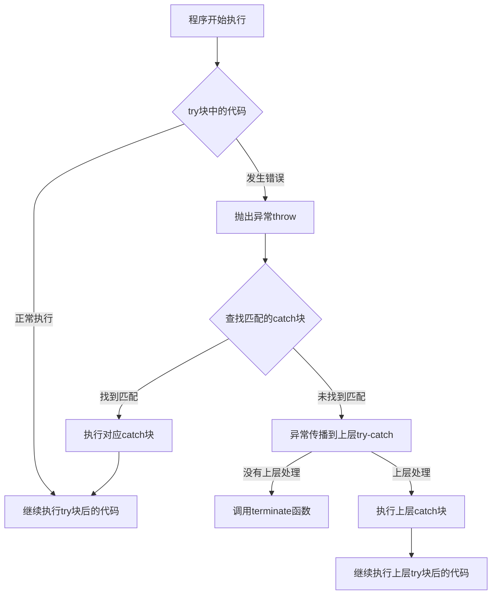

# C++ 异常处理基础

## 什么是异常处理？

在程序运行过程中，可能会遇到各种各样的错误情况，例如：打开一个不存在的文件，尝试使用一个空指针，或者进行除以零的操作。这些错误如果不妥善处理，可能导致程序崩溃或产生不可预期的行为。

**异常处理**是一种处理程序运行时错误的机制，它能够帮助我们：
- 检测程序运行时的错误
- 将错误信息传递给能够处理它的部分
- 保证程序的健壮性和可靠性

## C++ 异常处理的基本语法

### try, throw, catch 结构

C++的异常处理基于三个关键字：`try`, `throw`, 和 `catch`。

```cpp
try {
    // 可能抛出异常的代码
    throw exception_object; // 当检测到问题时抛出异常
}
catch (exception_type1 e1) {
    // 处理特定类型异常的代码
}
catch (exception_type2 e2) {
    // 处理另一种类型异常的代码
}
catch (...) {
    // 捕获任何类型的异常
}
```

### 基本工作流程



## 简单的异常处理示例

让我们看一个简单的除法运算的例子，演示如何使用异常处理来避免除以零的错误：

```cpp
#include <iostream>
using namespace std;

double divide(double a, double b) {
    if (b == 0) {
        throw "除数不能为零！";  // 抛出异常
    }
    return a / b;
}

int main() {
    double numerator, denominator, result;
    
    cout << "请输入被除数: ";
    cin >> numerator;
    cout << "请输入除数: ";
    cin >> denominator;
    
    try {
        result = divide(numerator, denominator);
        cout << "结果是: " << result << endl;
    } 
    catch (const char* msg) {
        cerr << "错误: " << msg << endl;
    }
    
    cout << "程序继续执行..." << endl;
    
    return 0;
}
```

**输入和输出示例 1**:
```
请输入被除数: 10
请输入除数: 2
结果是: 5
程序继续执行...
```

**输入和输出示例 2**:
```
请输入被除数: 10
请输入除数: 0
错误: 除数不能为零！
程序继续执行...
```

## 异常类型

C++支持多种类型的异常，包括：

1. **内置数据类型**：如整数、字符串等
2. **自定义类类型**
3. **标准异常类**：C++标准库提供的异常类

### 标准异常类

C++标准库提供了一组异常类，位于`<stdexcept>`头文件中，常用的包括：

```cpp
#include <stdexcept>

// 标准异常类的继承层次
// std::exception（基类）
//   ├── std::logic_error
//   │     ├── std::invalid_argument
//   │     ├── std::domain_error
//   │     ├── std::length_error
//   │     └── std::out_of_range
//   └── std::runtime_error
//         ├── std::range_error
//         ├── std::overflow_error
//         └── std::underflow_error
```

## 使用标准异常

```cpp
#include <iostream>
#include <stdexcept>
#include <vector>
using namespace std;

int main() {
    vector<int> numbers(5);
    
    try {
        // 尝试访问越界元素
        cout << "尝试访问元素 numbers[10]" << endl;
        numbers.at(10) = 100; // vector的at方法会检查边界并在越界时抛出异常
    }
    catch (const out_of_range& e) {
        cerr << "捕获到out_of_range异常: " << e.what() << endl;
    }
    catch (const exception& e) {
        cerr << "捕获到其他标准异常: " << e.what() << endl;
    }
    
    cout << "程序正常结束" << endl;
    
    return 0;
}
```

**输出**:
```
尝试访问元素 numbers[10]
捕获到out_of_range异常: vector::_M_range_check: __n (which is 10) >= this->size() (which is 5)
程序正常结束
```

## 自定义异常类

在更复杂的项目中，我们通常会定义自己的异常类，以更好地表达和处理特定的错误情况：

```cpp
#include <iostream>
#include <stdexcept>
#include <string>
using namespace std;

// 自定义异常类
class DatabaseException : public runtime_error {
private:
    int errorCode;
    
public:
    DatabaseException(const string& message, int code) 
        : runtime_error(message), errorCode(code) {}
        
    int getErrorCode() const {
        return errorCode;
    }
};

// 模拟数据库连接函数
void connectToDatabase(const string& connectionString) {
    // 假设连接字符串为空时表示配置错误
    if (connectionString.empty()) {
        throw DatabaseException("数据库连接字符串为空", 1001);
    }
    
    // 假设特定字符串表示服务器离线
    if (connectionString == "offline") {
        throw DatabaseException("数据库服务器离线", 2002);
    }
    
    cout << "数据库连接成功!" << endl;
}

int main() {
    try {
        string connString;
        cout << "请输入数据库连接字符串 (输入'offline'模拟服务器离线): ";
        getline(cin, connString);
        
        connectToDatabase(connString);
    }
    catch (const DatabaseException& e) {
        cerr << "数据库错误 [代码: " << e.getErrorCode() << "]: " 
             << e.what() << endl;
    }
    catch (const exception& e) {
        cerr << "其他异常: " << e.what() << endl;
    }
    
    return 0;
}
```

**输入和输出示例 1**:
```
请输入数据库连接字符串 (输入'offline'模拟服务器离线): mysql://localhost:3306
数据库连接成功!
```

**输入和输出示例 2**:
```
请输入数据库连接字符串 (输入'offline'模拟服务器离线): offline
数据库错误 [代码: 2002]: 数据库服务器离线
```

**输入和输出示例 3**:
```
请输入数据库连接字符串 (输入'offline'模拟服务器离线): 
数据库错误 [代码: 1001]: 数据库连接字符串为空
```

## 异常处理的最佳实践

:::tip 最佳实践
1. **只处理真正的异常情况**：异常处理机制相比普通的条件检查开销更大，应该只用于处理真正的异常情况。

2. **使用合适的异常类型**：选择或创建能够清晰表达错误原因的异常类型。

3. **保持异常规范的一致性**：在函数声明中使用`noexcept`明确表示函数不会抛出异常。

4. **按照从特殊到一般的顺序捕获异常**：更具体的异常类应该先于更一般的异常类被捕获。

5. **清理资源**：确保在异常发生时正确释放资源（或使用RAII技术）。

6. **避免在析构函数中抛出异常**：这可能会导致程序终止。
:::

## 资源管理与异常安全

异常处理的一个重要作用是确保程序即使在出错时也能正确释放资源。C++提供了RAII（Resource Acquisition Is Initialization）技术来实现这一点。

### RAII示例

```cpp
#include <iostream>
#include <fstream>
#include <memory>
using namespace std;

// 不使用RAII - 可能导致资源泄漏
void processFile_unsafe(const string& filename) {
    ifstream file(filename);
    if (!file) {
        throw runtime_error("无法打开文件");
    }
    
    // 处理文件...
    // 如果这里发生异常，file不会被正确关闭
    
    file.close(); // 正常情况下关闭文件
}

// 使用RAII - 自动管理资源
void processFile_safe(const string& filename) {
    ifstream file(filename); // 构造函数获取资源
    if (!file) {
        throw runtime_error("无法打开文件");
    }
    
    // 处理文件...
    // 如果这里发生异常，file的析构函数会自动关闭文件
    
    // 函数结束时，file对象超出作用域，析构函数自动关闭文件
}

// 使用智能指针进行动态内存管理
void dynamicMemory_example() {
    // 不安全的方法
    int* data1 = new int[1000];
    // 如果这里出现异常，内存将泄漏
    delete[] data1;
    
    // 安全的方法 - 使用智能指针
    unique_ptr<int[]> data2(new int[1000]);
    // 如果这里出现异常，data2的析构函数会自动释放内存
}
```

## 异常处理的实际应用场景

### 场景1：文件操作

```cpp
#include <iostream>
#include <fstream>
#include <stdexcept>
using namespace std;

void readConfigFile(const string& filename) {
    ifstream file(filename);
    
    if (!file.is_open()) {
        throw runtime_error("无法打开配置文件: " + filename);
    }
    
    string line;
    while (getline(file, line)) {
        cout << "配置项: " << line << endl;
    }
    
    if (file.bad()) {
        throw runtime_error("读取配置文件时发生I/O错误");
    }
}

int main() {
    try {
        readConfigFile("settings.cfg");
    }
    catch (const exception& e) {
        cerr << "错误: " << e.what() << endl;
        cerr << "使用默认配置继续..." << endl;
        // 加载默认配置...
    }
    
    cout << "应用程序继续运行..." << endl;
    return 0;
}
```

### 场景2：网络连接

```cpp
#include <iostream>
#include <stdexcept>
#include <string>
using namespace std;

// 模拟网络连接类
class NetworkConnection {
private:
    string serverAddress;
    bool connected;
    
public:
    NetworkConnection(const string& address) : serverAddress(address), connected(false) {}
    
    void connect() {
        if (serverAddress.empty()) {
            throw invalid_argument("服务器地址不能为空");
        }
        
        if (serverAddress == "unavailable") {
            throw runtime_error("服务器不可用");
        }
        
        // 模拟连接成功
        connected = true;
        cout << "成功连接到服务器: " << serverAddress << endl;
    }
    
    void sendData(const string& data) {
        if (!connected) {
            throw logic_error("尝试在未连接的状态下发送数据");
        }
        
        cout << "发送数据: " << data << endl;
    }
    
    ~NetworkConnection() {
        if (connected) {
            cout << "关闭与服务器的连接: " << serverAddress << endl;
        }
    }
};

int main() {
    try {
        NetworkConnection connection("example.com");
        connection.connect();
        connection.sendData("Hello, Server!");
    }
    catch (const invalid_argument& e) {
        cerr << "参数错误: " << e.what() << endl;
    }
    catch (const runtime_error& e) {
        cerr << "运行时错误: " << e.what() << endl;
        cerr << "尝试使用备用服务器..." << endl;
        
        try {
            NetworkConnection backupConnection("backup.example.com");
            backupConnection.connect();
            backupConnection.sendData("Hello, Backup Server!");
        }
        catch (const exception& e) {
            cerr << "备用服务器也失败: " << e.what() << endl;
        }
    }
    catch (const exception& e) {
        cerr << "其他错误: " << e.what() << endl;
    }
    
    return 0;
}
```

## noexcept 说明符

C++11引入了`noexcept`说明符，用于指定函数不会抛出异常。这有助于编译器进行优化，并明确函数的异常保证。

```cpp
// 这个函数保证不会抛出异常
void safeFunction() noexcept {
    // 实现...
}

// 这个函数可能会抛出异常
void riskyFunction() {
    // 实现...
    throw runtime_error("出错了");
}

// 根据表达式决定是否可能抛出异常
void conditionalFunction() noexcept(noexcept(safeFunction())) {
    safeFunction();
}
```

## 总结

异常处理是C++中处理错误情况的强大机制，它允许我们将错误检测与错误处理代码分离，使程序更加清晰和健壮。主要优点包括：

1. **错误无法被忽略**：抛出的异常必须被捕获或导致程序终止。
2. **错误处理集中化**：可以在调用堆栈的任何位置处理错误。
3. **支持层次化的错误处理**：可以定义异常层次结构以统一处理相关错误。
4. **促进代码分离**：正常流程代码和错误处理代码分离。

然而，异常处理也有一定的开销，因此不应该用来处理常规的控制流。正确使用异常处理可以显著提高程序的可靠性和可维护性。

## 练习

1. 编写一个函数，接受两个整数参数并返回它们的商，使用异常处理来处理除以零的情况。

2. 创建一个模拟银行账户的类，当尝试从账户中取出超过余额的金额时抛出自定义异常。

3. 实现一个简单的数组类，当尝试访问数组边界外的元素时抛出`std::out_of_range`异常。

4. 修改上面的银行账户示例，添加事务日志记录，并确保即使在异常发生时也能正确记录失败的交易。

## 参考资源

- [C++ 参考手册 - 异常处理](https://en.cppreference.com/w/cpp/language/exceptions)
- [C++ 标准异常](https://en.cppreference.com/w/cpp/error/exception)
- [C++ Core Guidelines - 异常处理](http://isocpp.github.io/CppCoreGuidelines/CppCoreGuidelines#S-errors)

掌握异常处理是成为一名优秀的C++程序员的重要一步。通过正确使用异常，你可以编写更加健壮、可维护的代码。