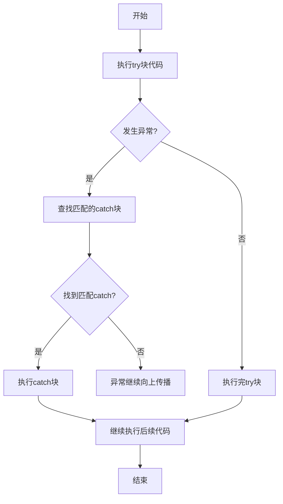

# C++ try块

## 什么是try块？

在C++编程中，`try`块是异常处理机制的核心组成部分。它用于标记可能会产生异常的代码段，然后与相应的`catch`块配合使用，以捕获并处理这些异常。

`try`块充当一个"保护区"，让你能够监视代码执行，并在出现问题时立即介入处理，而不是让程序崩溃或产生意外行为。

## try块的基本语法

```cpp
try {
    // 可能会抛出异常的代码
}
catch(异常类型1 参数名) {
    // 处理异常类型1的代码
}
catch(异常类型2 参数名) {
    // 处理异常类型2的代码
}
// 可以有更多的catch块
```

:::note
`try`块后面必须至少跟随一个`catch`块，否则会导致编译错误。
:::

## 异常处理流程

当`try`块中的代码执行到抛出异常的语句时，程序会：

1. 立即停止执行当前的`try`块中剩余的代码
2. 查找匹配的`catch`块
3. 执行找到的匹配`catch`块中的代码
4. 执行完`catch`块后，程序会继续执行后续代码



## 简单示例

让我们看一个基本的try-catch使用示例：

```cpp
#include <iostream>
using namespace std;

int main() {
    try {
        cout << "尝试执行可能出错的代码" << endl;
        throw 20; // 抛出一个int类型的异常
        cout << "这一行不会执行" << endl; // 这一行被跳过
    }
    catch(int e) {
        cout << "捕获到整数异常: " << e << endl;
    }
    
    cout << "程序继续执行" << endl;
    
    return 0;
}
```

**输出：**
```
尝试执行可能出错的代码
捕获到整数异常: 20
程序继续执行
```

在这个例子中，当`throw 20`语句执行时，程序立即停止执行try块中的剩余代码，跳转到匹配的catch块，并继续执行后续代码。

## 多种异常类型处理

C++允许你捕获多种不同类型的异常：

```cpp
#include <iostream>
#include <string>
using namespace std;

int main() {
    try {
        int choice;
        cout << "输入异常类型 (1:int, 2:double, 3:string): ";
        cin >> choice;
        
        if(choice == 1)
            throw 100;
        else if(choice == 2)
            throw 3.14;
        else if(choice == 3)
            throw string("字符串异常");
        else
            cout << "没有异常" << endl;
    }
    catch(int e) {
        cout << "整数异常: " << e << endl;
    }
    catch(double e) {
        cout << "浮点数异常: " << e << endl;
    }
    catch(string e) {
        cout << "字符串异常: " << e << endl;
    }
    
    return 0;
}
```

**输入：** `1`  
**输出：** `整数异常: 100`

**输入：** `2`  
**输出：** `浮点数异常: 3.14`

**输入：** `3`  
**输出：** `字符串异常: 字符串异常`

## 捕获所有异常

如果你想捕获所有类型的异常，可以使用省略号`...`：

```cpp
try {
    // 可能抛出任何类型异常的代码
    throw "未知错误";
}
catch(int e) {
    cout << "整数异常: " << e << endl;
}
catch(...) {
    cout << "捕获到未知类型的异常!" << endl;
}
```

:::caution
通用异常处理器(`catch(...)`)应该放在所有具体异常处理器之后，否则具体的异常处理器将永远不会被执行。
:::

## try块的嵌套

try块可以嵌套使用，内层try块抛出但未捕获的异常会传递到外层try块：

```cpp
#include <iostream>
using namespace std;

int main() {
    try {
        cout << "外层try块开始" << endl;
        
        try {
            cout << "内层try块开始" << endl;
            throw 100;
            cout << "内层try块结束" << endl; // 不会执行
        }
        catch(double) {
            cout << "内层catch - 捕获浮点数异常" << endl;
        }
        
        cout << "外层try块继续" << endl; // 不会执行，因为内层异常未被捕获
    }
    catch(int e) {
        cout << "外层catch - 捕获整数异常: " << e << endl;
    }
    
    cout << "程序继续执行" << endl;
    
    return 0;
}
```

**输出：**
```
外层try块开始
内层try块开始
外层catch - 捕获整数异常: 100
程序继续执行
```

## 实际应用案例

### 文件操作异常处理

```cpp
#include <iostream>
#include <fstream>
#include <string>
using namespace std;

void readFile(const string& filename) {
    ifstream file;
    
    try {
        file.open(filename);
        
        if(!file.is_open()) {
            throw runtime_error("无法打开文件: " + filename);
        }
        
        string line;
        while(getline(file, line)) {
            cout << line << endl;
        }
        
        file.close();
    }
    catch(const runtime_error& e) {
        cout << "文件错误: " << e.what() << endl;
        // 确保文件被关闭
        if(file.is_open()) {
            file.close();
        }
    }
}

int main() {
    readFile("existing_file.txt");
    readFile("non_existent_file.txt");
    
    return 0;
}
```

### 动态内存分配异常处理

```cpp
#include <iostream>
#include <new>
using namespace std;

int main() {
    try {
        cout << "尝试分配大量内存..." << endl;
        
        // 尝试分配非常大的内存块
        long long size = 1000000000000LL; // 非常大的数字，可能超出可用内存
        int* arr = new int[size];
        
        cout << "内存分配成功" << endl;
        delete[] arr; // 释放内存
    }
    catch(const bad_alloc& e) {
        cout << "内存分配失败: " << e.what() << endl;
        cout << "程序优雅地处理了内存不足的情况" << endl;
    }
    
    cout << "程序继续执行" << endl;
    
    return 0;
}
```

## 函数中抛出异常

异常处理的强大之处在于，异常可以在函数嵌套调用的任何深度抛出，然后在调用栈上传播，直到找到合适的catch块：

```cpp
#include <iostream>
using namespace std;

// 可能抛出异常的函数
void function3() {
    cout << "在function3中" << endl;
    throw "发生错误!";
    cout << "function3结束" << endl; // 不会执行
}

void function2() {
    cout << "在function2中，调用function3" << endl;
    function3();
    cout << "function2结束" << endl; // 不会执行
}

void function1() {
    cout << "在function1中，调用function2" << endl;
    function2();
    cout << "function1结束" << endl; // 不会执行
}

int main() {
    cout << "main开始" << endl;
    
    try {
        function1();
    }
    catch(const char* e) {
        cout << "异常被捕获: " << e << endl;
    }
    
    cout << "main结束" << endl;
    
    return 0;
}
```

**输出：**
```
main开始
在function1中，调用function2
在function2中，调用function3
在function3中
异常被捕获: 发生错误!
main结束
```

## try块的最佳实践

1. **明确异常类型**: 尽可能捕获具体类型的异常，而不是使用通用的捕获(`catch(...)`)
2. **异常的层次结构**: 从派生类到基类的顺序排列catch块
3. **资源管理**: 使用RAII（资源获取即初始化）或智能指针确保资源在发生异常时也能被正确释放
4. **不要过度使用**: 异常处理应该用于处理真正的异常情况，而不是正常的流程控制
5. **注释**: 在throw语句附近添加注释，说明抛出异常的原因

:::tip
C++17引入了嵌套命名空间声明，可以简化名称空间的嵌套：
```cpp
// 旧写法
namespace A {
    namespace B {
        namespace C {
            // 代码
        }
    }
}

// C++17新写法
namespace A::B::C {
    // 代码
}
```
:::

## 总结

`try`块是C++异常处理机制的基础，它与`catch`块一起使用，提供了一种结构化的方式来处理程序中可能出现的错误情况。通过使用`try-catch`机制：

1. 代码变得更加健壮，能够应对各种异常情况
2. 错误处理与正常业务逻辑分离，提高了代码的可读性
3. 异常可以在函数调用栈中传播，使错误处理更加灵活
4. 程序可以在发生错误时优雅地恢复或关闭，而不是突然终止

掌握`try`块的使用是成为熟练C++程序员的重要一步，它能帮助你编写出更加健壮和可维护的代码。

## 练习

1. 编写一个程序，使用`try-catch`块处理除零异常
2. 创建一个自定义异常类，并在适当的情况下抛出和捕获它
3. 编写一个函数，它可能抛出多种类型的异常，然后在`main()`函数中捕获和处理这些异常
4. 实现一个简单的计算器程序，使用异常处理无效的输入和运算错误

## 额外资源

- C++ 标准文档关于异常处理的章节
- Bjarne Stroustrup 的《C++程序设计语言》第4版中关于异常处理的章节
- C++ Core Guidelines中关于异常处理的最佳实践

通过持续练习和应用，你将能够熟练掌握C++中的异常处理机制，编写出更加健壮的程序。