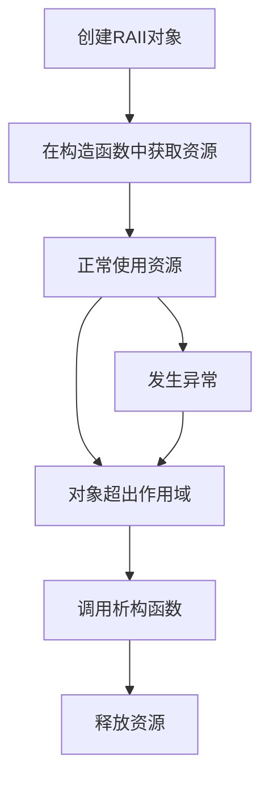
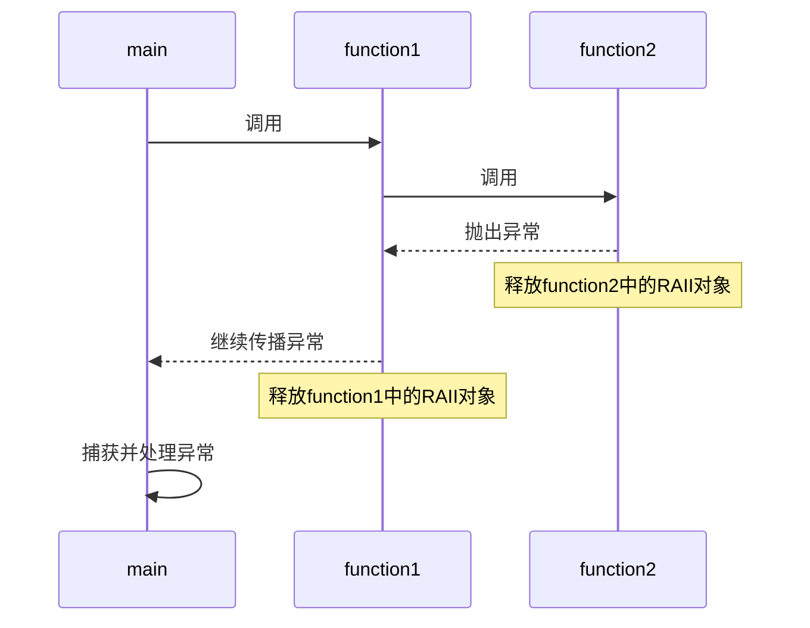

# C++ RAII与异常

## 什么是RAII？

RAII（Resource Acquisition Is Initialization，资源获取即初始化）是C++特有的设计模式，它将资源的生命周期与对象的生命周期绑定在一起。简单来说，RAII保证：

- 资源在对象**构造**时获取
- 资源在对象**析构**时释放

这种模式与C++的异常处理机制完美结合，确保即使在出现异常的情况下，也不会发生资源泄漏。

## RAII的基本原理

在C++中，当对象超出作用域时，会自动调用其析构函数。RAII利用这一特性来确保资源的自动释放。



## 为什么需要RAII？

考虑以下不使用RAII的代码：

```cpp
void processFile() {
    FILE* file = fopen("data.txt", "r");
    // 处理文件...
    
    // 如果这里发生异常，fclose永远不会被调用
    
    fclose(file); // 正常情况下的资源释放
}
```

如果在处理文件的过程中发生异常，`fclose(file)`将不会被执行，导致文件句柄泄漏。

## 使用RAII的正确方式

### 示例1：文件处理

```cpp
class FileHandler {
private:
    FILE* file;
public:
    FileHandler(const char* filename, const char* mode) {
        file = fopen(filename, mode);
        if (!file) {
            throw std::runtime_error("无法打开文件");
        }
    }
    
    ~FileHandler() {
        if (file) {
            fclose(file);
        }
    }
    
    // 禁止复制
    FileHandler(const FileHandler&) = delete;
    FileHandler& operator=(const FileHandler&) = delete;
    
    // 提供文件操作方法
    void write(const char* data) {
        fprintf(file, "%s", data);
    }
    
    // 更多文件操作...
};

void processFile() {
    try {
        FileHandler handler("data.txt", "w");
        handler.write("Hello World");
        // 即使这里抛出异常，文件也会被正确关闭
    } catch (const std::exception& e) {
        std::cerr << "Error: " << e.what() << std::endl;
    }
    // 当handler离开作用域，其析构函数会自动关闭文件
}
```

### 示例2：动态内存管理

```cpp
void processData() {
    // 不使用RAII
    int* data = new int[1000];
    // 处理数据...
    // 如果这里抛出异常，内存将不会被释放
    delete[] data;
    
    // 使用RAII (std::vector是RAII容器)
    std::vector<int> safeData(1000);
    // 处理数据...
    // 即使发生异常，safeData会自动释放内存
}
```

## RAII与异常的关系

RAII之所以在C++中如此重要，很大程度上是因为它与异常处理机制完美配合：

1. **保证资源释放**：无论函数如何退出（正常返回或抛出异常），RAII对象的析构函数总会被调用
2. **简化错误处理**：不需要在每个可能的退出点手动释放资源
3. **嵌套异常安全**：在处理一个异常时发生另一个异常，RAII仍能确保资源正确释放

### 栈展开（Stack Unwinding）过程

当异常被抛出时，C++运行时会执行"栈展开"过程：

1. 搜索匹配的catch块
2. 在搜索过程中，销毁当前作用域内的所有局部对象（调用它们的析构函数）
3. 继续向外层作用域搜索，重复步骤2
4. 找到匹配的catch块或达到main函数后终止搜索



## RAII在不同资源上的应用

### 1. 互斥锁

```cpp
#include <mutex>

std::mutex mtx;

void threadSafeFunction() {
    // 不使用RAII
    mtx.lock();
    // 临界区...
    // 如果这里抛出异常，mutex不会解锁！
    mtx.unlock();
    
    // 使用RAII
    {
        std::lock_guard<std::mutex> lock(mtx);
        // 临界区...
        // 即使抛出异常，离开作用域时mutex也会自动解锁
    }
}
```

### 2. 智能指针

```cpp
void processObject() {
    // 不使用RAII
    MyClass* obj = new MyClass();
    obj->doSomething(); // 可能抛出异常
    delete obj; // 如果上面抛异常，这行不会执行
    
    // 使用RAII (std::unique_ptr)
    std::unique_ptr<MyClass> obj2(new MyClass());
    // 或使用更推荐的方式:
    auto obj3 = std::make_unique<MyClass>();
    obj3->doSomething(); // 即使抛出异常，obj3也会被自动删除
}
```

### 实际案例：数据库连接管理

```cpp
class DatabaseConnection {
private:
    SQLConnection* conn;
    bool committed;
public:
    DatabaseConnection(const std::string& connectionString) : committed(false) {
        conn = SQLConnect(connectionString.c_str());
        if (!conn) {
            throw std::runtime_error("数据库连接失败");
        }
        SQLBeginTransaction(conn);
    }
    
    ~DatabaseConnection() {
        if (conn) {
            if (!committed) {
                SQLRollback(conn); // 如果没有提交，则回滚事务
            }
            SQLDisconnect(conn);
            SQLFreeConnection(conn);
        }
    }
    
    void execute(const std::string& query) {
        int result = SQLExecute(conn, query.c_str());
        if (result != SQL_SUCCESS) {
            throw std::runtime_error("SQL执行失败");
        }
    }
    
    void commit() {
        SQLCommit(conn);
        committed = true;
    }
    
    // 禁止复制
    DatabaseConnection(const DatabaseConnection&) = delete;
    DatabaseConnection& operator=(const DatabaseConnection&) = delete;
};

void updateUserData(int userId, const std::string& newData) {
    try {
        DatabaseConnection db("server=localhost;user=root;password=1234");
        
        // 执行多个SQL操作
        db.execute("UPDATE users SET data = '" + newData + "' WHERE id = " + std::to_string(userId));
        db.execute("INSERT INTO logs VALUES (NOW(), 'User data updated')");
        
        // 如果所有操作都成功，提交事务
        db.commit();
    } catch (const std::exception& e) {
        std::cerr << "数据库操作失败: " << e.what() << std::endl;
        // db的析构函数会自动回滚未提交的事务并释放连接
    }
}
```

:::note
上面的SQL示例为了简单起见没有进行参数化查询，实际开发中应当使用参数化查询防止SQL注入。
:::

## RAII最佳实践

1. **及时封装资源**：获取资源后立即将其封装到RAII对象中
2. **禁止复制或实现合理的复制语义**：在大多数情况下，资源不应被复制，使用`= delete`明确禁止
3. **保持类职责单一**：RAII类应专注于管理一种特定资源
4. **确保异常安全的析构函数**：析构函数不应抛出异常
5. **使用C++标准库提供的RAII工具**：
   - `std::unique_ptr`、`std::shared_ptr`用于内存管理
   - `std::lock_guard`、`std::unique_lock`用于互斥锁
   - `std::fstream`用于文件操作

## 常见陷阱与解决方案

### 1. 陷阱：析构函数抛出异常

```cpp
class Dangerous {
public:
    ~Dangerous() {
        throw std::runtime_error("在析构函数中抛出异常");
        // 这是非常危险的行为！
    }
};
```

:::warning
析构函数中抛出异常会导致程序终止。在栈展开过程中，如果析构函数抛出异常，将导致`std::terminate`被调用。
:::

**解决方案**：永远不要在析构函数中抛出异常，而是记录错误或使用其他方式处理。

```cpp
class Safe {
public:
    ~Safe() {
        try {
            // 可能抛出异常的操作
        } catch (const std::exception& e) {
            std::cerr << "析构时捕获到异常: " << e.what() << std::endl;
            // 处理错误，但不重新抛出
        }
    }
};
```

### 2. 陷阱：资源所有权不明确

**解决方案**：使用移动语义和智能指针明确所有权。

```cpp
std::unique_ptr<Resource> createResource() {
    return std::make_unique<Resource>();
    // 明确转移所有权
}

void useResource() {
    auto res = createResource();
    // 现在res拥有资源
    // 离开作用域时自动释放
}
```

## 总结

RAII是C++中管理资源最重要的设计模式，它与C++的异常处理机制天然配合，为我们提供了高效、安全的资源管理方式：

- RAII确保资源在构造时获取，在析构时释放
- RAII与异常处理配合，保证即使在异常情况下也不会发生资源泄漏
- C++标准库大量使用RAII设计模式
- 正确使用RAII可以显著减少代码中的错误处理逻辑
- RAII是编写异常安全代码的基础

掌握RAII模式对于编写健壮的C++程序至关重要，它不仅能避免资源泄漏，还能使代码更加简洁、安全。

## 练习

1. 编写一个使用RAII管理文件锁的类
2. 修改以下代码，使用RAII避免资源泄漏：

```cpp
void processData() {
    int* buffer = new int[1000];
    process(buffer);
    if (hasError()) {
        return; // 内存泄漏！
    }
    delete[] buffer;
}
```

3. 实现一个简单的RAII类来管理数据库事务

## 进一步阅读

- Bjarne Stroustrup的《The C++ Programming Language》第4版中关于RAII的章节
- Scott Meyers的《Effective C++》和《Effective Modern C++》
- Herb Sutter的《Exceptional C++》系列书籍