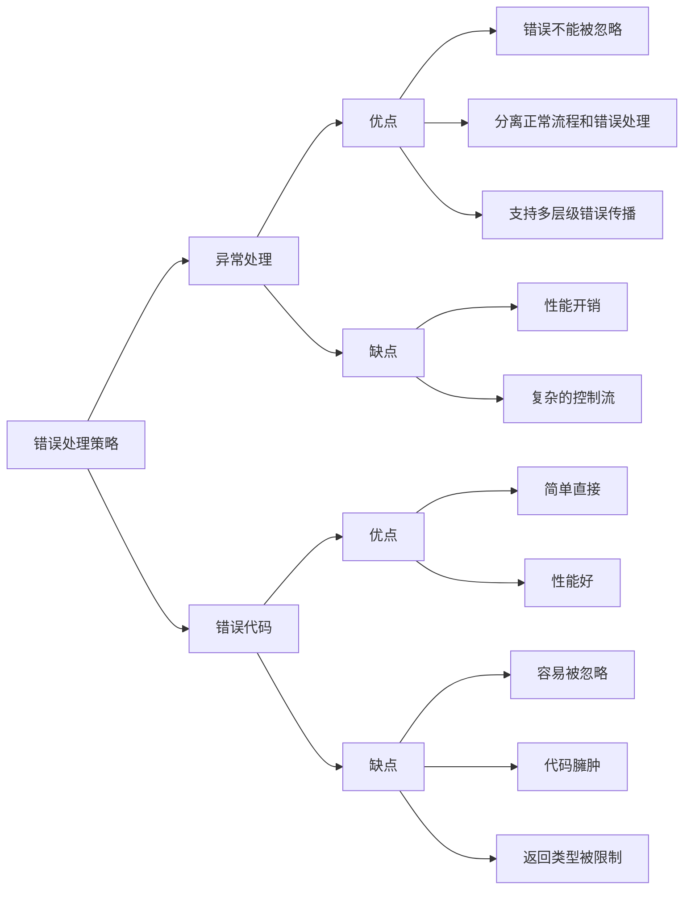

# C++ 异常处理最佳实践

## 异常处理简介

异常处理是C++中处理程序错误和异常情况的机制。当程序执行过程中遇到无法正常处理的情况时，可以"抛出"一个异常，然后在代码的其他部分"捕获"这个异常并进行处理，使程序能够优雅地恢复正常执行或安全终止。

异常处理的主要优势包括：

1. 将错误检测与错误处理分离
2. 错误无法被忽略（除非明确选择忽略）
3. 可以处理各种类型的错误
4. 支持错误的传播

## 基本语法

C++异常处理基于三个关键词：`try`、`catch` 和 `throw`。

```cpp
#include <iostream>
#include <stdexcept>

int main() {
    try {
        // 可能抛出异常的代码
        throw std::runtime_error("发生了一个运行时错误");
    } 
    catch (const std::exception& e) {
        // 处理异常
        std::cout << "捕获到异常: " << e.what() << std::endl;
    }
    
    std::cout << "程序继续执行" << std::endl;
    return 0;
}
```

**输出：**
```
捕获到异常: 发生了一个运行时错误
程序继续执行
```

## 异常处理最佳实践

### 1. 使用标准异常类

C++标准库提供了一系列异常类，它们都继承自`std::exception`。尽可能使用这些标准异常类，或者从它们派生自定义异常：

```cpp
#include <iostream>
#include <stdexcept>
#include <string>

class DatabaseError : public std::runtime_error {
public:
    DatabaseError(const std::string& message) 
        : std::runtime_error("数据库错误: " + message) {}
};

void connectToDatabase() {
    // 假设这里尝试连接数据库
    bool connectionFailed = true;
    
    if (connectionFailed) {
        throw DatabaseError("无法连接到服务器");
    }
}

int main() {
    try {
        connectToDatabase();
    }
    catch (const DatabaseError& e) {
        std::cerr << e.what() << std::endl;
    }
    catch (const std::exception& e) {
        std::cerr << "标准异常: " << e.what() << std::endl;
    }
    catch (...) {
        std::cerr << "未知异常" << std::endl;
    }
    
    return 0;
}
```

**输出：**
```
数据库错误: 无法连接到服务器
```

### 2. 异常规范和noexcept

现代C++中，最好使用`noexcept`指定函数是否会抛出异常：

```cpp
// 这个函数保证不会抛出异常
void safeFunction() noexcept {
    // 安全的代码
}

// 这个函数可能会抛出异常
void riskyFunction() {
    throw std::runtime_error("有风险的操作");
}

// 条件性noexcept
template <typename T>
void conditionallyNoexcept(T value) noexcept(std::is_integral<T>::value) {
    // 只有当T是整型时才保证不抛出异常
}
```

### 3. RAII (资源获取即初始化)

RAII是C++中处理资源管理的一种技术，它可以与异常处理配合使用，确保即使在发生异常的情况下资源也能被正确释放：

```cpp
#include <iostream>
#include <fstream>
#include <stdexcept>

class FileHandler {
private:
    std::ofstream file;
    
public:
    FileHandler(const std::string& filename) {
        file.open(filename);
        if (!file.is_open()) {
            throw std::runtime_error("无法打开文件: " + filename);
        }
        std::cout << "文件已打开" << std::endl;
    }
    
    void writeData(const std::string& data) {
        file << data;
    }
    
    ~FileHandler() {
        if (file.is_open()) {
            file.close();
            std::cout << "文件已关闭" << std::endl;
        }
    }
};

void processFile() {
    // 即使函数提前返回或抛出异常，FileHandler析构函数仍会被调用，确保文件被关闭
    FileHandler handler("example.txt");
    handler.writeData("这是一些测试数据");
    
    // 假设这里出现了一个异常
    throw std::runtime_error("处理文件时出错");
    
    // 这行代码永远不会执行
    handler.writeData("这行不会被写入");
}

int main() {
    try {
        processFile();
    }
    catch (const std::exception& e) {
        std::cerr << "捕获到异常: " << e.what() << std::endl;
    }
    
    return 0;
}
```

**输出：**
```
文件已打开
文件已关闭
捕获到异常: 处理文件时出错
```

### 4. 按引用捕获异常

总是按引用捕获异常，以避免对象切片问题：

```cpp
try {
    // 可能抛出异常的代码
}
catch (const std::exception& e) {  // 正确：按引用捕获
    // 处理异常
}

// 不推荐的方式
try {
    // 可能抛出异常的代码
}
catch (std::exception e) {  // 不正确：按值捕获可能导致对象切片
    // 处理异常
}
```

### 5. 适当地处理异常

避免空的`catch`块，确保异常得到适当处理：

```cpp
try {
    // 可能抛出异常的代码
}
catch (const std::exception& e) {
    // 不良做法：忽略异常
}

// 更好的做法：
try {
    // 可能抛出异常的代码
}
catch (const std::exception& e) {
    // 记录错误
    std::cerr << "错误: " << e.what() << std::endl;
    
    // 尝试恢复，或者进行清理操作
    
    // 如果无法处理，可以重新抛出
    throw;
}
```

### 6. 构造函数和析构函数中的异常

构造函数可以抛出异常以指示初始化失败，但析构函数应该避免抛出异常：

```cpp
class Resource {
public:
    Resource(const std::string& name) {
        if (name.empty()) {
            throw std::invalid_argument("资源名称不能为空");
        }
        // 初始化资源
    }
    
    ~Resource() noexcept {  // 析构函数应该标记为noexcept
        try {
            // 清理资源，可能抛出异常
        }
        catch (...) {
            // 捕获并处理任何异常，不要让它们传播出析构函数
            std::cerr << "析构函数中发生错误" << std::endl;
        }
    }
};
```

### 7. 使用异常处理的适当场景

异常处理适用于**异常**情况，而不是常规的程序控制流：

:::tip 何时使用异常
- 当遇到意料之外的错误时
- 当函数无法完成其承诺的任务时
- 当程序处于无法继续安全执行的状态时
:::

:::caution 何时不使用异常
- 控制正常的程序流程
- 处理可预期的错误情况（例如文件不存在）
- 处理用户输入验证
:::

## 实际应用案例

### 案例：简单计算器

让我们构建一个简单的计算器，它能够优雅地处理各种错误情况：

```cpp
#include <iostream>
#include <stdexcept>
#include <string>
#include <limits>
#include <cmath>

// 自定义异常
class CalculatorError : public std::runtime_error {
public:
    CalculatorError(const std::string& message) 
        : std::runtime_error("计算器错误: " + message) {}
};

class DivisionByZeroError : public CalculatorError {
public:
    DivisionByZeroError() : CalculatorError("除数不能为零") {}
};

class InvalidOperationError : public CalculatorError {
public:
    InvalidOperationError(const std::string& op) 
        : CalculatorError("无效的操作: " + op) {}
};

double performOperation(double a, double b, char op) {
    switch (op) {
        case '+':
            return a + b;
        case '-':
            return a - b;
        case '*':
            return a * b;
        case '/':
            if (b == 0) {
                throw DivisionByZeroError();
            }
            return a / b;
        case '^':
            return std::pow(a, b);
        default:
            throw InvalidOperationError(std::string(1, op));
    }
}

int main() {
    double num1, num2;
    char operation;
    bool continueCalculating = true;
    
    while (continueCalculating) {
        std::cout << "\n简单计算器\n";
        std::cout << "输入一个数字: ";
        
        try {
            // 输入验证
            if (!(std::cin >> num1)) {
                std::cin.clear();
                std::cin.ignore(std::numeric_limits<std::streamsize>::max(), '\n');
                throw CalculatorError("无效的数字输入");
            }
            
            std::cout << "输入操作 (+, -, *, /, ^): ";
            std::cin >> operation;
            
            std::cout << "输入另一个数字: ";
            if (!(std::cin >> num2)) {
                std::cin.clear();
                std::cin.ignore(std::numeric_limits<std::streamsize>::max(), '\n');
                throw CalculatorError("无效的数字输入");
            }
            
            // 执行计算
            double result = performOperation(num1, num2, operation);
            std::cout << "结果: " << num1 << ' ' << operation << ' ' << num2 << " = " << result << std::endl;
        }
        catch (const DivisionByZeroError& e) {
            std::cerr << "错误: " << e.what() << std::endl;
        }
        catch (const InvalidOperationError& e) {
            std::cerr << "错误: " << e.what() << std::endl;
        }
        catch (const CalculatorError& e) {
            std::cerr << "错误: " << e.what() << std::endl;
        }
        catch (const std::exception& e) {
            std::cerr << "标准错误: " << e.what() << std::endl;
        }
        catch (...) {
            std::cerr << "未知错误发生" << std::endl;
        }
        
        // 询问用户是否继续
        char choice;
        std::cout << "是否继续? (y/n): ";
        std::cin >> choice;
        continueCalculating = (choice == 'y' || choice == 'Y');
    }
    
    return 0;
}
```

这个案例展示了几个重要的异常处理原则：
1. 创建层次化的异常类
2. 对不同类型的错误使用不同的异常类
3. 精确地捕获异常并提供有用的错误信息
4. 使用适当的顺序捕获异常（从最具体到最一般）
5. 处理异常后恢复程序执行

## 异常处理和错误代码对比



## 总结

异常处理是C++中处理错误情况的强大机制，遵循最佳实践可以帮助你编写更加健壮和可维护的代码。本文介绍的关键原则包括：

1. 使用标准异常类或从它们派生自定义异常
2. 合理使用`noexcept`
3. 遵循RAII原则来确保资源安全
4. 按引用捕获异常
5. 适当处理异常，避免空的`catch`块
6. 在构造函数中适当抛出异常，避免在析构函数中抛出异常
7. 只在真正的异常情况下使用异常处理

掌握这些原则将帮助你更有效地利用C++的异常处理机制，写出高质量的代码。

## 练习

1. 创建一个自定义异常类层次结构，用于处理文件操作中可能出现的各种错误。
2. 修改计算器示例，添加对更多数学运算的支持，并处理可能发生的错误。
3. 实现一个使用RAII的资源管理类，确保在异常发生时资源能被正确释放。
4. 编写一个函数，使用`std::vector`的`at()`方法（而不是`operator[]`）来安全访问元素，并处理可能的`std::out_of_range`异常。
5. 编写代码示例，演示何时使用错误代码比使用异常处理更合适。

:::tip 进一步学习
- 研究C++标准库中的异常层次结构
- 了解异常处理对性能的影响及如何优化
- 学习异常安全保证和异常中立性概念
- 探索现代C++中的错误处理替代方案，如`std::optional`和`std::expected`
:::