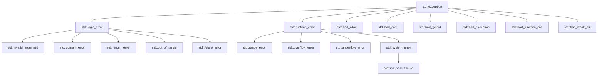

# C++ 标准异常

C++异常处理机制提供了一套标准的异常类体系，这些类都派生自`std::exception`基类。了解这些标准异常类可以帮助我们更有效地处理程序中的错误情况，使代码更加健壮和可靠。

## 什么是C++标准异常？

C++标准异常是C++标准库中定义的一系列异常类，它们构成了一个层次结构，用于表示程序执行过程中可能发生的各种异常情况。这些异常类都定义在不同的头文件中，但它们都直接或间接地继承自`std::exception`基类。

:::note
`std::exception`是所有标准异常类的基类，定义在`<exception>`头文件中。
:::

## C++ 标准异常层次结构

C++标准异常的层次结构如下：



## std::exception 基类

`std::exception`是所有标准异常类的基类，它提供了一个虚函数`what()`，该函数返回一个描述异常的C风格字符串。

```cpp
#include <iostream>
#include <exception>

int main() {
    try {
        throw std::exception();
    }
    catch (const std::exception& e) {
        std::cout << "捕获到异常: " << e.what() << std::endl;
    }
    return 0;
}
```

输出:
```
捕获到异常: std::exception
```

## 主要的标准异常类

### 1. std::logic_error

表示程序逻辑中的错误，这类错误理论上可以通过代码检查来避免。

```cpp
#include <iostream>
#include <stdexcept>
#include <string>

int main() {
    try {
        std::string s("Hello");
        // 尝试访问字符串之外的位置
        char c = s.at(10); // 将抛出std::out_of_range异常
    }
    catch (const std::logic_error& e) {
        std::cout << "逻辑错误: " << e.what() << std::endl;
    }
    return 0;
}
```

输出:
```
逻辑错误: basic_string::at: __n (which is 10) >= this->size() (which is 5)
```

### 2. std::runtime_error

表示只能在程序运行时检测到的错误。

```cpp
#include <iostream>
#include <stdexcept>
#include <cmath>

double calculate_sqrt(double x) {
    if (x < 0) {
        throw std::runtime_error("无法计算负数的平方根");
    }
    return std::sqrt(x);
}

int main() {
    try {
        double result = calculate_sqrt(-1.0);
        std::cout << "平方根结果: " << result << std::endl;
    }
    catch (const std::runtime_error& e) {
        std::cout << "运行时错误: " << e.what() << std::endl;
    }
    return 0;
}
```

输出:
```
运行时错误: 无法计算负数的平方根
```

## 常用的标准异常类详解

### 1. std::invalid_argument

当函数的参数不满足要求时抛出此异常。

```cpp
#include <iostream>
#include <stdexcept>
#include <string>

int parse_integer(const std::string& str) {
    if (str.empty()) {
        throw std::invalid_argument("字符串为空，无法转换为整数");
    }
    
    for (char c : str) {
        if (!std::isdigit(c)) {
            throw std::invalid_argument("字符串包含非数字字符");
        }
    }
    
    return std::stoi(str);
}

int main() {
    try {
        int num = parse_integer("abc");
        std::cout << "转换结果: " << num << std::endl;
    }
    catch (const std::invalid_argument& e) {
        std::cout << "无效参数: " << e.what() << std::endl;
    }
    return 0;
}
```

输出:
```
无效参数: 字符串包含非数字字符
```

### 2. std::out_of_range

当尝试访问超出有效范围的元素时抛出此异常。

```cpp
#include <iostream>
#include <vector>
#include <stdexcept>

int main() {
    std::vector<int> vec = {1, 2, 3, 4, 5};
    
    try {
        // vector.at() 会做范围检查
        int value = vec.at(10);
        std::cout << "值: " << value << std::endl;
    }
    catch (const std::out_of_range& e) {
        std::cout << "越界错误: " << e.what() << std::endl;
    }
    return 0;
}
```

输出:
```
越界错误: vector::_M_range_check: __n (which is 10) >= this->size() (which is 5)
```

### 3. std::bad_alloc

当内存分配失败时抛出此异常。

```cpp
#include <iostream>
#include <new>

int main() {
    try {
        // 尝试分配过量内存
        long long* huge_array = new long long[1000000000000LL];
        std::cout << "内存分配成功" << std::endl;
        delete[] huge_array;
    }
    catch (const std::bad_alloc& e) {
        std::cout << "内存分配失败: " << e.what() << std::endl;
    }
    return 0;
}
```

输出:
```
内存分配失败: std::bad_alloc
```

### 4. std::length_error

当操作会导致对象超出其最大允许大小时抛出此异常。

```cpp
#include <iostream>
#include <string>
#include <stdexcept>

int main() {
    try {
        std::string s;
        s.resize(s.max_size() + 1);  // 尝试将字符串调整为超过最大允许大小
        std::cout << "调整大小成功" << std::endl;
    }
    catch (const std::length_error& e) {
        std::cout << "长度错误: " << e.what() << std::endl;
    }
    return 0;
}
```

输出:
```
长度错误: basic_string::_M_create
```

## 创建自定义异常

虽然C++提供了许多标准异常类，但有时我们需要创建自己的异常类来更好地表示特定的错误情况。自定义异常类通常继承自`std::exception`或其派生类。

```cpp
#include <iostream>
#include <exception>
#include <string>

// 自定义异常类，继承自std::exception
class DatabaseException : public std::exception {
private:
    std::string message;
    
public:
    DatabaseException(const std::string& msg) : message(msg) {}
    
    // 重写what()方法
    const char* what() const noexcept override {
        return message.c_str();
    }
};

// 模拟数据库操作
void query_database(const std::string& query) {
    if (query.empty()) {
        throw DatabaseException("查询语句不能为空");
    }
    
    if (query.find("SELECT") == std::string::npos) {
        throw DatabaseException("不支持的查询类型：只能使用SELECT语句");
    }
    
    // 模拟正常操作
    std::cout << "执行查询: " << query << std::endl;
}

int main() {
    try {
        query_database(""); // 空查询
    }
    catch (const DatabaseException& e) {
        std::cout << "数据库错误: " << e.what() << std::endl;
    }
    
    try {
        query_database("UPDATE users SET status = 'active'"); // 非SELECT查询
    }
    catch (const DatabaseException& e) {
        std::cout << "数据库错误: " << e.what() << std::endl;
    }
    
    try {
        query_database("SELECT * FROM users"); // 有效查询
    }
    catch (const DatabaseException& e) {
        std::cout << "数据库错误: " << e.what() << std::endl;
    }
    
    return 0;
}
```

输出:
```
数据库错误: 查询语句不能为空
数据库错误: 不支持的查询类型：只能使用SELECT语句
执行查询: SELECT * FROM users
```

## 实际应用场景

### 文件操作错误处理

```cpp
#include <iostream>
#include <fstream>
#include <stdexcept>
#include <string>

class FileManager {
public:
    static std::string read_file(const std::string& filename) {
        std::ifstream file(filename);
        
        if (!file.is_open()) {
            throw std::runtime_error("无法打开文件: " + filename);
        }
        
        std::string content;
        std::string line;
        
        while (std::getline(file, line)) {
            content += line + "\n";
        }
        
        if (file.bad()) {
            throw std::runtime_error("读取文件时发生I/O错误: " + filename);
        }
        
        return content;
    }
};

int main() {
    try {
        std::string content = FileManager::read_file("不存在的文件.txt");
        std::cout << "文件内容:\n" << content << std::endl;
    }
    catch (const std::exception& e) {
        std::cout << "错误: " << e.what() << std::endl;
    }
    
    return 0;
}
```

输出:
```
错误: 无法打开文件: 不存在的文件.txt
```

### 网络连接错误处理（概念性示例）

```cpp
#include <iostream>
#include <stdexcept>
#include <string>

// 模拟网络连接类
class NetworkConnection {
private:
    std::string host;
    int port;
    bool connected;
    
public:
    NetworkConnection(const std::string& host, int port)
        : host(host), port(port), connected(false) {}
    
    void connect() {
        // 模拟连接过程中可能发生的各种错误
        if (host.empty()) {
            throw std::invalid_argument("主机名不能为空");
        }
        
        if (port <= 0 || port > 65535) {
            throw std::out_of_range("端口号必须在1-65535之间");
        }
        
        // 模拟特定主机的连接失败
        if (host == "unreachable.example.com") {
            throw std::runtime_error("无法连接到主机: 连接超时");
        }
        
        // 模拟成功连接
        std::cout << "成功连接到 " << host << ":" << port << std::endl;
        connected = true;
    }
    
    void send_data(const std::string& data) {
        if (!connected) {
            throw std::logic_error("发送数据前必须先连接");
        }
        
        if (data.empty()) {
            throw std::invalid_argument("发送的数据不能为空");
        }
        
        // 模拟发送数据
        std::cout << "发送数据: " << data << std::endl;
    }
    
    void disconnect() {
        if (!connected) {
            std::cout << "已经断开连接" << std::endl;
            return;
        }
        
        std::cout << "断开连接" << std::endl;
        connected = false;
    }
    
    ~NetworkConnection() {
        if (connected) {
            disconnect();
        }
    }
};

int main() {
    try {
        // 测试无效的主机名
        NetworkConnection conn1("", 8080);
        conn1.connect();
    }
    catch (const std::exception& e) {
        std::cout << "错误: " << e.what() << std::endl;
    }
    
    try {
        // 测试无效的端口号
        NetworkConnection conn2("example.com", 70000);
        conn2.connect();
    }
    catch (const std::exception& e) {
        std::cout << "错误: " << e.what() << std::endl;
    }
    
    try {
        // 测试无法连接的主机
        NetworkConnection conn3("unreachable.example.com", 8080);
        conn3.connect();
    }
    catch (const std::exception& e) {
        std::cout << "错误: " << e.what() << std::endl;
    }
    
    try {
        // 测试正常情况
        NetworkConnection conn4("example.com", 8080);
        conn4.connect();
        
        // 未连接就发送数据
        NetworkConnection conn5("example.com", 8080);
        conn5.send_data("测试数据");
    }
    catch (const std::exception& e) {
        std::cout << "错误: " << e.what() << std::endl;
    }
    
    return 0;
}
```

输出:
```
错误: 主机名不能为空
错误: 端口号必须在1-65535之间
错误: 无法连接到主机: 连接超时
成功连接到 example.com:8080
错误: 发送数据前必须先连接
断开连接
```

## 总结

1. **C++标准异常体系**：以`std::exception`为基类，包括`std::logic_error`和`std::runtime_error`等主要类别。

2. **标准异常的优势**：
   - 提供了一致的错误处理机制
   - 帮助区分不同类型的错误
   - 支持错误信息的传递

3. **使用标准异常的最佳实践**：
   - 选择合适的异常类型来表示错误
   - 提供有意义的错误消息
   - 在适当的级别处理异常
   - 考虑创建自定义异常类来表示特定领域的错误

4. **异常类层次结构**：了解继承关系可以帮助我们更有效地捕获和处理异常。

## 练习

1. 创建一个自定义异常类`MathError`，继承自`std::runtime_error`，用于表示数学运算中的错误。然后编写一个函数来计算两个数的除法，并在除数为0时抛出`MathError`异常。

2. 编写一个简单的栈类，当尝试从空栈中弹出元素时抛出`std::underflow_error`异常，当栈已满时尝试压入元素时抛出`std::overflow_error`异常。

3. 修改"文件操作错误处理"示例，添加更多的异常处理，如检查文件是否为空、文件是否有读取权限等。

## 附加资源

- [C++ 参考手册 - 标准异常](https://en.cppreference.com/w/cpp/error/exception)
- [C++ 异常处理最佳实践](https://isocpp.org/wiki/faq/exceptions)
- 书籍推荐：《C++ Primer》第5版，第18章异常处理
- 书籍推荐：《Effective C++》第三版，条款8：了解不抛出异常的析构函数的重要性

:::tip
学习标准异常时，多练习捕获不同类型的异常，并观察它们的行为表现是非常有帮助的。
:::