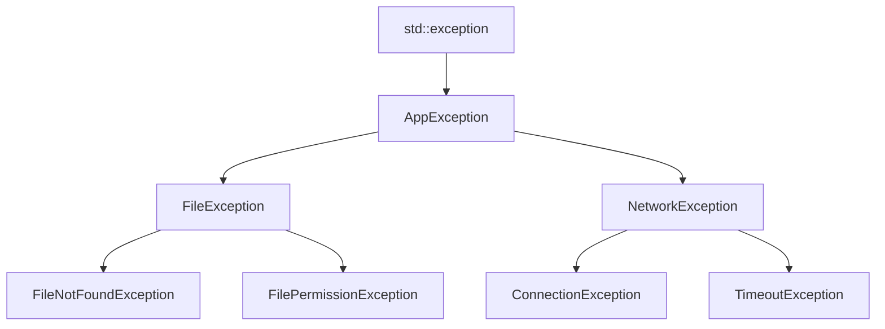

# C++ 自定义异常

## 为什么需要自定义异常？

在C++中，标准库提供了一系列的异常类（如`std::runtime_error`、`std::out_of_range`等），但在实际开发中，这些预定义异常可能无法准确表达特定应用的错误情况。通过创建自定义异常类，我们可以：

- 提供更具体的错误信息和上下文
- 实现应用特定的错误处理逻辑
- 使异常层次结构更加清晰，便于管理和分类
- 增强代码的可读性和可维护性

## 自定义异常的基本方法

在C++中，任何类都可以被用作异常。然而，通常建议让自定义异常类继承自标准异常层次结构中的类，特别是`std::exception`或其子类。

### 最简单的自定义异常

最基础的自定义异常只需要继承`std::exception`并重写`what()`方法：

```cpp
#include <iostream>
#include <exception>
#include <string>

class MyException : public std::exception {
private:
    std::string message;
    
public:
    MyException(const std::string& msg) : message(msg) {}
    
    const char* what() const noexcept override {
        return message.c_str();
    }
};

int main() {
    try {
        throw MyException("这是我的自定义异常");
    } catch (const std::exception& e) {
        std::cout << "捕获异常: " << e.what() << std::endl;
    }
    
    return 0;
}
```

**输出：**
```
捕获异常: 这是我的自定义异常
```

:::tip
`what()`方法返回`const char*`，所以我们需要使用`c_str()`将`std::string`转换为C风格字符串。
:::

:::caution
`what()`方法包含`noexcept`修饰符，这表示该函数不会抛出异常。在实现自己的`what()`时，必须保证这一点。
:::

## 创建异常层次结构

在复杂应用中，通常需要创建一个异常层次结构来表示不同种类的错误。以下是一个示例，展示如何创建一个基础应用异常类，然后派生出特定类型的异常：

```cpp
#include <iostream>
#include <exception>
#include <string>

// 应用基础异常类
class AppException : public std::exception {
protected:
    std::string message;
    
public:
    AppException(const std::string& msg) : message(msg) {}
    
    const char* what() const noexcept override {
        return message.c_str();
    }
};

// 文件操作异常
class FileException : public AppException {
public:
    FileException(const std::string& msg) : AppException("文件错误: " + msg) {}
};

// 网络操作异常
class NetworkException : public AppException {
public:
    NetworkException(const std::string& msg) : AppException("网络错误: " + msg) {}
};

// 文件不存在异常
class FileNotFoundException : public FileException {
public:
    FileNotFoundException(const std::string& filename) 
        : FileException("找不到文件 '" + filename + "'") {}
};

int main() {
    try {
        // 模拟文件操作错误
        throw FileNotFoundException("config.json");
    } catch (const FileNotFoundException& e) {
        std::cout << "特定文件错误: " << e.what() << std::endl;
    } catch (const FileException& e) {
        std::cout << "一般文件错误: " << e.what() << std::endl;
    } catch (const AppException& e) {
        std::cout << "应用错误: " << e.what() << std::endl;
    } catch (const std::exception& e) {
        std::cout << "标准异常: " << e.what() << std::endl;
    }
    
    return 0;
}
```

**输出：**
```
特定文件错误: 文件错误: 找不到文件 'config.json'
```

### 异常层次结构设计图



## 添加更多信息到自定义异常

自定义异常可以包含额外的信息，帮助诊断问题：

```cpp
#include <iostream>
#include <exception>
#include <string>
#include <ctime>

class DatabaseException : public std::exception {
private:
    std::string message;
    int errorCode;
    std::string timestamp;
    
public:
    DatabaseException(const std::string& msg, int code) : 
        message(msg), errorCode(code) {
        // 获取当前时间作为时间戳
        time_t now = time(0);
        char buffer[80];
        strftime(buffer, sizeof(buffer), "%Y-%m-%d %H:%M:%S", localtime(&now));
        timestamp = buffer;
    }
    
    const char* what() const noexcept override {
        return message.c_str();
    }
    
    int getErrorCode() const {
        return errorCode;
    }
    
    const std::string& getTimestamp() const {
        return timestamp;
    }
};

void connectToDatabase() {
    // 模拟数据库连接失败
    throw DatabaseException("无法连接到数据库服务器", 1001);
}

int main() {
    try {
        connectToDatabase();
    } catch (const DatabaseException& e) {
        std::cout << "数据库错误 [" << e.getErrorCode() << "] 在 " 
                  << e.getTimestamp() << ": " << e.what() << std::endl;
    }
    
    return 0;
}
```

**输出（时间戳会根据当前时间变化）：**
```
数据库错误 [1001] 在 2023-07-15 14:30:22: 无法连接到数据库服务器
```

## 实际应用案例：配置文件解析器

下面是一个更实际的例子，展示如何使用自定义异常来处理配置文件解析中的各种错误情况：

```cpp
#include <iostream>
#include <fstream>
#include <string>
#include <map>
#include <exception>

// 配置异常基类
class ConfigException : public std::exception {
protected:
    std::string message;
    
public:
    ConfigException(const std::string& msg) : message(msg) {}
    
    const char* what() const noexcept override {
        return message.c_str();
    }
};

// 特定异常类型
class ConfigFileNotFoundException : public ConfigException {
public:
    ConfigFileNotFoundException(const std::string& filename) 
        : ConfigException("配置文件不存在: " + filename) {}
};

class ConfigSyntaxException : public ConfigException {
private:
    int lineNumber;
    
public:
    ConfigSyntaxException(const std::string& error, int line) 
        : ConfigException("配置语法错误: " + error + " (第" + std::to_string(line) + "行)"),
          lineNumber(line) {}
          
    int getLine() const {
        return lineNumber;
    }
};

class ConfigKeyNotFoundException : public ConfigException {
public:
    ConfigKeyNotFoundException(const std::string& key) 
        : ConfigException("配置键不存在: " + key) {}
};

// 简单配置解析器类
class ConfigParser {
private:
    std::map<std::string, std::string> configData;
    
public:
    void loadFromFile(const std::string& filename) {
        std::ifstream file(filename);
        
        if (!file.is_open()) {
            throw ConfigFileNotFoundException(filename);
        }
        
        std::string line;
        int lineNum = 0;
        
        while (std::getline(file, line)) {
            lineNum++;
            
            // 跳过空行和注释
            if (line.empty() || line[0] == '#') {
                continue;
            }
            
            // 寻找键值分隔符
            size_t delimiterPos = line.find('=');
            if (delimiterPos == std::string::npos) {
                throw ConfigSyntaxException("缺少'='分隔符", lineNum);
            }
            
            std::string key = line.substr(0, delimiterPos);
            std::string value = line.substr(delimiterPos + 1);
            
            // 去除首尾空白字符
            key.erase(0, key.find_first_not_of(" \t"));
            key.erase(key.find_last_not_of(" \t") + 1);
            value.erase(0, value.find_first_not_of(" \t"));
            value.erase(value.find_last_not_of(" \t") + 1);
            
            if (key.empty()) {
                throw ConfigSyntaxException("键名不能为空", lineNum);
            }
            
            configData[key] = value;
        }
    }
    
    std::string getValue(const std::string& key) const {
        auto it = configData.find(key);
        if (it == configData.end()) {
            throw ConfigKeyNotFoundException(key);
        }
        return it->second;
    }
};

int main() {
    ConfigParser parser;
    
    try {
        // 尝试加载不存在的文件
        parser.loadFromFile("nonexistent.conf");
    } catch (const ConfigFileNotFoundException& e) {
        std::cout << "文件错误: " << e.what() << std::endl;
    }
    
    try {
        // 模拟文件内容和解析过程
        std::ofstream testFile("test.conf");
        testFile << "# 这是测试配置文件\n";
        testFile << "server_host = 127.0.0.1\n";
        testFile << "server_port = 8080\n";
        testFile << "invalid_line\n";  // 故意添加错误
        testFile.close();
        
        parser.loadFromFile("test.conf");
    } catch (const ConfigSyntaxException& e) {
        std::cout << "语法错误: " << e.what() << std::endl;
        std::cout << "在第 " << e.getLine() << " 行\n";
    }
    
    try {
        // 创建一个有效的配置文件
        std::ofstream validFile("valid.conf");
        validFile << "server_host = 127.0.0.1\n";
        validFile << "server_port = 8080\n";
        validFile.close();
        
        parser.loadFromFile("valid.conf");
        
        // 尝试访问存在和不存在的键
        std::cout << "服务器主机: " << parser.getValue("server_host") << std::endl;
        std::cout << "服务器端口: " << parser.getValue("server_port") << std::endl;
        std::cout << "数据库名称: " << parser.getValue("db_name") << std::endl; // 这个键不存在
    } catch (const ConfigKeyNotFoundException& e) {
        std::cout << "配置错误: " << e.what() << std::endl;
    } catch (const ConfigException& e) {
        std::cout << "其他配置错误: " << e.what() << std::endl;
    }
    
    return 0;
}
```

**可能的输出：**
```
文件错误: 配置文件不存在: nonexistent.conf
语法错误: 配置语法错误: 缺少'='分隔符 (第4行)
在第 4 行
服务器主机: 127.0.0.1
服务器端口: 8080
配置错误: 配置键不存在: db_name
```

:::note
在实际应用中，你可能需要使用更健壮的文件操作方法，并进行更全面的错误处理。
:::

## 自定义异常的最佳实践

1. **继承自标准异常类**：总是从`std::exception`或其子类继承，这样可以确保你的异常可以被捕获到`std::exception`引用中。

2. **实现`what()`方法**：确保`what()`方法能返回有用的错误消息，并标记为`noexcept`。

3. **传递有用的上下文信息**：在异常中包含足够的信息，以帮助诊断问题。

4. **保持异常类的轻量级**：避免在异常类中存储大量数据或执行复杂操作，因为抛出异常通常发生在错误状态下。

5. **使用明确的命名**：为异常类使用描述性名称，清楚地表明它们表示的错误类型。

6. **考虑异常安全性**：确保自定义异常不会导致资源泄漏或其他问题。

## 结语

自定义异常是C++异常处理机制中的强大工具，可以帮助你创建更清晰、更具表达力的错误处理系统。通过继承标准异常类并添加特定信息，可以使错误报告更加精确，并使调试过程更加高效。

在实际项目中，良好设计的异常层次结构可以大大提高代码的可维护性和健壮性，特别是在大型应用程序中。

## 练习

1. 创建一个简单的数学运算库，使用自定义异常处理诸如除零、溢出等错误情况。

2. 扩展本文中的配置解析器示例，添加对配置节（sections）的支持，并创建相应的异常类型。

3. 为一个简单的用户认证系统设计异常层次结构，包括诸如"用户不存在"、"密码错误"、"账户锁定"等错误情况。

4. 实现一个自定义的内存分配器，使用自定义异常报告内存分配失败的原因（例如内存不足、分配大小无效等）。

## 进一步阅读

- C++ 标准库中的异常层次结构
- 异常安全性保证和最佳实践
- 性能考虑：异常处理 vs 错误代码
- 在不同平台和编译器下的异常行为差异