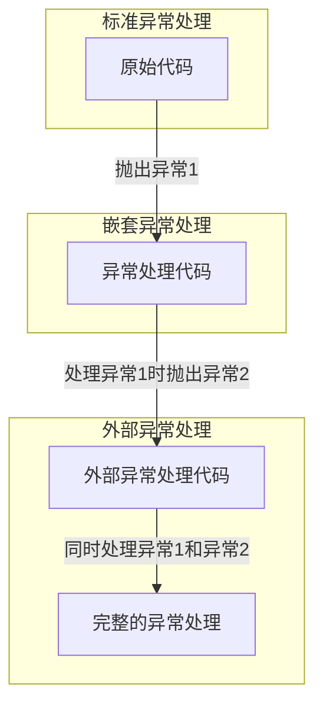

# C++ 嵌套异常

## 什么是嵌套异常？

在C++编程中，嵌套异常是指在处理一个异常的过程中又抛出另一个异常的情况。这种情况通常出现在`catch`块内，当你尝试处理一个异常时，可能由于某种原因又触发了新的异常。嵌套异常处理是异常处理机制中比较高级的特性，掌握它对于编写健壮的代码至关重要。

## 嵌套异常的基本概念

嵌套异常主要有两种形式：

1. **直接嵌套**：在`catch`块中直接抛出新的异常
2. **间接嵌套**：在`catch`块中调用的函数抛出异常

此外，C++标准库提供了`std::nested_exception`类和`std::rethrow_if_nested()`函数，专门用于处理嵌套异常。

## 基本嵌套异常示例

让我们先看一个简单的嵌套异常示例：

```cpp
#include <iostream>
#include <stdexcept>

void processDivision(int a, int b) {
    try {
        if (b == 0) {
            throw std::runtime_error("除数不能为0");
        }
        std::cout << "结果: " << a / b << std::endl;
    } catch (const std::runtime_error& e) {
        std::cout << "捕获到异常: " << e.what() << std::endl;
        // 在处理异常的过程中抛出新异常
        throw std::logic_error("除法处理失败");
    }
}

int main() {
    try {
        processDivision(10, 0);
    } catch (const std::logic_error& e) {
        std::cout << "主函数捕获到异常: " << e.what() << std::endl;
    }
    
    return 0;
}
```

**输出**:
```
捕获到异常: 除数不能为0
主函数捕获到异常: 除法处理失败
```

在这个例子中，当`processDivision`函数遇到除以零的情况时，它抛出一个`runtime_error`异常。在处理这个异常的`catch`块中，我们又抛出了一个`logic_error`异常，这就形成了一个嵌套异常。主函数中的`catch`块最终捕获到的是第二个异常。

## 使用std::nested_exception

C++11引入了`std::nested_exception`类，它允许我们在抛出新异常的同时保留原始异常的信息。要使用这个功能，我们可以：

1. 让自定义异常类继承`std::nested_exception`
2. 使用`std::throw_with_nested`抛出异常
3. 使用`std::rethrow_if_nested`重新抛出嵌套异常

让我们看一个例子：

```cpp
#include <iostream>
#include <exception>
#include <stdexcept>
#include <string>

class DatabaseError : public std::runtime_error, public std::nested_exception {
public:
    explicit DatabaseError(const std::string& message) 
        : std::runtime_error(message) {}
};

void executeQuery(const std::string& query) {
    try {
        // 模拟数据库查询失败
        throw std::runtime_error("SQL语法错误: 缺少分号");
    } catch (const std::exception& e) {
        // 使用throw_with_nested抛出嵌套异常
        std::throw_with_nested(DatabaseError("查询执行失败: " + query));
    }
}

void processNestedException(const std::exception& e, int level = 0) {
    // 打印当前异常信息
    std::cout << std::string(level, ' ') << "异常: " << e.what() << std::endl;
    
    try {
        // 尝试重新抛出嵌套异常
        std::rethrow_if_nested(e);
    } catch (const std::exception& nested) {
        // 递归处理嵌套异常
        processNestedException(nested, level + 2);
    }
}

int main() {
    try {
        executeQuery("SELECT * FROM users");
    } catch (const std::exception& e) {
        std::cout << "捕获到异常链:\n";
        processNestedException(e);
    }
    
    return 0;
}
```

**输出**:
```
捕获到异常链:
异常: 查询执行失败: SELECT * FROM users
  异常: SQL语法错误: 缺少分号
```

这个例子展示了如何创建、抛出和处理嵌套异常，同时保留完整的异常链。

## 嵌套异常的工作流程

下面是嵌套异常的工作流程图：



## 嵌套异常的实际应用场景

### 场景1：资源清理与报告

在处理资源时，可能需要在异常处理中执行清理操作，如果清理操作也失败，可以使用嵌套异常：

```cpp
#include <iostream>
#include <fstream>
#include <exception>

void processFile(const std::string& fileName) {
    std::ifstream file(fileName);
    try {
        if (!file.is_open()) {
            throw std::runtime_error("无法打开文件：" + fileName);
        }
        
        // 处理文件...
        
        // 模拟文件处理错误
        throw std::runtime_error("文件格式错误");
    } catch (const std::exception& e) {
        try {
            // 尝试记录错误
            std::ofstream logFile("error.log", std::ios::app);
            if (!logFile) {
                std::throw_with_nested(std::runtime_error("无法记录错误"));
            }
            logFile << "错误：" << e.what() << std::endl;
            logFile.close();
            
            // 重新抛出原始异常
            throw;
        } catch (...) {
            std::throw_with_nested(std::runtime_error("文件处理失败"));
        }
    }
}

int main() {
    try {
        processFile("nonexistent.txt");
    } catch (const std::exception& e) {
        try {
            std::rethrow_if_nested(e);
        } catch (const std::exception& nested) {
            std::cout << "主异常: " << e.what() << std::endl;
            std::cout << "嵌套异常: " << nested.what() << std::endl;
        }
    }
    
    return 0;
}
```

### 场景2：多层API调用

在复杂系统中，嵌套异常可以帮助保留异常链，方便调试：

```cpp
#include <iostream>
#include <exception>
#include <string>

// 底层API
void networkRequest(const std::string& url) {
    // 模拟网络错误
    throw std::runtime_error("连接超时: " + url);
}

// 中间层API
void fetchData(const std::string& resource) {
    try {
        networkRequest("https://api.example.com/" + resource);
    } catch (const std::exception& e) {
        std::throw_with_nested(std::runtime_error("获取资源失败: " + resource));
    }
}

// 上层API
void updateUserProfile(int userId) {
    try {
        fetchData("users/" + std::to_string(userId));
    } catch (const std::exception& e) {
        std::throw_with_nested(std::runtime_error("更新用户配置文件失败，用户ID: " + std::to_string(userId)));
    }
}

void printException(const std::exception& e, int level = 0) {
    std::cerr << std::string(level, ' ') << "异常: " << e.what() << std::endl;
    try {
        std::rethrow_if_nested(e);
    } catch (const std::exception& nested) {
        printException(nested, level + 2);
    }
}

int main() {
    try {
        updateUserProfile(42);
    } catch (const std::exception& e) {
        std::cout << "错误堆栈:\n";
        printException(e);
    }
    
    return 0;
}
```

**输出**:
```
错误堆栈:
异常: 更新用户配置文件失败，用户ID: 42
  异常: 获取资源失败: users/42
    异常: 连接超时: https://api.example.com/users/42
```

通过嵌套异常，我们可以清楚地看到完整的错误调用链。

## 嵌套异常的最佳实践

1. **保持异常链完整**：使用`std::throw_with_nested`和`std::rethrow_if_nested`来保持异常链。

2. **适当添加上下文**：当重新抛出异常时，添加有意义的上下文信息。

3. **递归处理嵌套异常**：如同上面的`printException`函数，使用递归方式处理嵌套异常。

4. **避免过深的嵌套**：过多的嵌套异常会使代码难以理解和维护。

5. **注意性能影响**：嵌套异常可能对性能有一定影响，在性能敏感的代码中要谨慎使用。

:::caution 警告
嵌套异常不应该用作常规的控制流程。异常主要用于处理异常情况，而不是作为函数返回值的替代品。
:::

## 常见问题与注意事项

### 1. 资源管理

嵌套异常处理中，资源管理变得更加复杂。使用RAII（资源获取即初始化）模式可以帮助确保资源被正确释放：

```cpp
#include <iostream>
#include <memory>
#include <fstream>

class FileHandler {
private:
    std::unique_ptr<std::ifstream> file;
    std::string filename;

public:
    FileHandler(const std::string& name) : filename(name) {
        file = std::make_unique<std::ifstream>(filename);
        if (!file->is_open()) {
            throw std::runtime_error("无法打开文件: " + filename);
        }
    }
    
    ~FileHandler() {
        if (file && file->is_open()) {
            file->close();
            std::cout << "文件 " << filename << " 已关闭" << std::endl;
        }
    }
    
    void process() {
        // 处理文件...
        throw std::runtime_error("文件处理错误");
    }
};

int main() {
    try {
        FileHandler handler("test.txt");
        handler.process();
    } catch (const std::exception& e) {
        std::cout << "捕获异常: " << e.what() << std::endl;
    }
    
    return 0;
}
```

### 2. 避免异常泄漏

确保所有潜在的异常都被妥善处理，避免异常泄漏到不应该处理它们的代码部分：

```cpp
void safeFunction() noexcept {
    try {
        // 可能抛出异常的代码
        throw std::runtime_error("一个错误");
    } catch (const std::exception& e) {
        // 确保异常不会泄漏出去
        std::cerr << "错误被安全处理: " << e.what() << std::endl;
    } catch (...) {
        std::cerr << "捕获到未知异常" << std::endl;
    }
}
```

## 总结

嵌套异常是C++异常处理机制中的高级特性，它允许我们在处理一个异常的过程中抛出新的异常，同时保留原始异常的信息。通过使用`std::nested_exception`、`std::throw_with_nested`和`std::rethrow_if_nested`，我们可以构建完整的异常链，这对于调试复杂系统中的错误非常有用。

嵌套异常的主要应用场景包括：
- 复杂资源管理与清理
- 多层API调用中的错误传播
- 详细的错误报告和日志记录

在使用嵌套异常时，应遵循最佳实践，保持异常链的完整性，添加适当的上下文信息，并避免过深的嵌套层次。同时，要注意使用RAII模式来确保资源正确释放，避免异常泄漏。

## 练习

1. 编写一个程序，模拟文件读取、解析和处理的过程，在每一步可能出现异常，使用嵌套异常传递详细的错误信息。

2. 创建一个自定义异常类层次结构，包含基类异常和至少两个派生异常类，并演示如何在这些类之间使用嵌套异常。

3. 实现一个通用的异常处理函数，可以递归地打印出嵌套异常链中的所有异常信息，包括异常类型和描述。

4. 研究如何在嵌套异常中保存和恢复程序状态，使程序能够在处理异常后继续执行。

:::tip 提示
嵌套异常是一个高级主题，掌握它需要对C++的异常处理机制有深入的理解。如果你遇到困难，请先复习基本的异常处理概念。
:::