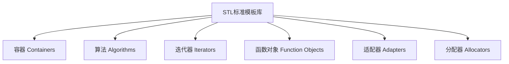

# C++ STL概述

## 什么是STL？

STL（Standard Template Library，标准模板库）是C++标准库的一部分，提供了一系列通用的模板类和函数，这些模板类和函数可以实现许多常用的数据结构和算法，如向量、链表、队列、栈、集合、映射、排序、搜索等。

STL的设计理念是将数据和操作分离，通过模板技术实现，具有高度的可复用性、可扩展性和效率。通过使用STL，程序员可以避免重复"发明轮子"，专注于解决应用问题。

## STL的核心组件

STL主要由以下六大组件构成：



### 1. 容器（Containers）

容器是用来存储数据的模板类，分为三类：

- **顺序容器**：按照线性顺序存储元素
  - `vector`：动态数组
  - `list`：双向链表
  - `deque`：双端队列
  - `array`（C++11）：固定大小数组
  - `forward_list`（C++11）：单向链表

- **关联容器**：基于键值对快速查找
  - `set`：集合（不重复元素）
  - `map`：映射（键值对）
  - `multiset`：可重复元素集合
  - `multimap`：可重复键映射

- **无序容器**（C++11）：基于哈希表实现
  - `unordered_set`：无序集合
  - `unordered_map`：无序映射
  - `unordered_multiset`：无序可重复集合
  - `unordered_multimap`：无序可重复映射

### 2. 算法（Algorithms）

STL提供了大量的算法用于处理容器中的数据，这些算法以函数模板形式实现，常见的有：

- 非修改序列操作：`find`、`count`、`for_each`等
- 修改序列操作：`copy`、`move`、`transform`等
- 排序相关：`sort`、`merge`、`partition`等
- 数值操作：`accumulate`、`inner_product`等

### 3. 迭代器（Iterators）

迭代器提供了访问容器元素的统一接口，是算法和容器之间的桥梁。按功能分类：

- 输入迭代器：只读，只能向前移动一次
- 输出迭代器：只写，只能向前移动一次
- 前向迭代器：可读写，可多次向前移动
- 双向迭代器：可读写，可向前向后移动
- 随机访问迭代器：可读写，可随机访问

### 4. 函数对象（Function Objects）

函数对象是行为类似函数的对象，可以被当做算法的参数。

### 5. 适配器（Adapters）

适配器用于转换容器、迭代器或函数对象的接口。常见的容器适配器有：

- `stack`：栈适配器
- `queue`：队列适配器
- `priority_queue`：优先队列适配器

### 6. 分配器（Allocators）

分配器负责空间的分配和管理，用户通常不需要直接操作分配器。

## 如何使用STL

要使用STL，你需要包含相应的头文件：

```cpp
#include <vector>    // 使用vector容器
#include <list>      // 使用list容器
#include <map>       // 使用map容器
#include <algorithm> // 使用算法
#include <iterator>  // 使用迭代器
#include <functional>// 使用函数对象
```

## STL容器基础示例

### 使用vector容器

```cpp
#include <iostream>
#include <vector>

int main() {
    // 创建一个整数vector
    std::vector<int> numbers;
    
    // 添加元素
    numbers.push_back(10);
    numbers.push_back(20);
    numbers.push_back(30);
    
    // 使用索引访问
    std::cout << "第二个元素: " << numbers[1] << std::endl;
    
    // 使用迭代器遍历
    std::cout << "所有元素: ";
    for (auto it = numbers.begin(); it != numbers.end(); ++it) {
        std::cout << *it << " ";
    }
    std::cout << std::endl;
    
    // 使用范围for循环 (C++11)
    std::cout << "使用范围for: ";
    for (auto num : numbers) {
        std::cout << num << " ";
    }
    std::cout << std::endl;
    
    return 0;
}
```

输出：
```
第二个元素: 20
所有元素: 10 20 30 
使用范围for: 10 20 30 
```

### 使用map容器

```cpp
#include <iostream>
#include <map>
#include <string>

int main() {
    // 创建一个字符串到整数的映射
    std::map<std::string, int> ages;
    
    // 插入键值对
    ages["Alice"] = 30;
    ages["Bob"] = 25;
    ages.insert(std::make_pair("Charlie", 35));
    
    // 查找和访问
    std::cout << "Bob的年龄: " << ages["Bob"] << std::endl;
    
    // 检查键是否存在
    if (ages.find("David") == ages.end()) {
        std::cout << "David不在map中" << std::endl;
    }
    
    // 遍历所有键值对
    std::cout << "所有人的年龄: " << std::endl;
    for (const auto& pair : ages) {
        std::cout << pair.first << ": " << pair.second << std::endl;
    }
    
    return 0;
}
```

输出：
```
Bob的年龄: 25
David不在map中
所有人的年龄: 
Alice: 30
Bob: 25
Charlie: 35
```

## STL算法示例

```cpp
#include <iostream>
#include <vector>
#include <algorithm>

int main() {
    std::vector<int> numbers = {30, 10, 50, 20, 40};
    
    // 排序
    std::sort(numbers.begin(), numbers.end());
    
    std::cout << "排序后: ";
    for (int num : numbers) {
        std::cout << num << " ";
    }
    std::cout << std::endl;
    
    // 查找元素
    auto it = std::find(numbers.begin(), numbers.end(), 20);
    if (it != numbers.end()) {
        std::cout << "找到元素20，位置: " 
                  << (it - numbers.begin()) << std::endl;
    }
    
    // 计算总和
    int sum = std::accumulate(numbers.begin(), numbers.end(), 0);
    std::cout << "总和: " << sum << std::endl;
    
    return 0;
}
```

输出：
```
排序后: 10 20 30 40 50 
找到元素20，位置: 1
总和: 150
```

:::note
要使用`accumulate`函数，需要包含`<numeric>`头文件。上面的例子中省略了这一包含语句。
:::

## 实际应用场景

### 学生成绩管理系统

```cpp
#include <iostream>
#include <vector>
#include <map>
#include <string>
#include <algorithm>
#include <numeric>

// 学生结构体
struct Student {
    std::string name;
    std::vector<double> scores;
    
    // 计算平均分
    double getAverage() const {
        if (scores.empty()) return 0.0;
        return std::accumulate(scores.begin(), scores.end(), 0.0) / scores.size();
    }
};

int main() {
    // 创建学生集合
    std::vector<Student> students = {
        {"Alice", {95.5, 88.0, 76.5, 90.0}},
        {"Bob", {78.0, 92.5, 85.0, 88.5}},
        {"Charlie", {90.0, 91.0, 89.5, 93.0}}
    };
    
    // 按平均分排序
    std::sort(students.begin(), students.end(), [](const Student& a, const Student& b) {
        return a.getAverage() > b.getAverage();  // 降序排序
    });
    
    // 显示排名
    std::cout << "学生排名 (按平均分):\n";
    int rank = 1;
    for (const auto& student : students) {
        std::cout << rank++ << ". " << student.name 
                  << " - 平均分: " << student.getAverage() << std::endl;
    }
    
    // 使用map统计各分数段人数
    std::map<char, int> gradeDistribution;
    for (const auto& student : students) {
        double avg = student.getAverage();
        char grade;
        if (avg >= 90) grade = 'A';
        else if (avg >= 80) grade = 'B';
        else if (avg >= 70) grade = 'C';
        else if (avg >= 60) grade = 'D';
        else grade = 'F';
        
        gradeDistribution[grade]++;
    }
    
    // 显示分数段统计
    std::cout << "\n成绩分布:\n";
    for (const auto& pair : gradeDistribution) {
        std::cout << pair.first << ": " << pair.second << " 人\n";
    }
    
    return 0;
}
```

输出示例：
```
学生排名 (按平均分):
1. Charlie - 平均分: 90.875
2. Alice - 平均分: 87.5
3. Bob - 平均分: 86

成绩分布:
A: 1 人
B: 2 人
```

### 文本分析工具

```cpp
#include <iostream>
#include <string>
#include <map>
#include <set>
#include <vector>
#include <algorithm>
#include <sstream>

int main() {
    std::string text = "This is a sample text. This text is used to demonstrate "
                       "the STL containers and algorithms for text analysis. "
                       "Text analysis is an important part of natural language processing.";
                       
    // 将文本转换为小写
    std::transform(text.begin(), text.end(), text.begin(), 
                   [](unsigned char c){ return std::tolower(c); });
    
    // 将文本分割成单词
    std::istringstream iss(text);
    std::vector<std::string> words;
    std::string word;
    
    while (iss >> word) {
        // 移除标点符号
        word.erase(std::remove_if(word.begin(), word.end(), 
                                 [](char c){ return std::ispunct(c); }), 
                   word.end());
        
        if (!word.empty()) {
            words.push_back(word);
        }
    }
    
    // 计算每个单词的出现次数
    std::map<std::string, int> wordFrequency;
    for (const auto& w : words) {
        wordFrequency[w]++;
    }
    
    // 获取唯一单词
    std::set<std::string> uniqueWords(words.begin(), words.end());
    
    // 输出统计信息
    std::cout << "文本统计:\n";
    std::cout << "总单词数: " << words.size() << std::endl;
    std::cout << "唯一单词数: " << uniqueWords.size() << std::endl;
    
    // 显示出现频率最高的5个单词
    std::vector<std::pair<std::string, int>> wordFreqVec(
        wordFrequency.begin(), wordFrequency.end());
    
    std::sort(wordFreqVec.begin(), wordFreqVec.end(),
              [](const auto& a, const auto& b) {
                  return a.second > b.second;  // 按频率降序排序
              });
    
    std::cout << "\n出现频率最高的单词:\n";
    int count = 0;
    for (const auto& pair : wordFreqVec) {
        if (count++ >= 5) break;
        std::cout << pair.first << ": " << pair.second << " 次\n";
    }
    
    return 0;
}
```

输出示例：
```
文本统计:
总单词数: 24
唯一单词数: 19

出现频率最高的单词:
text: 3 次
is: 3 次
this: 2 次
a: 1 次
sample: 1 次
```

## 总结

C++ STL是C++标准库的重要组成部分，它提供了一套通用的数据结构和算法，能够极大地提高编程效率和代码质量。通过使用STL：

1. 你能够使用现成的、经过优化的数据结构和算法，而无需自己实现
2. 代码更加简洁、可读性更高，也更不容易出错
3. 能够更专注于应用层逻辑，而不是底层实现细节
4. 代码更容易维护和迁移

掌握STL是每个C++程序员必须具备的技能。在学习STL的过程中，建议先熟悉几个常用的容器（如vector、map、set）和算法，然后再逐步扩展到其他组件。

:::tip
初学者应该从vector、string和map这些最常用的容器开始学习，并学习使用基本的迭代器和算法。随着你对STL概念的理解不断深入，再逐步扩展到更复杂的组件。
:::

## 练习

1. 创建一个vector容器，存储10个随机数，然后对它们进行排序并打印结果。
2. 使用map容器实现一个简单的电话簿，支持添加、查找和删除联系人。
3. 使用list容器和STL算法实现一个待办事项列表，支持添加、完成和查看任务。
4. 编写一个程序，使用set容器找出两个文本文件中的共同单词。
5. 实现一个使用priority_queue的任务调度器，根据任务优先级执行任务。

## 进一步学习资源

- C++ Reference: [http://en.cppreference.com/w/cpp/container](http://en.cppreference.com/w/cpp/container)
- C++ Standard Library Tutorial: [http://www.cplusplus.com/reference/stl/](http://www.cplusplus.com/reference/stl/)
- 《C++ Primer》第四部分：标准库
- 《Effective STL》 by Scott Meyers

通过本文的学习和实践，你应该已经对C++ STL有了基本的了解。随着你编程经验的增长，STL会成为你日常编程中不可或缺的工具。继续探索更多STL功能，并在实际项目中应用它们！