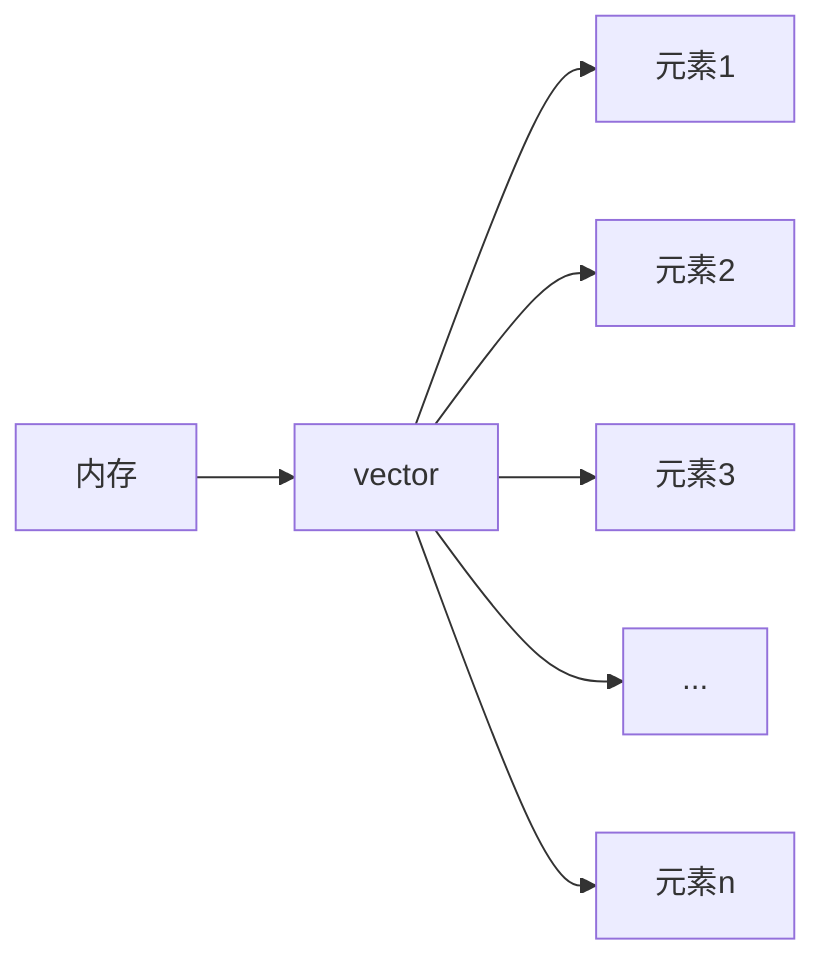
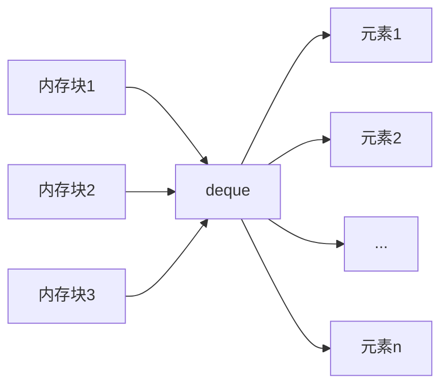
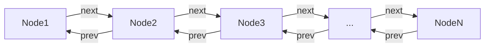
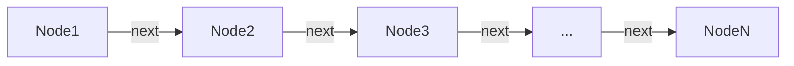

# C++ 序列容器

## 什么是序列容器？

序列容器是C++ STL(标准模板库)中的一类容器，它们以**线性方式**存储和组织元素。序列容器中的每个元素都有固定的位置，取决于插入的时间和地点，与元素的值无关。

:::note
序列容器的主要特点是元素按照**严格的线性顺序**排列，可以通过位置访问。
:::

## 主要的序列容器类型

C++标准库提供了几种不同的序列容器，每种都有其特定的用途和性能特点：

1. `vector` - 动态数组
2. `deque` - 双端队列
3. `list` - 双向链表
4. `forward_list` (C++11) - 单向链表
5. `array` (C++11) - 静态数组

## vector容器

### 基本概念

`vector`是最常用的序列容器，它实现了一个**动态数组**，可以在运行时改变大小。



### 特点

- 支持快速随机访问 O(1)
- 在末尾插入/删除元素效率高 O(1)（平摊复杂度）
- 在中间或开头插入/删除元素效率低 O(n)
- 当空间不足时，会重新分配更大的连续内存空间

### 基本用法

```cpp
#include <iostream>
#include <vector>

int main() {
    // 创建一个空的vector
    std::vector<int> vec1;
    
    // 创建一个包含5个元素的vector，每个元素初始化为0
    std::vector<int> vec2(5, 0);
    
    // 使用初始化列表(C++11)
    std::vector<int> vec3 = {1, 2, 3, 4, 5};
    
    // 添加元素
    vec1.push_back(10);
    vec1.push_back(20);
    
    // 访问元素
    std::cout << "第一个元素: " << vec1[0] << std::endl;  // 输出: 10
    std::cout << "第二个元素: " << vec1.at(1) << std::endl;  // 输出: 20
    
    // 获取大小
    std::cout << "容器大小: " << vec1.size() << std::endl;  // 输出: 2
    
    // 遍历vector
    for (const auto& element : vec3) {
        std::cout << element << " ";
    }
    // 输出: 1 2 3 4 5
    
    return 0;
}
```

### 常用成员函数

| 函数名 | 描述 |
|--------|------|
| `push_back()` | 在末尾添加元素 |
| `pop_back()` | 删除末尾元素 |
| `size()` | 返回容器中的元素数量 |
| `empty()` | 检查容器是否为空 |
| `at()` | 返回指定位置的元素（带边界检查） |
| `operator[]` | 返回指定位置的元素（无边界检查） |
| `front()` | 返回第一个元素 |
| `back()` | 返回最后一个元素 |
| `clear()` | 清空容器 |
| `insert()` | 在指定位置插入元素 |
| `erase()` | 删除指定位置的元素 |
| `resize()` | 调整容器大小 |
| `reserve()` | 预分配容量，不改变size |
| `capacity()` | 返回容器当前分配的存储空间大小 |

## deque容器

### 基本概念

`deque`（双端队列）是一个支持快速在两端进行插入和删除操作的序列容器。



### 特点

- 支持随机访问 O(1)
- 在两端插入/删除元素效率高 O(1)
- 在中间插入/删除元素效率低 O(n)
- 内存布局不连续，使用多个内存块链接

### 基本用法

```cpp
#include <iostream>
#include <deque>

int main() {
    // 创建一个空的deque
    std::deque<int> dq1;
    
    // 创建一个包含5个元素的deque，每个元素初始化为0
    std::deque<int> dq2(5, 0);
    
    // 使用初始化列表
    std::deque<int> dq3 = {1, 2, 3, 4, 5};
    
    // 在两端添加元素
    dq1.push_back(10);  // 在末尾添加
    dq1.push_front(5);  // 在开头添加
    
    // 访问元素
    std::cout << "第一个元素: " << dq1.front() << std::endl;  // 输出: 5
    std::cout << "最后一个元素: " << dq1.back() << std::endl;  // 输出: 10
    
    // 遍历deque
    for (const auto& element : dq1) {
        std::cout << element << " ";
    }
    // 输出: 5 10
    
    return 0;
}
```

## list容器

### 基本概念

`list`是一个双向链表，它允许在任何位置进行常数时间的插入和删除操作。



### 特点

- 不支持随机访问（只能顺序访问）
- 在任何位置插入/删除元素效率高 O(1)
- 占用更多内存（需要存储前后指针）

### 基本用法

```cpp
#include <iostream>
#include <list>

int main() {
    // 创建一个空的list
    std::list<int> lst1;
    
    // 创建一个包含5个元素的list，每个元素初始化为0
    std::list<int> lst2(5, 0);
    
    // 使用初始化列表
    std::list<int> lst3 = {1, 2, 3, 4, 5};
    
    // 在两端添加元素
    lst1.push_back(10);
    lst1.push_front(5);
    
    // 在特定位置插入元素
    auto it = lst1.begin();
    ++it;  // 移动到第二个位置
    lst1.insert(it, 7);
    
    // 遍历list
    for (const auto& element : lst1) {
        std::cout << element << " ";
    }
    // 输出: 5 7 10
    
    return 0;
}
```

## forward_list容器 (C++11)

### 基本概念

`forward_list`是一个单向链表，相比`list`更加节省内存，但只能向前遍历。



### 特点

- 最小的内存开销
- 不支持随机访问
- 只能从前向后遍历
- 不能获取size（没有size()方法）
- 在任何位置插入/删除元素效率高

### 基本用法

```cpp
#include <iostream>
#include <forward_list>

int main() {
    // 创建一个空的forward_list
    std::forward_list<int> flist1;
    
    // 创建一个包含5个元素的forward_list，每个元素初始化为0
    std::forward_list<int> flist2(5, 0);
    
    // 使用初始化列表
    std::forward_list<int> flist3 = {1, 2, 3, 4, 5};
    
    // 在开头添加元素
    flist1.push_front(10);
    flist1.push_front(20);
    flist1.push_front(30);
    
    // 在特定位置后插入元素
    auto it = flist1.begin();  // 指向第一个元素
    flist1.insert_after(it, 25);
    
    // 遍历forward_list
    for (const auto& element : flist1) {
        std::cout << element << " ";
    }
    // 输出: 30 25 20 10
    
    return 0;
}
```

## array容器 (C++11)

### 基本概念

`array`是一个固定大小的数组，它包装了一个C风格的数组，提供了STL容器的接口。

### 特点

- 大小固定，不能动态改变
- 支持快速随机访问 O(1)
- 不会进行动态内存分配
- 比vector更加高效（当大小固定时）

### 基本用法

```cpp
#include <iostream>
#include <array>

int main() {
    // 创建一个包含5个int元素的array
    std::array<int, 5> arr1 = {1, 2, 3, 4, 5};
    
    // 访问元素
    std::cout << "第一个元素: " << arr1[0] << std::endl;  // 输出: 1
    std::cout << "第三个元素: " << arr1.at(2) << std::endl;  // 输出: 3
    
    // 获取大小
    std::cout << "容器大小: " << arr1.size() << std::endl;  // 输出: 5
    
    // 遍历array
    for (const auto& element : arr1) {
        std::cout << element << " ";
    }
    // 输出: 1 2 3 4 5
    
    // 使用fill方法填充所有元素
    arr1.fill(10);
    
    // 再次遍历
    for (const auto& element : arr1) {
        std::cout << element << " ";
    }
    // 输出: 10 10 10 10 10
    
    return 0;
}
```

## 序列容器的性能比较

下表总结了各序列容器的性能特点：

| 容器 | 随机访问 | 开头插入/删除 | 中间插入/删除 | 末尾插入/删除 | 内存使用 |
|------|----------|--------------|--------------|--------------|----------|
| `vector` | O(1) | O(n) | O(n) | O(1)* | 低（连续存储） |
| `deque` | O(1) | O(1)* | O(n) | O(1)* | 中（分块存储） |
| `list` | O(n) | O(1) | O(1) | O(1) | 高（双向链表） |
| `forward_list` | O(n) | O(1) | O(n) | O(n) | 中（单向链表） |
| `array` | O(1) | 不支持 | 不支持 | 不支持 | 最低（固定大小） |

*注：平摊复杂度，某些情况下可能会触发内存重新分配。

## 实际应用场景

### vector 的应用

```cpp
// 使用vector存储学生信息
#include <iostream>
#include <vector>
#include <string>

struct Student {
    std::string name;
    int id;
    float gpa;
    
    Student(const std::string& n, int i, float g) : name(n), id(i), gpa(g) {}
};

int main() {
    std::vector<Student> students;
    
    // 添加学生
    students.push_back(Student("张三", 1001, 3.8));
    students.push_back(Student("李四", 1002, 3.9));
    students.push_back(Student("王五", 1003, 3.7));
    
    // 查找并显示特定ID的学生
    int searchId = 1002;
    for (const auto& student : students) {
        if (student.id == searchId) {
            std::cout << "找到学生: " << student.name 
                      << ", GPA: " << student.gpa << std::endl;
            break;
        }
    }
    
    return 0;
}
```

### deque 的应用

```cpp
// 使用deque实现一个简单的任务队列
#include <iostream>
#include <deque>
#include <string>

int main() {
    std::deque<std::string> taskQueue;
    
    // 添加普通任务（从队尾）
    taskQueue.push_back("发送邮件");
    taskQueue.push_back("生成报表");
    
    // 添加优先任务（从队首）
    taskQueue.push_front("紧急修复Bug");
    
    // 处理任务（总是从队首开始）
    std::cout << "处理任务顺序:" << std::endl;
    while (!taskQueue.empty()) {
        std::cout << "- " << taskQueue.front() << std::endl;
        taskQueue.pop_front();
    }
    
    return 0;
}
```

### list 的应用

```cpp
// 使用list实现一个播放列表，可以在任意位置插入/删除歌曲
#include <iostream>
#include <list>
#include <string>

int main() {
    std::list<std::string> playlist;
    
    // 添加歌曲
    playlist.push_back("歌曲1");
    playlist.push_back("歌曲2");
    playlist.push_back("歌曲4");
    
    // 在特定位置插入歌曲
    auto it = playlist.begin();
    std::advance(it, 2);  // 移动到第三个位置
    playlist.insert(it, "歌曲3");
    
    // 显示播放列表
    std::cout << "播放列表:" << std::endl;
    int trackNum = 1;
    for (const auto& song : playlist) {
        std::cout << trackNum++ << ". " << song << std::endl;
    }
    
    // 删除一首歌曲
    it = playlist.begin();
    std::advance(it, 1);  // 移动到第二个位置
    playlist.erase(it);
    
    // 显示更新后的播放列表
    std::cout << "\n更新后的播放列表:" << std::endl;
    trackNum = 1;
    for (const auto& song : playlist) {
        std::cout << trackNum++ << ". " << song << std::endl;
    }
    
    return 0;
}
```

## 选择合适的序列容器

在选择序列容器时，应考虑以下几点：

1. **需要频繁随机访问元素？**
   - 是 → 考虑 `vector` 或 `array`
   - 否 → 考虑 `list` 或 `forward_list`

2. **需要在容器中间频繁插入/删除元素？**
   - 是 → 考虑 `list`
   - 否 → 考虑 `vector` 或 `deque`

3. **需要在容器两端频繁插入/删除元素？**
   - 是 → 考虑 `deque`
   - 否 → 根据其他需求选择

4. **内存使用是否关键？**
   - 是 → 考虑 `vector` (连续存储) 或 `forward_list` (单链表)
   - 否 → 根据其他需求选择

5. **容器大小是否固定？**
   - 是 → 考虑 `array`
   - 否 → 考虑其他动态容器

:::tip
在实际应用中，除非有特殊需求，`vector`通常是首选的序列容器，因为它提供了良好的性能和便利的接口。
:::

## 总结

序列容器是C++ STL的重要组成部分，它们提供了不同的存储和访问数据的方式：

- `vector`: 动态数组，适合快速随机访问和末尾操作
- `deque`: 双端队列，适合两端操作
- `list`: 双向链表，适合任意位置的插入和删除
- `forward_list`: 单向链表，占用更少内存但功能有限
- `array`: 固定大小数组，提供STL接口的轻量级封装

了解不同序列容器的特点和用途，可以帮助你在编程中选择最合适的容器，提高程序的效率和可维护性。

## 练习与挑战

1. 实现一个简单的文本编辑器，使用适当的序列容器存储文本行，支持在任意位置插入和删除行。

2. 编写一个程序，比较在不同大小的数据集上，使用`vector`和`list`进行中间位置插入操作的性能差异。

3. 实现一个滑动窗口算法，使用`deque`存储窗口中的元素。

4. 创建一个使用`array`的固定大小缓冲区，实现循环写入和读取操作。

5. 使用`forward_list`实现一个简单的内存池，管理固定大小的内存块。

## 进一步学习资源

- [C++ 参考手册 - 容器](https://en.cppreference.com/w/cpp/container)
- 《C++ Primer》第9章 顺序容器
- 《Effective STL》by Scott Meyers
- 《STL 源码剖析》by 侯捷